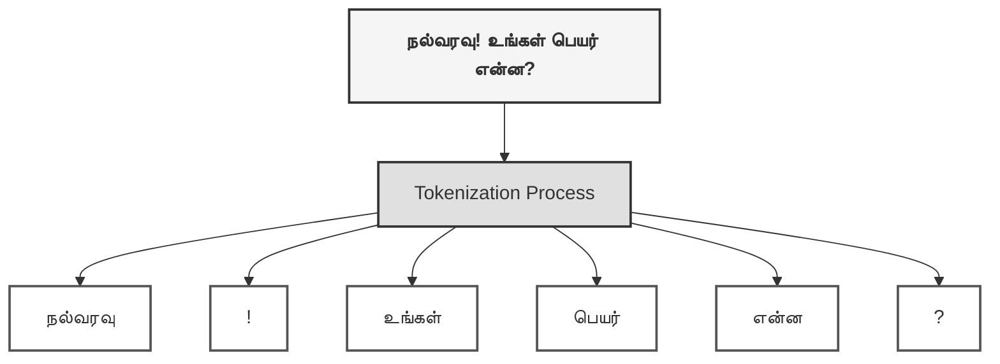

### **அத்தியாயம் 2: மொழியின் புதிர் - இயல் மொழி தெளிதல் (NLP)**

செயற்கை நுண்ணறிவு, தர்க்கரீதியாகச் சிந்தித்து, தரவுகளிலிருந்து கற்றுக்கொண்டு, விளையாட்டுகளில் உத்திகளை வகுக்கப் பழகிவிட்டது. ஆனால், அதன் பயணத்தின் மாபெரும் சவால்களில் ஒன்று இப்போதுதான் தொடங்குகிறது: மனிதர்களின் உலகைப் புரிந்துகொள்வது. அந்த உலகத்திற்கான திறவுகோல், நமது **மொழி**.

இயந்திரங்களின் தர்க்க உலகிற்கும், மனிதர்களின் உணர்ச்சிமயமான மொழி உலகிற்கும் இடையே ஒரு பாலத்தை அமைக்கும் முயற்சியே **இயல் மொழி தெளிதல் (Natural Language Processing - NLP)**.

மனிதர்களாகிய நமக்கு மொழி என்பது சுவாசம் போல இயல்பானது. ஆனால், ஒரு கணினிக்கு, அது முடிவற்ற சிக்கல்களும், புதிர்களும் நிறைந்த ஒரு பிரம்மாண்டமான காடு.

#### **மொழியின் சிக்கல்: ஒரு வார்த்தை, பல உலகங்கள்**

```
														"He saw the bat."
```

இந்த எளிய வாக்கியத்தை ஒரு கணினியிடம் கொடுத்தால், அது ஒரு மர்மத்தின் முன் நிற்கும். அது பார்க்கும் **"bat"** என்பது விளையாடும் மட்டையா 🏏, அல்லது பறக்கும் வௌவாலா? 🦇

இந்தக் குழப்பமே, NLP-யின் இதயத்தில் இருக்கும் **"பலபொருள் நிலை" (Ambiguity)** என்ற சவாலாகும். இந்த மர்மத்தைத் தீர்க்கும் திறவுகோல் எது? அது ஒன்றே ஒன்றுதான்: **சூழல் (Context)**.

அதற்கான விடை ஒன்றே ஒன்றுதான்: **சூழல் (Context)**. சூழல் என்ற வழிகாட்டி இல்லையென்றால், ஒவ்வொரு வாக்கியமும் கணினிக்கு ஒரு தீர்க்கமுடியாத புதிர் தான்.

- "He saw the bat **at the zoo**." → இங்கே சூழல் 'விலங்கியல் பூங்கா', எனவே "bat" என்பது **வௌவால்**.
- "He saw the bat **in the sports shop**." → இங்கே சூழல் 'விளையாட்டுக் கடை', எனவே "bat" என்பது **மட்டை**.

சூழல் என்ற ஒற்றைச் சாவி, இந்த மர்மக் கதவைத் திறந்துவிடுகிறது. மொழி என்பது வெறும் வார்த்தைகளின் தொகுப்பு அல்ல; அது சூழல்களால் பின்னப்பட்ட ஒரு சிக்கலான வலை. இந்த வலையில் சிக்காமல், அதன் வழியே பயணிக்கக் கற்றுக்கொள்வதே NLP-யின் உண்மையான வெற்றி.

இந்தச் சூழல் சார்ந்த புரிதல்தான், இன்று நாம் பயன்படுத்தும் மொழிபெயர்ப்பு மென்பொருட்கள், அரட்டைப் பெட்டிகள் (Chatbots), மற்றும் குரல் உதவியாளர்களின் (Voice Assistants) மையக் கருவாக அமைந்துள்ளது.

மொழி என்ற சிக்கலான புதிரை விடுவித்து, அதன் அர்த்தத்தை உணர்ந்து, அதற்கு ஏற்பச் செயல்படும் திறனில்தான் ஒரு இயந்திரத்தின் உண்மையான நுண்ணறிவு வெளிப்படுகிறது.  ஆனால், ஒரு இயந்திரம் இந்தச் சூழலைப் புரிந்துகொள்வதற்கு முன், அது மொழியின் அடிப்படைகளைக் கற்க வேண்டும். ஒரு குழந்தையைப் போல, அதுவும் எழுத்துக்கூட்டிப் படிக்க வேண்டும்.

இந்த அடிப்படை நுட்பங்கள்தான், இயந்திரங்கள் மொழியின் புதிரான உலகிற்குள் நுழைய உதவும் முதல் படிகளாகும். இந்தப் பயணத்தைத் தொடர, முதலில் மொழியை எந்திரங்களுக்குப் புரியும் எளிய வடிவத்திற்கு எப்படி மாற்றுவது என்பதை நாம் கற்க வேண்டும். 

- ஒரு நீண்ட வாக்கியத்தை எப்படி வார்த்தைகளாக உடைப்பது? **(Tokenization)**
- அர்த்தமற்ற சிறு சொற்களை (`is`, `the`, `a`) எப்படி நீக்குவது? **(Stop Word Removal)**
- ஒரு வார்த்தையின் மூலத்தை (`running` → `run`) எப்படி கண்டறிவது? **(Stemming & Lemmatization)**

வாருங்கள், NLP-யின் அடிப்படை நுட்பங்களான Tokenization, Stemming போன்றவற்றை ஆராய்ந்து, மொழி என்ற புதிர்க் கோட்டையின் முதல் கதவைத் திறப்போம்.  

###### 2.1. டோக்கனைசேஷன்: மொழியைத் துண்டாக்குதல்

மொழி என்ற பிரம்மாண்டமான புதிர்க் கோட்டையின் முதல் கதவைத் திறந்துவிட்டோம். உள்ளே, கணினிக்கு நாம் கற்றுக்கொடுக்க வேண்டிய முதல் பாடம், மொழியை எப்படிப் படிப்பது என்பதுதான்.

ஒரு மனிதன் ஒரு வாக்கியத்தைப் படிக்கும்போது, அதன் முழு அர்த்தத்தையும் உடனடியாகப் யூகிக்கிறான். ஆனால் ஒரு கணினி, ஒரு வாக்கியத்தை முதலில் ஒரு நீளமான, அர்த்தமற்ற எழுத்துக் கோர்வையாகவே பார்க்கிறது. அந்த எழுத்துக் கோவைக்கு அர்த்தம் கொடுக்க, நாம் முதலில் அதைச் சிறிய சிறிய, அர்த்தமுள்ள துண்டுகளாகப் பிரிக்க வேண்டும்.

இந்த முதல் மற்றும் மிக முக்கியமான படிக்குத்தான் **டோக்கனைசேஷன் (Tokenization)** என்று பெயர்.

ஒரு சமையல்காரர், ஒரு சிக்கலான உணவைத் தயாரிக்கும் முன், காய்கறிகளைச் சிறிய சிறிய துண்டுகளாக வெட்டுவதைப் போல, டோக்கனைசேஷன், ஒரு உரைப்பகுதியை அதன் அடிப்படை அலகுகளாக, அதாவது **டோக்கன்களாக (Tokens)** வெட்டுகிறது. இந்த டோக்கன்கள் வார்த்தைகளாகவோ, வாக்கியங்களாகவோ, அல்லது குறியீடுகளாகவோ இருக்கலாம்.

உதாரணமாக, **"நல்வரவு! உங்கள் பெயர் என்ன?"** என்ற வாக்கியத்தை கணினி பார்க்கும்போது, அதை ஒரே தொடராகப் பார்க்காது. மாறாக, டோக்கனைசேஷன் மூலம்,

```
						  ["நல்வரவு", "!", "உங்கள்", "பெயர்", "என்ன", "?"]
```



என ஒவ்வொரு துண்டாகப் பிரித்து, அவற்றின் தனித்தனிப் பங்கைப் புரிந்துகொள்ள முயற்சிக்கும். இந்த அடிப்படைச் செயல்பாடு இல்லாமல், இயந்திர மொழிபெயர்ப்பு முதல் உணர்ச்சிப் பகுப்பாய்வு (Sentiment Analysis) வரை எந்தவொரு மேம்பட்ட NLP செயல்பாடும் சாத்தியமில்லை.

#### டோக்கனைசேஷனின் இரண்டு முக்கியப் பார்வைகள்

இந்த மொழியைத் "துண்டாக்கும்" கலையில் இரண்டு முக்கிய அணுகுமுறைகள் உள்ளன:

1. **வாக்கிய டோக்கனைசேஷன் (Sentence Tokenization):** ஒரு பெரிய பத்தியை, அதன் முக்கியக் கருத்துகளான தனித்தனி வாக்கியங்களாகப் பிரிப்பது. இது முதல் கட்ட, பெரிய அளவிலான வெட்டு.
   - **உரை:** `"Hello! How are you? I hope you are doing well."`
   - **டோக்கன்கள்:** `["Hello!", "How are you?", "I hope you are doing well."]`
2. **வார்த்தை டோக்கனைசேஷன் (Word Tokenization):** ஒவ்வொரு வாக்கியத்தையும் எடுத்து, அதன் மூலப்பொருட்களான தனித்தனி வார்த்தைகளாகப் பிரிப்பது. இது நுணுக்கமான, இரண்டாம் கட்ட வெட்டு.
   - **உரை:** `"Hello! How are you?"`
   - **டோக்கன்கள்:** `['Hello', '!', 'How', 'are', 'you', '?']`

பைத்தான் மொழியில் உள்ள **NLTK** போன்ற கருவிகள், இந்த டோக்கனைசேஷன் செயல்முறையை எளிதாகச் செய்ய நமக்கு உதவுகின்றன. மொழியை அதன் எளிய வடிவத்திற்கு மாற்றுவதன் மூலம், கணினி தனது கற்றல் பயணத்தின் அடுத்த படிக்குத் தயாராகிறது.

```python
from nltk.tokenize import word_tokenize, sent_tokenize

# உரை (Text)
text = "Hello! How are you? I hope you are doing well."

# வார்த்தைகளாக துண்டாக்கம் (Word Tokenization)
words = word_tokenize(text)
print("Words:", words)

# வாக்கியங்களாக துண்டாக்கம் (Sentence Tokenization)
sentences = sent_tokenize(text)
print("Sentences:", sentences)
```

```python
Words: ['Hello', '!', 'How', 'are', 'you', '?', 'I', 'hope', 'you', 'are', 'doing', 'well', '.']
Sentences: ['Hello!', 'How are you?', 'I hope you are doing well.']
```

##### 2.2. Stop Words Removal ஸ்டாப் வோர்ட்ஸ் நீக்கம்: இரைச்சலை அகற்றி இசையைக் கேட்டல்

மொழியை டோக்கன்களாகத் துண்டாக்கிய பிறகு, நமது அடுத்த படி, அந்தத் துண்டுகளைச் சுத்தம் செய்வது. ஒரு உரையில் உள்ள எல்லா வார்த்தைகளும் ஒரே அளவு முக்கியத்துவம் வாய்ந்தவை அல்ல. சில வார்த்தைகள், ஒரு வாக்கியத்தின் இலக்கண அமைப்பிற்குத் தேவைப்பட்டாலும், அதன் மையக் கருத்திற்குப் பெரிய பங்களிப்பை வழங்குவதில்லை.

இந்த வார்த்தைகள்தான் **ஸ்டாப் வோர்ட்ஸ் (Stop Words)** என்று அழைக்கப்படுகின்றன.

`a`, `and`, `I`, `is`, `the` போன்ற வார்த்தைகள், மொழியின் இரைச்சல் (Noise) போன்றவை. இவை உரையாடலை இணைக்க உதவும் பசை போன்றவை. ஆனால், ஒரு கணினி உரையின் மையக் கருத்தைப் புரிந்துகொள்ள முயற்சிக்கும்போது, இந்த வார்த்தைகள் தேவையற்ற சுமையாக மாறி, அதன் கவனத்தைச் சிதறடிக்கின்றன.

எனவே, இந்த இரைச்சலை அகற்றி, உரையின் உண்மையான இசையை (முக்கியமான வார்த்தைகளை) மட்டும் கணினி கேட்கும்படி செய்ய வேண்டும். உதாரணமாக, **"This is a simple example of removing stop words"** என்ற வாக்கியத்தை எடுத்துக்கொள்வோம்.

இதில் உள்ள 'is', 'a', 'of' போன்ற ஸ்டாப் வோர்ட்ஸை நீக்கிய பிறகு, நமக்குக் கிடைப்பது அதன் சாராம்சம் மட்டுமே:

```
['This', 'simple', 'example', 'removing', 'stop', 'words', '.']
```

இந்தச் சிறிய சுத்திகரிப்பு, NLP மாதிரிகளின் செயலாக்க வேகத்தை அதிகரிப்பதோடு, அவற்றின் துல்லியத்தையும் மேம்படுத்துகிறது. பைத்தானில் உள்ள **NLTK** போன்ற கருவிகள், ஒவ்வொரு மொழிக்கும் பொதுவான ஸ்டாப் வோர்ட்ஸ் பட்டியலை தயார் நிலையில் வைத்திருக்கின்றன. இந்த இரைச்சலை நீக்குவதன் மூலம், அடுத்தகட்ட ஆழமான பகுப்பாய்வுக்குத் தரவைத் தயார்படுத்துகிறோம்.

```python
from nltk.corpus import stopwords

# உரை (Text)
text = "This is a simple example of removing stop words."

# Stop words-ஐப் பெறுதல்
stop_words = set(stopwords.words('english'))

# Tokenization
words = word_tokenize(text)

# Stop words-ஐ நீக்குதல்
filtered_words = [word for word in words if word.lower() not in stop_words]
print("Filtered Words:", filtered_words)
```

**Output:**  

```
Filtered Words: ['This', 'simple', 'example', 'removing', 'stop', 'words', '.']
```

##### 2.3. ஸ்டெமிங்: வார்த்தைகளின் வேரைத் தேடி

மொழியில் உள்ள இரைச்சலை (Stop Words) அகற்றிவிட்டோம். இப்போது, சுத்தம் செய்யப்பட்ட வார்த்தைகளின் ஆழத்திற்குச் சென்று, அவற்றின் மூல வடிவத்தைக் கண்டறிய வேண்டும். இது, மொழியை மேலும் எளிமைப்படுத்தும் ஒரு முக்கியமான படி. இந்தப் படிக்குத்தான் **ஸ்டெமிங் (Stemming)** அல்லது **வேர்ச்சொல் பிரித்தல்** என்று பெயர்.

ஒரு கணினியைப் பொறுத்தவரை, "ஓடு" (run), "ஓடுகிறது" (runs), "ஓடியது" (ran) ஆகிய மூன்றுமே வெவ்வேறு வார்த்தைகள். ஆனால், மனிதர்களாகிய நமக்கு, இவை அனைத்தும் "ஓடு" என்ற ஒரே ஒரு செயலின் வெவ்வேறு வடிவங்கள் என்று தெரியும். இந்த உண்மையைக் கணினிக்குப் புரிய வைப்பதே ஸ்டெமிங்.

இது ஒரு மரத்தின் கிளைகளையும், இலைகளையும் வெட்டி, அதன் உறுதியான அடிமரத்தை மட்டும் வெளிக்கொணர்வதைப் போன்றது. ஸ்டெமிங், ஒரு வார்த்தையின் விகுதிகளான `-ing`, `-s`, `-ed` போன்றவற்றை நீக்கி, அதன் **வேர் வடிவத்தை (stem)** நமக்குத் தருகிறது.

| மூல வார்த்தை | ஸ்டெமிங் செய்யப்பட்ட வேர் |
| ---------- | ------------------- |
| running    | run                 |
| jumps      | jump                |
| easily     | easili              |
| fairly     | fairli              |

ஸ்டெமிங் ஒரு வேகமான மற்றும் எளிமையான செயல்முறை. ஆனால், அது எப்போதும் இலக்கணப்படி சரியான வார்த்தையைத் தரும் என்று சொல்ல முடியாது. மேலே உள்ள எடுத்துக்காட்டில், 'easily' என்ற வார்த்தை 'easili' என்று மாற்றப்பட்டிருப்பதைக் கவனியுங்கள். இது ஒரு உண்மையான ஆங்கில வார்த்தை அல்ல.

ஸ்டெமிங், மொழியின் அழகை விட, கணினிக்குத் தேவையான வேகத்திற்கும், எளிமைக்குமே முக்கியத்துவம் கொடுக்கிறது. பைத்தானின் **NLTK** நூலகத்தில் உள்ள `PorterStemmer` போன்ற கருவிகள் இந்தச் செயலை எளிதாகச் செய்கின்றன. இந்தச் சிறிய குறைபாடு இருந்தாலும், உரையின் சிக்கலைக் குறைத்து, கணினியின் புரிதலை மேம்படுத்துவதில் ஸ்டெமிங் ஒரு முக்கியப் பங்கு வகிக்கிறது.

```python
from nltk.stem import PorterStemmer

# உரை (Text)
words = ["running", "jumps", "easily", "fairly"]

# Stemmer
stemmer = PorterStemmer()

# Stemming
stemmed_words = [stemmer.stem(word) for word in words]
print("Stemmed Words:", stemmed_words)
```

**Output:**  

```
Stemmed Words: ['run', 'jump', 'easili', 'fairli']
```

##### 2.4. Lemmatization  லெமடைசேஷன்: வார்த்தையின் ஆன்மாவைத் தேடி

ஸ்டெமிங் (Stemming), ஒரு வார்த்தையின் வேரை வேகமாகக் கண்டறியும் ஒரு கரடுமுரடான உத்தி என்று பார்த்தோம். அது சில நேரங்களில், வார்த்தையின் இலக்கண அழகைச் சிதைத்துவிடுகிறது (`easily` -> `easili`). இந்தச் சிக்கலைச் சரிசெய்ய, ஒரு புத்திசாலித்தனமான, மேலும் நேர்த்தியான அணுகுமுறை தேவை.

அந்த அணுகுமுறைதான் **லெமடைசேஷன் (Lemmatization)**.

ஸ்டெமிங் ஒரு வேகமான விறகுவெட்டி என்றால், லெமடைசேஷன் ஒரு திறமையான சிற்பி. அது வார்த்தைகளின் விகுதிகளைக் கண்மூடித்தனமாக வெட்டி எறிவதில்லை. மாறாக, ஒரு சொல்லின் உண்மையான, அகராதியில் உள்ள அர்த்தமுள்ள மூல வடிவத்தை (**lemma**) கண்டறிகிறது.

| மூல வார்த்தை | லெமடைசேஷன் செய்யப்பட்ட லெம்மா |
| ---------- | ------------------------ |
| running    | run                      |
| better     | good                     |
| jumps      | jump                     |

லெமடைசேஷனின் ரகசியம் என்ன? அது வார்த்தையின் **சூழலையும், அது பெயர்ச்சொல்லா அல்லது வினைச்சொல்லா என்பதையும் (Part of Speech)** கருத்தில் கொள்கிறது.

உதாரணமாக, "running" என்ற வார்த்தையை அது பார்க்கும்போது, "இது ஓட்டம் என்ற பெயர்ச்சொல்லா? அல்லது ஓடிக்கொண்டிருத்தல் என்ற வினைச்சொல்லா?" என்று ஆராயும். இந்தச் சூழலைப் பொறுத்தே, அதன் மூல வடிவமான "run" என்பதை அது கண்டறியும். அதேபோல, "better" என்ற வார்த்தையின் மூல வடிவம் "good" என்பதை, ஒரு முழுமையான அகராதியின் உதவியுடன் அது தெரிந்துகொள்கிறது.

பைத்தானின் **NLTK** நூலகத்தில் உள்ள `WordNetLemmatizer` போன்ற கருவிகள், இந்த அகராதி அடிப்படையிலான தேடலைச் செய்ய உதவுகின்றன.

சுருக்கமாக, வேகமும் எளிமையும் தேவைப்படும்போது ஸ்டெமிங் பயன்படுகிறது. ஆனால், மொழியின் அர்த்தமும், துல்லியமும் முக்கியம் என்னும்போது, லெமடைசேஷன் என்ற சிற்பியே சிறந்த தேர்வாக அமைகிறது.

```python
from nltk.stem import WordNetLemmatizer

# உரை (Text)
words = ["running", "jumps", "easily", "better"]

# Lemmatizer
lemmatizer = WordNetLemmatizer()

# Lemmatization
lemmatized_words = [lemmatizer.lemmatize(word) for word in words]
print("Lemmatized Words:", lemmatized_words)
```

**Output:**  

```
Lemmatized Words: ['running', 'jump', 'easily', 'better']
```

##### 2.5. POS டேக்கிங்: ஒவ்வொரு சொல்லுக்கும் ஒரு பாத்திரம்

லெமடைசேஷன் என்ற சிற்பி, ஒரு வார்த்தையின் சரியான மூல வடிவத்தைச் செதுக்க, அந்த வார்த்தை பெயர்ச்சொல்லா அல்லது வினைச்சொல்லா என்பதைத் தெரிந்துகொள்ள வேண்டும் என்று பார்த்தோம். கணினிக்கு இந்த அறிவைக் கொடுக்கும் செயல்முறைதான் **POS டேக்கிங் (Part-of-Speech Tagging)**.

ஒரு வாக்கியத்தை ஒரு நாடக மேடையாகக் கற்பனை செய்யுங்கள். அந்த நாடகத்தில் வரும் ஒவ்வொரு வார்த்தைக்கும் ஒரு συγκεκριந்த பாத்திரம் (Role) உள்ளது.

- **பெயர்ச்சொல் (Noun):** நாடகத்தின் நாயகன்.
- **வினைச்சொல் (Verb):** நாயகன் செய்யும் செயல்.
- **உரிச்சொல் (Adjective):** நாயகனை வர்ணிக்கும் சொல்.

POS டேக்கிங் என்பது, இந்த நாடகத்தில் உள்ள ஒவ்வொரு வார்த்தைக்கும் அதன் சரியான பாத்திரத்தை, அதாவது அதன் இலக்கண வகையை, ஒரு 'டேக்' (Tag) மூலம் அடையாளம் காட்டும் செயல்முறையாகும்.

உதாரணமாக, **"I love learning NLP."** என்ற வாக்கியத்தை எடுத்துக்கொள்வோம். POS டேக்கிங், இந்த வாக்கியத்தின் கட்டமைப்பை இப்படிப் பிரிக்கிறது:

| வார்த்தை   | இலக்கணப் பாத்திரம் (POS Tag) | விளக்கம்                        |
| -------- | ------------------------ | ----------------------------- |
| I        | PRP                      | பிரதிப்பெயர்ச்சொல் (Pronoun)      |
| love     | VBP                      | வினைச்சொல் (Verb)               |
| learning | VBG                      | வினைச்சொல் (Gerund)             |
| NLP      | NNP                      | ஒருமைப் பெயர்ச்சொல் (Proper Noun) |
| .        | .                        | நிறுத்தற்குறி                   |

இந்த இலக்கண அடையாளங்கள், ஒரு வாக்கியத்தின் வரைபடத்தைப் போலச் செயல்படுகின்றன. "book" என்ற வார்த்தை, "I read a **book**" என்பதில் பெயர்ச்சொல்லாகவும், "I will **book** a ticket" என்பதில் வினைச்சொல்லாகவும் வருகிறது. இந்த வேறுபாட்டை ஒரு கணினிக்குப் புரிய வைப்பதே POS டேக்கிங்.

பைத்தானின் **NLTK** போன்ற கருவிகள், இந்த இலக்கணப் பாத்திரங்களை எளிதாக அடையாளம் காண உதவுகின்றன. வார்த்தைகளைத் துண்டாக்கி, சுத்தம் செய்து, வேர்ச்சொல்லைக் கண்டறிந்த பிறகு, அவற்றின் இலக்கணப் பாத்திரத்தையும் அறிந்துகொள்வதன் மூலம், கணினி ஒரு வாக்கியத்தின் ஆன்மாவை, அதாவது அதன் முழுமையான கட்டமைப்பைப் புரிந்துகொள்ளத் தொடங்குகிறது.

உரையின் கட்டமைப்பை புரிந்து கொள்ள உதவுகிறது.  பிற NLP பணிகளுக்கு பயனுள்ளது.   

```python
from nltk import pos_tag

# உரை (Text)
text = "I love learning NLP."

# Tokenization
words = word_tokenize(text)

# POS Tagging
pos_tags = pos_tag(words)
print("POS Tags:", pos_tags)
```

**Output:**  

```
POS Tags: [('I', 'PRP'), ('love', 'VBP'), ('learning', 'VBG'), ('NLP', 'NNP'), ('.', '.')]
```

##### 2.6. Named Entity Recogn (NER): பெயர்களை அடையாளம் காணுதல்

ஒரு வாக்கியத்தின் இலக்கணத்தையும், அதன் பாத்திரங்களையும் கணினி புரிந்துகொண்ட பிறகு, அது தனது பயணத்தின் அடுத்த கட்டத்திற்குச் செல்கிறது: உரையில் மறைந்திருக்கும் நிஜ உலகத்தைப் அடையாளம் காண்பது.

ஒரு துப்பறிவாளர், ஒரு வழக்கின் கோப்புகளைப் படிக்கும்போது, அதில் வரும் முக்கிய நபர்களின் பெயர்கள், இடங்கள், மற்றும் நிறுவனங்களைக் கோடிட்டுக் காட்டுவதைப் போல, கணினியும் ஒரு உரையில் உள்ள முக்கியமான பெயர்களை அடையாளம் காண வேண்டும். இந்தத் துப்பறியும் வேலைக்குத்தான் **NER (Named Entity Recognition)** என்று பெயர்.

இது, உரையில் உள்ள வார்த்தைகளுக்குப் பின்னால் இருக்கும் நிஜ உலக அடையாளங்களைக் கண்டறியும் ஒரு சக்திவாய்ந்த செயல்முறை.

உதாரணமாக, **"Apple is located in Cupertino."** என்ற வாக்கியத்தை NER கருவி படிக்கும்போது, அது வெறும் வார்த்தைகளைப் பார்ப்பதில்லை. மாறாக, அது உடனடியாகத் தனது டிஜிட்டல் ஹைலைட்டரைக் கொண்டு கோடிடுகிறது:

- **Apple** - இது ஒரு **நிறுவனம் (ORG)**.
- **Cupertino** - இது ஒரு **இடம் (GPE - Geopolitical Entity)**.

இந்தச் சிறிய அடையாளம் காணுதல், ஒரு சாதாரண உரையை, பகுப்பாய்வு செய்யக்கூடிய, கட்டமைக்கப்பட்ட தரவாக (Structured Data) மாற்றுகிறது. இதன் மூலம், "இந்தக் கட்டுரையில் எந்தெந்த நிறுவனங்கள் குறிப்பிடப்பட்டுள்ளன?" அல்லது "இந்த நிகழ்வு எந்த ஊரில் நடந்தது?" போன்ற கேள்விகளுக்கு நம்மால் எளிதாக விடை காண முடியும்.

பைத்தானின் **spaCy** போன்ற மேம்பட்ட கருவிகள், இந்தத் துப்பறியும் வேலையை மிகத் திறமையாகச் செய்யப் பயிற்றுவிக்கப்பட்டுள்ளன. உரையின் இலக்கணத்தைப் புரிந்துகொள்வதிலிருந்து, உரையில் உள்ள நிஜ உலகத்தைப் புரிந்துகொள்வதற்கு NER ஒரு பாலமாக அமைகிறது. இதன் மூலம், கணினி மொழியை வாசிப்பது மட்டுமல்லாமல், அதிலுள்ள அறிவையும் கிரகித்துக்கொள்ளத் தொடங்குகிறது.

```python
import spacy

# spaCy மாதிரியை ஏற்றுதல்
nlp = spacy.load("en_core_web_sm")

# உரை (Text)
text = "Apple is located in Cupertino."

# NER
doc = nlp(text)
for ent in doc.ents:
    print(ent.text, ent.label_)
```

**Output:**  

```
Apple ORG
Cupertino GPE
```

##### 2.7. Sentiment Analysis : உணர்ச்சிப் பகுப்பாய்வு (வரிகளுக்குப் பின்னால் இருக்கும் இதயத்துடிப்பு)

ஒரு கணினி, மொழியைத் துண்டாக்கி (Tokenization), சுத்தம் செய்து (Stop Words), அதன் வேரை அறிந்து (Stemming/Lemmatization), இலக்கணப் பாத்திரங்களை (POS Tagging) உணர்ந்து, அதில் உள்ள நிஜ உலகப் பெயர்களை (NER) அடையாளம் கண்டுகொண்டது.

இப்போது, அதன் பயணத்தின் மிக மனிதத்தன்மை வாய்ந்த கட்டத்திற்கு அது வந்துள்ளது: **உணர்ச்சிகளைப் புரிந்துகொள்வது**.

ஒருவர் என்ன சொல்கிறார் என்பதைப் புரிந்துகொள்வது ஒரு நிலை. ஆனால், அவர் அதை **எப்படி உணர்ந்து சொல்கிறார்** என்பதைப் புரிந்துகொள்வதே உண்மையான நுண்ணறிவு. இந்த ஆழமான புரிதலை உருவாக்கும் கலைதான் **உணர்ச்சிப் பகுப்பாய்வு (Sentiment Analysis)**.

இது, ஒரு உரையின் "இதயத் துடிப்பைக்" கேட்கும் ஒரு செயல்முறை. அந்த உரையில் வெளிப்படும் உணர்வு **நேர்மறையானதா (Positive)**, **எதிர்மறையானதா (Negative)**, அல்லது **நடுநிலையானதா (Neutral)** என்பதை இது கண்டறிகிறது.

உதாரணமாக, **"I love this product!"** என்ற வாக்கியத்தை எடுத்துக்கொள்வோம். ஒரு வாடிக்கையாளர் இதை எழுதும்போது, அவர் ஒரு தகவலை மட்டும் கொடுக்கவில்லை; தனது மகிழ்ச்சியான உணர்வையும் வெளிப்படுத்துகிறார்.

`TextBlob` போன்ற கருவிகள் இந்த உணர்வை இரண்டு முக்கிய அளவீடுகள் மூலம் கணிக்கின்றன:

1. **போலாரிட்டி (Polarity):** இது உணர்ச்சியின் திசையைக் காட்டும் ஒரு மதிப்பு (-1 முதல் +1 வரை).
   - நமது உதாரணத்திற்கு, போலாரிட்டி **+0.625** என வரலாம். இது, அந்த வாக்கியம் ஒரு வலுவான **நேர்மறை** உணர்ச்சியைக் கொண்டிருப்பதைக் காட்டுகிறது.
2. **சப்ஜெக்டிவிட்டி (Subjectivity):** இது, உரை எந்த அளவிற்கு ஒருவரின் தனிப்பட்ட கருத்து அல்லது உணர்வைச் சார்ந்துள்ளது என்பதைக் காட்டும் ஒரு மதிப்பு (0 முதல் 1 வரை).
   - நமது உதாரணத்திற்கு, சப்ஜெக்டிவிட்டி **0.6** என வரலாம். இது, அந்த வாக்கியம் ஒரு பொதுவான உண்மை அல்ல, மாறாக ஒருவரின் தனிப்பட்ட, உணர்வுப்பூர்வமான கருத்து என்பதைக் காட்டுகிறது.

இன்று, நிறுவனங்கள் வாடிக்கையாளர்களின் லட்சக்கணக்கான கருத்துக்களைப் புரிந்துகொள்ளவும், சமூக ஊடகங்களில் ஒரு விஷயத்தைப் பற்றிய மக்களின் மனநிலையை அறியவும் இந்த நுட்பத்தைப் பயன்படுத்துகின்றன.

உணர்ச்சிப் பகுப்பாய்வு, கணினிகளுக்கு ஒருவித டிஜிட்டல் பச்சாதாபத்தை (Empathy) வழங்குகிறது. இதன் மூலம், அவை வெறும் வார்த்தைகளைப் படிக்கும் இயந்திரங்களாக இல்லாமல், அந்த வார்த்தைகளுக்குப் பின்னால் இருக்கும் மனித உணர்வுகளைப் புரிந்துகொள்ளும் ஒரு தோழனாக மாறுகின்றன.

**Code:**

```python
from textblob import TextBlob

# உரை (Text)
text = "I love this product!"

# Sentiment Analysis
blob = TextBlob(text)
sentiment = blob.sentiment
print("Sentiment:", sentiment)
```

**Output:**  

```python
Sentiment: Sentiment(polarity=0.625, subjectivity=0.6)
```

