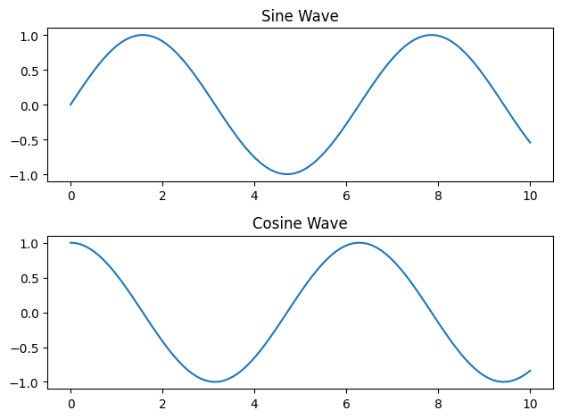
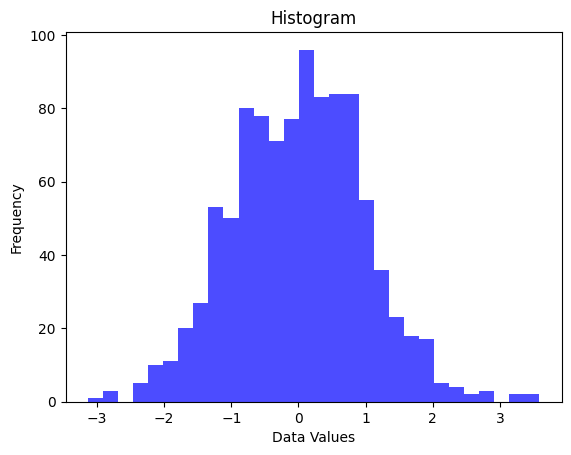

# NumPy – அறிமுகம் மற்றும் வரலாறு

NumPy என்பது Python-இல் **scientific computing** (கணினிசார் அறிவியல்) செய்ய பயன்படும் மிக முக்கியமான open-source library ஆகும். இது "Numerical Python" என்பதன் சுருக்கமாகும். Python மொழியின் மைய library-களில் ஒன்று ஆக NumPy இருக்கிறது. இதன் மூலம் நம்மால் எளிதில் multi-dimensional arrays-ஐ கையாள முடிகிறது. இது Python-ஐ கணினி அறிவியல் மற்றும் அறிவியல் கணக்கீடுகளுக்கான ஒரு மிகச்சிறந்த கருவியாக மாற்றியது.

**NumPy உருவாக்கத்திற்கான அடிப்படைத் தேவைகள்**

1990-களில், Python-ஐ science மற்றும் engineering கணக்கீடுகளுக்குப் பயன்படுத்த ஆரம்பித்தனர். அதற்காக high-performance arrays, matrices போன்ற data structures-ஐ handle செய்ய முடியாத நிலை ஏற்பட்டது. இந்த நிலையை தாண்ட, Python மொழியில் multi-dimensional arrays கையாளுவதற்கான library-கள் உருவாக்கப்பட்டன. இதன் முந்தைய library-களில் முக்கியமானவை **Numeric** மற்றும் **Numarray** ஆகும்.

**Numeric** 

NumPy-க்கான முன்னோடி library ஆக **Numeric** இருந்தது. இதன் உதவியால் Python-இல் நம் array-க்களை scientific calculations-க்குப் பயன்படுத்த முடிந்தது. எனினும், சில performance மற்றும் flexibility குறைகள் இருந்ததால், இது முற்றிலும் perfect tool ஆக இருக்கவில்லை.

**Numarray** 

Numeric-ன் குறைகளை சரி செய்யும் வகையில், **Numarray** library உருவாக்கப்பட்டது. இது மிகப் பெரிய data-களைப் பயன்படுத்தும் array operations-க்கு support அளித்தது. ஆனால், இந்த library-யும் பல செயல்பாட்டு சவால்கள் மற்றும் complications-ஐ கொண்டிருந்தது.

**NumPy-ன் உருவாக்கம்** 

Python-இல் multi-dimensional arrays மற்றும் numerical operations-ஐ சரியான வகையில் கையாள ஒரு unified library தேவையாக இருந்தது. இதனால், **Travis Oliphant** 2005-இல் NumPy-ஐ உருவாக்கினார். **Numeric** மற்றும் **Numarray**-இன் சிறந்த அம்சங்களை ஒருங்கிணைத்து, இதன் குறைபாடுகளை சரி செய்தார். NumPy-யின் மிக முக்கியமான அம்சம் இதன் **ndarray** (N-dimensional array) ஆகும், இது multi-dimensional arrays கையாள பயன்படுகிறது. 

**Ndarray** என்பது NumPy-யின் மையம், இதை NumPy-யின் இதயத்துடிப்பு எனக்கூறலாம். இதன் உதவியால், multi-dimensional data-களை மிகவும் சிறப்பாக கையாள முடிகிறது. இது Python-இல் ஒரு single-dimensional array (1D), double-dimensional array (2D) மட்டுமல்லாமல், N-dimensional arrays-ஐ handle செய்யும் திறனுடையது.

**ஏன் N-dimensional arrays தேவை?**

N-dimensional arrays-ஐ பயன்படுத்துவதற்கான முக்கியக் காரணம், இது real-world problems-இல் complex தகவல்களை represent செய்ய உதவுகிறது. உதாரணமாக, Image-களை process செய்யும் போது, நாம் images-ஐ arrays-ஆக represent செய்கிறோம். Image என்பது பல pixel values-ஆகும். ஒவ்வொரு pixel-மும் ஒரு value-ஐ கொண்டிருக்கும், அதனால் ஒரு grayscale image-ஐ 2D array-ஆகக் கருதலாம். 

- ஒரு 100x100 grayscale image-ஐ 2D array-ஆக represent செய்யலாம், இதன் rows மற்றும் columns ஒவ்வொரு pixel value-ஐ குறிக்கின்றன.

**Color images** (RGB images) ஒவ்வொரு pixel-க்கும் 3 colors (Red, Green, Blue) values-ஐ வைத்திருக்கும். இதனால், ஒரு RGB image 3D array ஆகும், இதில் ஒவ்வொரு pixel-க்கும் 3 dimensions-ல் data இருக்கும்.

**Shape of a color image**: 100x100x3 (100 rows, 100 columns, 3 color values for each pixel)

**ஆகையால், image processing-ல் N-dimensional arrays-ஐ பயன்படுத்தி நம் image data-ஐ நிறைய dimensions-இல் represent செய்து அதை process செய்யலாம்.**

இதேப்போன்று Weather data-வை அணுகும் போது, நாம் ஒரு குறிப்பிட்ட இடத்தின் வெப்பநிலை, காற்றின் வேகம், ஈரப்பதம் போன்றவற்றைப் பெற விரும்புகிறோம். இதற்காக, வெவ்வேறு இடங்களில் (latitude, longitude) 3D array-கள் weather parameters-ஐ represent செய்ய உதவும்.

- 3D array-ல், ஒரு நாடு முழுவதும் உள்ள வெப்பநிலை data-வை represent செய்யலாம், இதில் rows latitude-ஐ, columns longitude-ஐ, depth வெப்பநிலை அல்லது காற்றின் வேகம் போன்ற தரவுகளைக் குறிக்கும்.

- **Shape of the array**: 50x50x24 (50 latitude locations, 50 longitude locations, 24 time periods for a day)

**இதன் மூலம், weather forecasting மற்றும் data analysis-ஐ multi-dimensional arrays-இல் represent செய்து complex data-ஐ கையாளலாம்.**

NumPy-யின் N-dimensional arrays-ஐப் பயன்படுத்துவதன் மூலம், நம் scientific computations மற்றும் data analysis tasks மிகுந்த அளவில் ஆற்றலானதாக இருக்கும்.

**குறிப்பு:**

[Array programming with NumPy](https://www.nature.com/articles/s41586-020-2649-2)

**GitHub:** https://github.com/tamil-phy/NumPy_Book_Tamil


#### 1. NUMPY − ARRAY ATTRIBUTES   

##### 1.1. ndarray.shape

**shape** attribute என்பது NumPy array-இன் அமைப்பை (structure) குறிக்கிறது. இது array-இல் எத்தனை rows மற்றும் columns உள்ளன என்பதை சொல்கிறது. 

எந்த ஒரு array-யும் கையாளும்போது, அதன் **shape** attribute மூலம் array-இன் பரிமாணங்களை (dimensions) அறிந்து கொள்ளலாம். **shape** attribute-ல் உள்ள  values array-இல் உள்ள rows மற்றும் columns எண்ணிக்கையை தருகின்றன.

**Input:**

```python
import numpy as np

arr = np.array([[1, 2, 3], [4, 5, 6]])
print("Shape of array:", arr.shape)
```

மேலே கொடுக்கப்பட்டுள்ள code-இல், **arr** என்ற 2D array உருவாக்கப்பட்டுள்ளது. இந்த array-இன் **shape** attribute-ஐ பயன்படுத்தி array-இன் அமைப்பை அறியலாம்.

அதாவது, இதன் **output:**

```
Shape of array: (2, 3)
```

  இந்த array-இல் 2 rows மற்றும் 3 columns உள்ளன என்று பொருள். 

இதன் மூலம், **shape** attribute ஒரு Numpy array-இன் கட்டமைப்பை (structure) முழுமையாக குறிக்க உதவுகிறது.

##### 1.2. ndarray.ndim 

**ndim** என்பது array-இன் பரிமாணங்களின் எண்ணிக்கையை (number of dimensions) குறிக்கிறது. NumPy array-களின் பரிமாணங்களை புரிந்து கொள்ள இது மிகவும் முக்கியமான attribute ஆகும்.

ஒரு array எத்தனை dimension-களை கொண்டுள்ளது என்பதை **ndim** attribute-ஐ பயன்படுத்தி எளிதில் அறிய முடியும். இதன் உதவியால், 1D, 2D அல்லது multi-dimensional array என்பதை நம்மால் அறிய முடியும்.

**Input:**

```python
import numpy as np

arr = np.array([[1, 2, 3], [4, 5, 6]])
print("Number of dimensions:", arr.ndim)
```

மேலே கொடுக்கப்பட்டுள்ள code-இல், **arr** என்ற 2D array உருவாக்கப்பட்டுள்ளது. இந்த array-இன் **ndim** attribute-ஐ பயன்படுத்தி array-இன் பரிமாணங்களின் எண்ணிக்கையை (number of dimensions) அறியலாம்.

**Output:**

```
Number of dimensions: 2
```

**2** என்று வரும்போது, இந்த array ஒரு 2D array என்று பொருள். 

இதன் மூலம், **ndim** attribute ஒரு Numpy array-இன் பரிமாணங்களின் எண்ணிக்கையை முழுமையாக அறிய உதவுகிறது.

##### 1.3. numpy.itemsize 

**itemsize** attribute ஒரு element-ஐ represent செய்ய memory-யில் எத்தனை bytes எடுக்கின்றது என்பதை அளிக்கிறது. இது, NumPy array-ல் உள்ள ஒவ்வொரு element-க்கும் memory allocation-ஐ எவ்வளவு எடுக்கும் என்பதை அறிய உதவுகிறது.

**Input:**

```python
import numpy as np

arr = np.array([1, 2, 3, 4, 5])
print("Item size of array:", arr.itemsize, "bytes")
```

இந்த code-இல், **arr** என்ற 1D array உருவாக்கப்பட்டுள்ளது, மற்றும் **itemsize** attribute-ஐ பயன்படுத்தி array-இன் ஒவ்வொரு element-ஐ memory-யில் represent செய்ய எவ்வளவு bytes எடுக்கின்றது என்பதை பார்க்கலாம்.

**Output:**

```
Item size of array: 8 bytes
```

**8 bytes** என்று வரும்போது, அந்த array-இல் உள்ள ஒவ்வொரு element-மும் 8 bytes அளவு memory-யைப் பயன்படுத்துகின்றது என்று பொருள்.

இதன் மூலம், **itemsize** attribute ஒரு Numpy array-இல் உள்ள ஒவ்வொரு element-இன் memory அளவை சரியாக அளக்க உதவுகிறது.

##### 1.4. numpy.flags 

**flags** attribute என்பது NumPy array-இன் memory layout-ஐ குறிக்கிறது. இது array-இன் உள்ளமைப்புகள் (properties) மற்றும் memory-இன் அடிப்படையில் array எவ்வாறு அமைக்கப்பட்டுள்ளது என்பதை விளக்குகிறது.

**Input:**

```python
import numpy as np

arr = np.array([1, 2, 3, 4, 5])
print("Flags of the array:\n", arr.flags)
```

இந்த code-இல், **arr** என்ற 1D array உருவாக்கப்பட்டுள்ளது, மற்றும் **flags** attribute-ஐ பயன்படுத்தி array-இன் memory layout பற்றிய தகவல்களை அறியலாம்.

**Output:**

```
Flags of the array:
  C_CONTIGUOUS : True
  F_CONTIGUOUS : False
  OWNDATA : True
  WRITEABLE : True
  ALIGNED : True
  WRITEBACKIFCOPY : False
```

இந்த **flags** attribute இவ்வாறு array-இன் memory layout பற்றிய விவரங்களை கொடுக்கிறது:

- **C_CONTIGUOUS**: Array-இன் memory layout C-style (row-major) ஆக உள்ளது.
- **F_CONTIGUOUS**: Array-இன் memory layout Fortran-style (column-major) ஆக இல்லை.
- **OWNDATA**: Array-க்கு சொந்தமாக memory data இருக்கிறது.
- **WRITEABLE**: Array-இல் உள்ள data மாற்றக்கூடியது.
- **ALIGNED**: Data memory alignment சரியாக உள்ளது.
- **WRITEBACKIFCOPY**: Write-back operation தேவைப்படும்போது False ஆகும்.

இதன் மூலம், **flags** attribute NumPy array-இன் memory layout மற்றும் array-இன் உள்ளமைப்புகள் பற்றிய முழு தகவல்களை வழங்குகிறது.


#### 2. NUMPY − ARRAY CREATION ROUTINES    

NumPy-ல் array-களை உருவாக்க பல்வேறு methods உள்ளன, அவற்றைப் பயன்படுத்தி data handling மற்றும் computation process-களை எளிதாக்கலாம். இப்போது, சில பொதுவாகப் பயன்படுத்தப்படும் array creation functions பற்றி விரிவாகப் பார்ப்போம்.

##### 2.1. numpy.empty

**numpy.empty( )** function ஒரு initialization values இல்லாத array-ஐ உருவாக்க பயன்படுகிறது. இதனால், array-இல் உள்ள values ஏதாவது முன்பே memory-யில் இருந்த random values ஆக இருக்கும். இதனால், memory-யில் உள்ள values reset செய்யப்படாமல், அந்த values array-இல் வரலாம்.

**Input:**

```python
import numpy as np
empty_array = np.empty((2, 3))
print("Empty array:\n", empty_array)
```

இந்த code-இல், **np.empty( )** function-ஐ பயன்படுத்தி 2 rows மற்றும் 3 columns கொண்ட ஒரு array உருவாக்கப்படுகிறது. இந்த array-இல் உள்ள values எல்லாம் எதுவும் initial values இல்லை. அதற்குப் பதிலாக, memory-யில் இருக்கும் junk values அல்லது random values array-இல் காணப்படும்.

**Output:**

```
Empty array:
 [[4.66651921e-310 0.00000000e+000 2.05833592e-312]
 [6.79038654e-313 2.14321575e-312 2.27053550e-312]]
```

இதில், array-இன் values எல்லாம் random values ஆக உள்ளன, ஏனெனில் **numpy.empty( )** function memory-யில் ஏற்கனவே இருக்கும் data-ஐ பயன்படுத்தி array-ஐ உருவாக்குகிறது. இதனால், இந்த function array-ஐ மிக வேகமாக உருவாக்கும் ஆனால் initialization values கொடுக்காது.

- **numpy.empty( )** function பயன்படுத்தப்படும் போது array-இன் values எல்லாம் unpredictable ஆக இருக்கும்.
- Performance அதிகம் தேவைப்படும் போது, initialization values-ஐ avoid செய்ய இந்த function மிகவும் உதவியாக இருக்கும்.
- எப்போது values முக்கியமாக கருதப்படுகின்றனவோ, அப்போது **numpy.zeros( )** அல்லது **numpy.ones( )** போன்ற functions-ஐ பயன்படுத்துவது சிறந்தது.

இந்த function **speed optimization** தேவைப்படும் போது மிகவும் பயனுள்ளதாக இருக்கும், ஏனெனில் இது memory allocation மட்டும் செய்து, values-ஐ initialize செய்யாது.

##### 2.2. numpy.zeros

**zeros( )** function-ஐ பயன்படுத்தி, எல்லா elements-உம் 0 values கொண்ட ஒரு array-ஐ உருவாக்கலாம். இந்த function, array-இன் structure-ஐ (shape) user-defined shape-ஆக அமைத்து, அந்த shape-ஐ கொண்டு அனைத்து இடங்களிலும் 0 values-ஐ கொண்டு ஒரு array-ஐ return செய்யும்.

**Input:**

```python
import numpy as np

zeros_array = np.zeros((2, 2))
print("Zeros array:\n", zeros_array)
```

**Output:**

```
Zeros array:
 [[0. 0.]
 [0. 0.]]
```

- இங்கு **np.zeros( )** function-ஐ பயன்படுத்தி, 2 rows மற்றும் 2 columns கொண்ட ஒரு array உருவாக்கப்பட்டுள்ளது. இந்த array-இன் எல்லா elements-ம் 0 values கொண்டவை.

- **numpy.zeros( )** function memory-யை allocate செய்து, எல்லா elements-க்கும் 0 values கொடுக்கும்.
- இது, array-ஐ முழுமையாக 0 values கொண்டு initialize செய்ய விரும்பும் போது பயன்படும்.
- **zeros( )** function data initialization தேவையுள்ள போது மிகவும் பயனுள்ளதாக இருக்கும், ஏனெனில் இது memory-யை efficient-ஆக நிரப்பி array-ஐ உருவாக்குகிறது.

##### 2.3. numpy.ones

**ones( )** function-ஐ பயன்படுத்தி, எல்லா elements-உம் 1 values கொண்ட ஒரு array-ஐ உருவாக்கலாம். இந்த function, array-இன் structure-ஐ (shape) user-defined shape-ஆக அமைத்து, அந்த shape-ஐ கொண்டு அனைத்து இடங்களிலும் 1 values-ஐ கொண்டு ஒரு array-ஐ return செய்யும்.

**Input:**

```python
import numpy as np

ones_array = np.ones((3, 3))
print("Ones array:\n", ones_array)
```

**Output:** 

```
Ones array:
 [[1. 1. 1.]
 [1. 1. 1.]
 [1. 1. 1.]]
```

- இங்கு **np.ones( )** function-ஐ பயன்படுத்தி, 3 rows மற்றும் 3 columns கொண்ட ஒரு array உருவாக்கப்பட்டுள்ளது.
- இந்த array-இன் எல்லா elements-ம் 1 values கொண்டவை.

இதன் மூலம், **zeros( )** மற்றும் **ones( )** functions மிகவும் பயனுள்ளதாக இருக்கும், ஏனெனில் அவை predictable values கொண்ட array-களை உருவாக்குகின்றன, computation-ஐ எளிதாக்குகின்றன.


#### 3. NUMPY − ARRAY FROM EXISTING DATA

Numpy-ல் array-களை உருவாக்குவதற்கான முக்கியமான வழிகளில் ஒன்றாக **Existing data**-விலிருந்து array-ஐ உருவாக்குவது அமைகிறது. இது Python-ல் ஏற்கனவே இருக்கும் data structures, போன்றவை (lists, buffers, iterables) கொண்டு நமக்கு தேவையான array-களை எளிதாக உருவாக்க உதவுகிறது. இதனால் data-ஐ NumPy-யின் powerful array operations-இல் பயன்படுத்த முடியும்.

##### 3.1. numpy.asarray

**asarray( )** function-ஐ பயன்படுத்தி, ஒரு existing data-ஐ NumPy array-ஆக மாற்றலாம். இதன் முக்கிய பயனாக, இதனால் original data-ஐ clone செய்து, array-ஆக மாற்றுவதில் பயன்படுத்தப்படும் memory space குறைவாக இருக்கும்.

**Input:**

list data-யை numpy array-ஆக மாற்றுதல்
```python
import numpy as np


list_data = [1, 2, 3, 4, 5]
array_data = np.asarray(list_data)
print("Array from list:", array_data)
```

**Output:**

```
Array from list: [1 2 3 4 5]
```

இந்த Code-இல், ஒரு Python list **list_data**-ஐ **asarray( )** function-ஐ பயன்படுத்தி NumPy array-ஆக மாற்றுகிறோம். இதன் மூலம், original data type retain ஆகிறது (சேமித்து),  list_data array-ஆக மாற்றப்படுகிறது, மேலும் நம்மால் memory usage-யை திறமையாக கையாள முடிகிறது.

##### 3.2. numpy.frombuffer

**frombuffer( )** method-ஐ பயன்படுத்தி, buffer-ல் உள்ள data-ஐ NumPy array-ஆக மாற்ற முடியும். buffer-ல் உள்ள binary data-ஐ NumPy array-இல் மாற்றுவதன் மூலம், அதனுடன் அடுத்தடுத்த data manipulations மேற்கொள்ள உதவுகிறது.

**Input:**

```python
buffer = b'Hello World'
array_buffer = np.frombuffer(buffer, dtype='S1')
print("Array from buffer:", array_buffer)
```

**Output:**

```
Array from buffer: [b'H' b'e' b'l' b'l' b'o' b' ' b'W' b'o' b'r' b'l' b'd']
```

இங்கு, **buffer** என்ற binary data-ஐ **frombuffer( )** method மூலம் NumPy array-ஆக மாற்றுகிறோம். இதனால், byte data அலகு அலகாக array-இல் element-களாகக் கிடைக்கிறது. இதுபோன்ற conversions binary data parsing மற்றும் manipulation-ஐ எளிதாக்கும்.

##### 3.3. numpy.fromiter

**fromiter( )** function-ஐ பயன்படுத்தி, iterable object-களை NumPy array-ஆக மாற்ற முடியும். இது memory-efficient-ஆகவும், high-performance data conversion-ஐ உருவாக்கவும் உதவுகிறது. **fromiter( )** iterable values-ஐ array-ஆக dynamic-ஆக மாற்றுவதற்கான ஒரு method ஆகும். Iterables-ல் இருந்து continuous data stream-ஐ NumPy array-ஆக உருவாக்குவதன் மூலம், sequence-களை நேரடியாக array-களாக மாற்ற முடியும். 

**Input:**

```python
iterable = (x*x for x in range(5))
array_iter = np.fromiter(iterable, dtype='int32')
print("Array from iterable:", array_iter)
```

**Output:**

```
Array from iterable: [ 0  1  4  9 16]
```

இந்த Code-இல், **iterable** என்ற generator expression-ஐ **fromiter( )** method மூலம் NumPy array-ஆக மாற்றுகிறோம். இதனால் iterator-ல் உள்ள data sequential order-ஆக array-இல் சேமிக்கப்படுகிறது.

**குறிப்புகள்:**

- **asarray( )** function data-ஐ NumPy array-ஆக மாற்றும்போது, original data-ஐ duplicate செய்யாமல், அதை memory-efficient-ஆக array-ஆக மாற்றும்.

  

- **frombuffer( )** method buffer-ல் உள்ள binary data-ஐ NumPy array-ஆக மாற்றி, low-level data manipulation செய்ய உதவுகிறது.

  

- **fromiter( )** method iterators அல்லது generators கொண்டு data stream-ஐ array-ஆக மாற்றும், sequence operations-ஐ அதிக அளவில் எளிமையாக மாற்றுகிறது.

  

- **Memory Efficiency**: **fromiter( )** function memory-ஐ குறைவாக பயன்படுத்தி iterable object-களை array-ஆக நேரடியாக மாற்ற உதவுகிறது. இது, ஒரு iterator data-ஐ dynamic-ஆக உருவாக்கி, memory allocation-ஐ தற்செயலாக (lazy evaluation) செய்ய அனுமதிக்கிறது.

  

- **High Performance**: Large-scale data conversions-இல் **fromiter( )** function வேகமாக செயல்படுகிறது. Python list comprehension-ஐப் பயன்படுத்தி data-ஐ உருவாக்கும் முறைக்குப் பதிலாக, NumPy-யின் vectorized operations-ஐ பயன்படுத்துவதால், performance அதிகரிக்கிறது.

இதனால், NumPy-யில் data-ஐ நமக்கு வேண்டிய படி நமக்கு ஏற்கனவே உள்ள structures-இல் இருந்து array-களாக மாற்றி manipulations மற்றும் calculations செய்ய நம்மால் முடியும்.


#### 4. NUMPY − ARRAY FROM NUMERICAL RANGES

NumPy-யில் **எண்கள் அடிப்படையிலான array** களை உருவாக்க பல functions உள்ளன. இந்த functions array values-ஐ ஏறுவரிசையில் அல்லது குறிப்பிட்ட அளவுகளில் உருவாக்குவதற்கான எளிமையான வழிகளை வழங்குகின்றன. இதனால் sequences மற்றும் ranges கொண்ட array-களை உருவாக்க முடிகிறது.

##### 4.1. numpy.arange

**arange( )** function-ஐ பயன்படுத்தி, start value-இல் இருந்து stop value வரை, குறிப்பிட்ட step values-ஐ அடிப்படையாகக் கொண்டு array-ஐ உருவாக்கலாம். இந்த function, Python-ல் உள்ள **range( )** function போலவே செயல்படும், ஆனால் NumPy array-களாக values-ஐ return செய்யும்.

**Input:**

```python
import numpy as np

array_arange = np.arange(1, 10, 2)
print("Array using arange:", array_arange)
```

**Output:**

```
Array using arange: [1 3 5 7 9]
```

இங்கு, **arange( )** function **start value** 1-இல் இருந்து **stop value** 10 வரை, **step** value 2-ஐ அடிப்படையாகக் கொண்டு array values-ஐ உருவாக்குகிறது. இதனால், 1, 3, 5, 7, 9 போன்ற values கொண்ட array உருவாக்கப்படுகிறது.

##### 4.2. numpy.linspace

**linspace( )** function-ஐ பயன்படுத்தி, start value மற்றும் stop value-க்கு இடையில், even spacing values கொண்ட array-ஐ உருவாக்கலாம். இங்கு values எத்தனை elements-ஆக பிரிக்கப்படும் என்பதை user define செய்ய முடியும்.

**Input:**

```python
array_linspace = np.linspace(0, 1, 5)
print("Array using linspace:", array_linspace)
```

**Output:**

```
Array using linspace: [0.   0.25 0.5  0.75 1.  ]
```

இங்கு, **linspace( )** function **start** value 0-இல் இருந்து **stop** value 1 வரை, மொத்தம் 5 elements-ஆக values-ஐ even spacing-ஆக பிரிக்கிறது. இதனால், 0, 0.25, 0.5, 0.75, 1.0 போன்ற values கொண்ட array உருவாக்கப்படுகிறது.

##### 4.3. numpy.logspace

**logspace( )** function logarithmic spacing கொண்ட array values-ஐ உருவாக்கும். இது logarithmic scale-ல் base powers-இன் values-ஐ கொண்டு array-ஐ return செய்யும்.

**Input:**

```python
array_logspace = np.logspace(1, 3, 5)
print("Array using logspace:", array_logspace)
```

**Output:**

```
Array using logspace: [  10.          31.6227766  100.         316.22776602 1000.        ]
```

இங்கு, **logspace( )** function base 10 powers-இல், **start** value 10^1-இல் இருந்து **stop** value 10^3 வரை மொத்தம் 5 values-ஐ logarithmic scale-ல் return செய்கிறது. இதனால், [10, 31.62, 100, 316.22, 1000] போன்ற logarithmic values கொண்ட array உருவாக்கப்படுகிறது.

- **arange( )**: Regular intervals-ஐ கொண்ட array values-ஐ return செய்கிறது.

- **linspace( )**: Start மற்றும் stop values இடையே even spacing கொண்ட values-ஐ return செய்கிறது.

- **logspace( )**: Logarithmic scale-ல் evenly spaced values-ஐ return செய்கிறது.

  

இந்த functions, numerical ranges அடிப்படையிலான array-களை உருவாக்குவதில் மிகவும் பயனுள்ளதாக இருக்கின்றன, ஏனெனில் இதனால் sequence-based calculations மற்றும் simulations எளிதாக செய்ய முடிகிறது.


#### 5. NUMPY − INDEXING & SLICING

NumPy array-களில் **indexing** மற்றும் **slicing** methods மிக முக்கியமானவை, ஏனெனில் இவையால் array-களின் தனிப்பட்ட elements-ஐ அணுகுவதோடு, array-களின் ஒரு பகுதியை எளிதாக பிரிக்கவும் முடிகிறது. இவை data extraction மற்றும் manipulation-ஐ மிக எளிதாக்குகின்றன.

**Input:**

```python
import numpy as np

arr = np.array([10, 20, 30, 40, 50])
print("Element at index 2:", arr[2])  # Indexing
print("Sliced array:", arr[1:4])  # Slicing
```

**Output:**

```
Element at index 2: 30
Sliced array: [20 30 40]
```

- **Indexing**: Indexing-ஐ பயன்படுத்தி, array-இல் உள்ள குறிப்பிட்ட இடத்தில் இருக்கும் element-ஐ நேரடியாக அணுக முடியும். Example-இல், **arr[2]** என்பது array-இன் மூன்றாவது இடத்தில் உள்ள value **30**-ஐ அணுகுகிறது.

- **Slicing**: Slicing-ன் மூலம், array-இன் ஒரு பகுதியை எளிதாக பிரித்து, அந்த பகுதியில் உள்ள values-ஐ return செய்யலாம். Example-இல், **arr[1:4]** என்பது array-இல் இரண்டாவது இடத்திலிருந்து நான்காவது இடம் வரை உள்ள values **[20, 30, 40]**-ஐ return செய்கிறது.

இந்த methods data extraction-ஐ மிக எளிமையாக மாற்றுகின்றன, மேலும் NumPy array-களுடன் நாம் பயனுள்ளதாக மற்றும் திறமையாக செயல்பட உதவுகின்றன.


#### 6. NUMPY − ADVANCED INDEXING

NumPy-இல் **advanced indexing** முலம் array values-ஐ எளிதாக அணுகவும், update செய்யவும் அனுமதிக்கின்றன. இவை data selection மற்றும் manipulation-ஐ மேலும் திறமையாக செயல்படுத்த உதவுகின்றன.

##### 6.1. Integer Indexing

Integer indexing-ன் மூலம் array-யின் குறிப்பிட்ட இடங்களில் உள்ள elements-ஐ எளிதாக பெறலாம். இதன் மூலம், multi-dimensional array-களில் அதிக specific data points-ஐ எளிதாக அணுக முடியும்.

**Input:**

```python
import numpy as np

arr = np.array([[1, 2], [3, 4], [5, 6]])
print("Element at position (2, 1):", arr[2, 1])
```

**Output:**

```
Element at position (2, 1): 6
```

இந்தCode-இல், **arr[2, 1]** என்பது array-இன் மூன்றாவது row-இல் உள்ள இரண்டாவது element-ஐ காட்டுகிறது, அதாவது value **6**.

##### 6.2. Boolean Array Indexing

Boolean array indexing-ன் மூலம், condition அடிப்படையில் array values-ஐ எளிதாக filter செய்ய முடியும். இது data analysis மற்றும் condition-based filtering-ஐ மிக எளிதாக்கும்.

**Input:**

```python
arr = np.array([10, 20, 30, 40, 50])
condition = arr > 25
print("Filtered array with condition:", arr[condition])
```

**Output:**

```
Filtered array with condition: [30 40 50]
```

இந்த Code-இல், condition **arr > 25**-ஐ அடிப்படையாகக் கொண்டு array-இல் 25-ஐ விட அதிகமான values மட்டுமே return செய்கின்றன. இதனால் **[30, 40, 50]** என்ற values மட்டும் filter ஆகின்றன.


#### 7. NUMPY − BROADCASTING

NumPy-யில் **broadcasting** என்பது shape-கள் வேறுபட்ட array-களை arithmetic operations-ல் பயன்படுத்த ஒரு நுட்பமாகும். இது data-ஐ duplicate செய்யாமல், memory-efficient-ஆக operations-ஐ நேரடியாக செய்ய உதவுகிறது. Broadcasting-ஐ பயன்படுத்தி arrays-இல் arithmetic operations செய்யும்போது, NumPy data-ஐ தானாகவே மிக எளிதாகப் பொருந்தும் விதமாக மாற்றுகிறது.

##### Broadcasting என்றால் என்ன?

Broadcasting என்பது NumPy-யின் திறனாக, இரண்டு array-களின் shape-கள் பொருந்தாதபோதும், arithmetic operations-ஐ செய்து முடிக்க data-ஐ தானாக விரிவாக்கி ஆக்க முறையாகும். NumPy-யின் broadcasting விதிகள் array-களை ஒன்று சேர்க்கவும், குறைந்த memory-யில் calculations செய்யவும் உதவுகின்றன.

**Input:**

```python
import numpy as np
array1 = np.array([1, 2, 3])
array2 = np.array([[1], [2], [3]])
print("array1 shape: ", array1.shape)
print("array2 shape: ", array2.shape)
result = array1 + array2
print("Broadcasted array:\n", result)
```

**Output:**

```
Broadcasted array:
 [[2 3 4]
 [3 4 5]
 [4 5 6]]
```

- **array1**: 1D array, இதன் shape `(3,)`
- **array2**: 2D array, இதன் shape `(3, 1)`

இங்கு, broadcasting நுட்பம் **array1**-ஐ **array2**-இன் shape-க்கு பொருந்தும் வகையில் தானாக விரிவாக்குகிறது, அதன் பிறகு arithmetic operation நடக்கிறது. NumPy இவ்வாறு array-களை தானாக பொருத்துவது மூலமாக memory-யை சிக்கனமாக பயன்படுத்தி calculations செய்யும் திறன் அதிகரிக்கிறது.

Broadcasting பின்பற்ற வேண்டிய முக்கியமான விதிமுறைகள்:

1. **Dimension Compatibility**: இரண்டு array-களின் dimensions சமமாக இருக்க வேண்டும் அல்லது அவற்றில் ஏதாவது ஒரு dimension 1 என்ற அளவிற்கு சமமாக இருக்க வேண்டும்.
2. **Automatic Expansion**: Lower-dimensional arrays தானாகவே higher-dimensional array-க்கு பொருந்தும் வகையில் விரிவாக்கப்படுகின்றன.
3. **Efficient Operations**: Broadcasting-ன் மூலம் unnecessary data duplication-ஐ தவிர்க்கும் மற்றும் memory-யை சிறப்பாக பயன்படுத்தும்.
4. **Memory Efficiency**: Broadcasting data duplication இல்லாமல் calculations செய்ய உதவுகிறது, இதனால் memory utilization மேம்படுகிறது.
5. **Code Simplification**: Code-ஐ சுருக்கமாகவும் சுலபமாகவும் எழுத முடிகிறது, அதனால் complex array operations-ஐ நேரடியாக எழுதி புரியவைக்கலாம்.
6. **Performance**: Broadcasting arithmetic operations-ஐ வேகமாக செய்யும் திறன் கொண்டது, ஏனெனில் NumPy backend-ல் vectorized operations பயன்படுத்துகிறது.

**எப்போது Broadcasting உதவிகரமாக இருக்கும்?**

- **வெவ்வேறு Shape கொண்ட Array-களுக்கு Calculations செய்யும்போது**.
- **Data Analysis மற்றும் Machine Learning** calculations செய்யும் போது broadcasting மிகவும் முக்கியம்.

Broadcasting மூலம், NumPy பயனர் data-ஐ duplicate செய்யாமல் எளிமையாகவும் திறமையாகவும் operations-ஐ செய்ய உதவுகிறது, இதன் மூலம் high-performance calculations மற்றும் memory efficiency ஆகியவை அதிகரிக்கின்றன.


#### 8. NUMPY − ITERATING OVER ARRAY

NumPy array-களை **iterate** செய்வது Python list-களை iterate செய்வதைப் போலவே எளிதானது. NumPy array-களில் iteration செய்யும் நுட்பங்கள் அதிக துல்லியமாகவும் வேகமாகவும் செயல்படுவதற்காக வடிவமைக்கப்பட்டுள்ளன. இதன் மூலம், multi-dimensional array-களில் iteration செய்யும்போது memory efficiency மற்றும் execution speed அதிகரிக்கின்றன.

##### 8.1. Iteration Order

NumPy array-களை iterate செய்வதில் **row-major** அல்லது **column-major** order-ல் iteration செய்ய முடியும். 

**Input:**

```python
import numpy as np

# Row-major order iteration
array = np.array([[1, 2, 3], [4, 5, 6]])
for row in array:
    print("Row:", row)

# Column-major order iteration
for element in array.flat:
    print("Element:", element)
```

**Output:**

```
Row: [1 2 3]
Row: [4 5 6]
Element: 1
Element: 2
Element: 3
Element: 4
Element: 5
Element: 6
```

- **Row-major** order-ல் iteration செய்யும் போது, ஒவ்வொரு row-யும் தனித்தனியாக iterate செய்யப்படுகிறது. Example-இல், `array`-இன் ஒவ்வொரு row-ஐ print செய்கிறோம்.
- **flat** attribute-ஐ பயன்படுத்தி, array-இன் அனைத்து elements-ஐ flatten செய்து, அவற்றை column-major order-ல் iterate செய்கிறோம்.

**Row-major order** என்பதனால் rows-ஐ முன்னுரிமை கொடுத்து iterate செய்யப்படுகிறது, அதாவது முழு row-ஐ முன்னதாக process செய்யும்.
**flat** attribute-ஐ பயன்படுத்தி, multi-dimensional array-ஐ ஒரு single-dimensional array போல iterate செய்ய முடியும்.

##### 8.2. Modifying Array Values

Iteration-ஐ பயன்படுத்தி array values-ஐ நேரடியாக மாற்றவும் (update) முடியும். இதனால், array-இன் original values-ஐ iteration முறையில் update செய்வது எளிதாகும்.

**Input:**

```python
# Array values-ஐ iterate செய்து மாற்றுதல்
for i in np.nditer(array, op_flags=['readwrite']):
    i[...] = i * 2
print("Modified array:\n", array)
```

**Output:**

```
Modified array:
 [[ 2  4  6]
 [ 8 10 12]]
```

- **`np.nditer( )`**:
  - **`np.nditer( )`** என்பது NumPy array-ஐ iterate செய்ய உதவும் ஒரு iterator object-ஐ உருவாக்குகிறது.
  - இது multi-dimensional arrays-ஐ எளிமையாக iterate செய்யக்கூடியதாக மாற்றுகிறது.

- **`op_flags=['readwrite']`**:
  - **`op_flags`** argument-ஐ பயன்படுத்தி iteration செய்யும் போது array-ஐ எப்படி access செய்ய வேண்டும் என்பதை நிர்ணயிக்க முடியும்.
  - **`readwrite`** flag-ஐ பயன்படுத்துவதன் மூலம் iteration செய்து கொண்டிருக்கும் போது array values-ஐ both (மேம்படுத்தவும் மற்றும் படிக்கவும்) access செய்ய முடிகிறது.

- **`i[...] = i * 2`**:
  - **`i[...]`** மூலம், iterator (i) pointing செய்யும் array-இன் தற்போதைய element-ஐ access செய்கிறோம்.
  - இங்கு, ஒவ்வொரு element-ஐ இரட்டிப்பு (double) செய்து, அதை array-இல் replace செய்கிறோம், அதாவது original array-இன் values-ஐ update செய்கிறோம்.

**Iteration-ஐ எப்போது பயன்படுத்துவது?**

- **Row-major order iteration**: நமக்கு row-by-row analysis அல்லது manipulation தேவையான போது.
- **flat attribute iteration**: Multi-dimensional array-களை flatten செய்து, அவர்களுடன் சுலபமாக iterate செய்ய வேண்டிய போது.
- **Modifying array values**: Iteration செய்கையில் values-ஐ நேரடியாக update செய்ய விரும்பும் போது.

**Iteration-ன் முக்கியத்துவம்:**

NumPy-யில் iteration methods-ஐ பயன்படுத்தி array values-ஐ access மற்றும் update செய்வது நமக்கு மிக வேகமாகவும் திறமையாகவும் data handling செய்ய உதவுகிறது. இதனால், data manipulation, analysis மற்றும் computation போன்ற செயல்பாடுகள் மிக எளிமையாகும்.

##### 8.3. External Loop

**External Loop** iteration நுட்பம் array values-ஐ மேம்படுத்தி மற்றும் memory-efficient-ஆக iterate செய்ய உதவுகிறது. **external_loop** flag-ஐ பயன்படுத்தி, iteration செய்யும்போது data-ஐ ஒரு continuous block-ஆக iterate செய்ய முடியும், இதனால் execution speed அதிகரிக்கிறது.

**Input:**

```python
import numpy as np

# External loop iteration
array = np.array([[2, 4, 6], [8, 10, 12]])
for x in np.nditer(array, flags=['external_loop'], order='F'):
    print("External loop iteration:", x)
```

**Output:**

```
External loop iteration: [2 8]
External loop iteration: [ 4 10]
External loop iteration: [ 6 12]
```

- **`flags=['external_loop']`**: இந்த flag-ஐ பயன்படுத்தி, iteration செய்யும் போது data continuous block-ஆக iterate செய்யப்படுகிறது.
- **`order='F'`**: Iteration order-ஐ Fortran-style (column-major) ஆக மாற்றுகிறது, இதனால் column-wise data-ஐ iterate செய்யலாம்.

External loop iteration-ஐ column-wise data handling-க்கு பயன்படுத்தும்போது, இது calculations மற்றும் data processing-ஐ வேகமாகவும் memory-efficient-ஆகவும் செய்கிறது.

##### 8.4. Broadcasting Iteration

Broadcasting iteration மூலம் shape வேறுபட்ட array values-ஐ ஒரே நேரத்தில் iterate செய்ய உதவுகிறது. இது NumPy-யின் broadcasting principle-ஐ பயன்படுத்தி, operations-ஐ சிறப்பாக நிறைவேற்றுகிறது.

**Input:**

```python
import numpy as np

array1 = np.array([1, 2, 3])
array2 = np.array([[1], [2], [3]])
for x, y in np.nditer([array1, array2]):
    print(f"x: {x}, y: {y}")
```

**Output:**

```
x: 1, y: 1
x: 2, y: 1
x: 3, y: 1
x: 1, y: 2
x: 2, y: 2
x: 3, y: 2
x: 1, y: 3
x: 2, y: 3
x: 3, y: 3
```

- **Broadcasting Iteration**: Broadcasting iteration-ஐ பயன்படுத்தி shape-ல் வேறுபாடுகள் இருந்தாலும் array values-ஐ இணைத்து iterate செய்ய முடிகிறது.
- **`np.nditer([array1, array2])`**: இரண்டு array-களையும் ஒரே iteration-ல் பயணிக்க பயன்படுகிறது, அதனால் values-ஐ side-by-side compare மற்றும் process செய்ய முடிகிறது.

இந்த broadcasting iteration data manipulation மற்றும் array operations-ஐ மிகவும் சுலபமாகவும் திறமையாகவும் செய்கிறது, ஏனெனில் இது different shapes கொண்ட array-களையும் ஒரு நேரத்தில் iterate செய்து எளிதாக இணைக்கிறது.


#### 9. NUMPY – ARRAY MANIPULATION

NumPy, array-களை மாற்றவும் அதனை மாற்றி அமைக்கவும் பல்வேறு வழிகள் உண்டு. அதாவது இவை array-களின் structure-ஐ மாற்றுவதில், flatten செய்வதில், மற்றும் iterator-களை பயன்படுத்துவதில் மிகவும் பயனுள்ளதாக இருக்கும்.

##### 9.1. numpy.reshape

**reshape( )** function-ஐ பயன்படுத்தி, NumPy array-இன் shape-ஐ மாற்றலாம். இதனால், array-இல் உள்ள elements-ஐ மறு அமைப்பு செய்து, data structure-ஐ எளிதாக மாற்ற முடியும்.

**Input:**

```python
import numpy as np

# Reshape operation
array = np.array([1, 2, 3, 4, 5, 6])
reshaped_array = array.reshape(2, 3)
print("Reshaped array:\n", reshaped_array)
```

**Output:**

```
Reshaped array:
 [[1 2 3]
 [4 5 6]]
```

- **reshape( )** function-ஐ பயன்படுத்தி, 1D array `[1, 2, 3, 4, 5, 6]`-ஐ 2 rows மற்றும் 3 columns கொண்ட 2D array-ஆக மாற்றியுள்ளோம்.
- Reshape operation செய்வதற்கு array-இன் மொத்த elements எண்ணிக்கை மாறாமல் இருக்க வேண்டும்.
- **reshape( )**: Array-இன் structure-ஐ மாற்ற உதவும், ஆனால் original shape-க்கு elements எண்ணிக்கை பொருந்த வேண்டும்.

**குறிப்பு**: Reshape operation செய்யும் போது, புதிய shape-க்கு elements கிட்டத்தட்ட இருந்தால் மட்டுமே அது செயல்படும்.

##### 9.2. numpy.ndarray.flat

**flat** attribute-ஐ பயன்படுத்தி, array-இன் elements-ஐ ஒரு iterator-ஆக பெறலாம். இதன் மூலம், multi-dimensional array-ஐ ஒரு iterator-ஆக flatten செய்து iterate செய்ய முடியும்.

**Input:**

```python
# Flat iteration
for element in array.flat:
    print("Flat element:", element)
```

**Output:**

```
Flat element: 1
Flat element: 2
Flat element: 3
Flat element: 4
Flat element: 5
Flat element: 6
```

- **flat** attribute-ஐ பயன்படுத்தி, multi-dimensional array-இல் உள்ள elements-ஐ ஒரு continuous sequence-ஆக iterator-ஆக iterate செய்கிறோம்.
- இது memory-efficient-ஆக array-ஐ handle செய்ய உதவுகிறது, மற்றும் எளிதாக elements-ஐ access செய்ய அனுமதிக்கிறது.

##### 9.3. numpy.ndarray.flatten

**flatten( )** method-ஐ பயன்படுத்தி, multi-dimensional array-ஐ ஒரு single-dimensional array-ஆக மாற்றலாம். இது array-இல் உள்ள அனைத்து elements-ஐ ஒரு single line-ல் வைத்து return செய்யும்.

**Input:**

```python
# Flatten operation
flattened_array = array.flatten( )
print("Flattened array:", flattened_array)
```

**Output:**

```
Flattened array: [1 2 3 4 5 6]
```

- **flatten( )** method-ஐ பயன்படுத்தி multi-dimensional array-ஐ ஒரே dimension-க்குள் flatten செய்து convert செய்கிறோம்.
- Flatten operation array-ஐ reshape செய்யாமல், ஒரு continuous structure-ஆக return செய்யும்.
- **flatten( )**: Multi-dimensional array-ஐ single-dimensional array-ஆக மாற்றும், இது ஒரு new flattened copy-ஐ return செய்யும்.

##### 9.4. numpy.ravel

**ravel( )** method-ஐ பயன்படுத்தி, multi-dimensional array-ஐ flattened array-ஆக மாற்றலாம். இது **flatten( )** போலவே செயல்படும், ஆனால் பெரும்பாலான சூழல்களில் original memory-யை share செய்ய memory-efficient ஆக செயல்படுகிறது.

**Input:**

```python
import numpy as np

# Ravel operation
array = np.array([[1, 2, 3], [4, 5, 6]])
raveled_array = array.ravel( )
print("Raveled array:", raveled_array)
```

**Output:**

```
Raveled array: [1 2 3 4 5 6]
```

- **ravel( )** method multi-dimensional array-ஐ flattened array-ஆக மாற்றி return செய்கிறது.
- இது memory-யை சிக்கனமாக பயன்படுத்தி, wherever possible, original data-ஐ share செய்வதால் memory allocation குறைவாக இருக்கும்.

##### 9.5. numpy.transpose

**transpose( )** function-ஐ பயன்படுத்தி, array-இன் axes-ஐ மாற்றி அமைக்க முடியும். இது row-களை column-களாகவும் column-களை row-களாகவும் மாற்றுவதற்கான method ஆகும்.

**Input:**

```python
# Transpose operation
reshaped_array = np.array([[1, 2, 3], [4, 5, 6]])
transposed_array = reshaped_array.transpose( )
print("Transposed array:\n", transposed_array)
```

**Output:**

```
Transposed array:
 [[1 4]
 [2 5]
 [3 6]]
```

- **transpose( )** function array-இன் structure-ஐ மாற்றி row-களை column-களாகவும் column-களை row-களாகவும் மாற்றுகிறது.
- இது data analysis மற்றும் matrix operations-இல் அதிகமாக பயன்படும்.

##### 9.5.1. numpy.ndarray.T

**T** attribute transpose operation-ஐ எளிதாக செய்ய alternate முறையாக பயன்படுகிறது. இது **transpose( )** function-ஐ போன்றே செயல்படும், ஆனால் syntax சிறிது சுருக்கமாக இருக்கும்.

**Input:**

```python
# Transpose operation using T attribute
print("Transposed array using T:\n", reshaped_array.T)
```

**Output:**

```
Transposed array using T:
 [[1 4]
 [2 5]
 [3 6]]
```

- **T** attribute-ஐ பயன்படுத்தி array-இன் transpose-ஐ செய்யலாம், இது code-ஐ சுருக்கமாகவும் வாசிக்க எளிதாகவும் அமைக்கும்.
- **T** attribute transpose-ஐ எளிதாகவும் வேகமாகவும் செயல்படுத்த உதவுகிறது.

##### 9.6. numpy.swapaxes

**swapaxes( )** function-ஐ பயன்படுத்தி array-இல் உள்ள axes-ஐ மாற்றி அமைக்க முடியும். இதனால் multi-dimensional array-இல் axes-ஐ மாற்றி data structure-ஐ மாற்றலாம்.

**Input:**

```python
import numpy as np

# Swap axes operation
reshaped_array = np.array([[1, 2, 3], [4, 5, 6]])
swapped_array = reshaped_array.swapaxes(0, 1)
print("Swapped axes array:\n", swapped_array)
```

**Output:**

```
Swapped axes array:
 [[1 4]
 [2 5]
 [3 6]]
```

- **swapaxes( )** function-ஐ பயன்படுத்தி, array-இல் 0 மற்றும் 1 axes-ஐ மாற்றியுள்ளோம்.
- இது data-ஐ transpose செய்யும் ஒரு alternate method ஆகும், ஆனால் குறிப்பிட்ட axes-ஐ user-defined இடத்தில் மாற்றிக் கொள்ளலாம்.

##### 9.7. numpy.rollaxis

**rollaxis( )** method-ஐ பயன்படுத்தி, multi-dimensional array-இல் உள்ள axes-ஐ ஒரு குறிப்பிட்ட இடத்திற்கு மாற்றி அமைக்க முடியும். இது axes-ஐ flexibly reorder செய்ய உதவுகிறது.

**Input:**

```python
# Roll axes operation
rolled_array = np.rollaxis(swapped_array, 1)
print("Rolled axes array:\n", rolled_array)
```

**Output:**

```
Rolled axes array:
 [[1 2 3]
 [4 5 6]]
```

- **rollaxis( )** method axes-ஐ ஒரு குறிப்பிட்ட இடத்திற்கு மாற்றி அமைக்கிறது.

- இங்கு, axis-ஐ 1 இடத்தில் இருந்து 0 இடத்திற்கு மாற்றியுள்ளோம், இதனால் data structure மாற்றப்பட்டது.

  **குறிப்பு**: **swapaxes( )** மற்றும் **rollaxis( )**: Array-இல் உள்ள axes-ஐ மாற்றி data structure-ஐ reconfigure செய்ய பயன்படுகின்றன.

##### 9.8. numpy.broadcast

**broadcast( )** function broadcasting operation எப்படி செயல்படுகிறது என்பதை காட்ட உதவுகிறது. இது shape-ல் பொருந்தாத array values-ஐ, NumPy broadcasting principle-ஐ பயன்படுத்தி இணைக்கும்.

**Input:**

```python
array1 = np.array([1, 2, 3])
array2 = np.array([[1], [2], [3]])
broadcasted = np.broadcast(array1, array2)
for x, y in broadcasted:
    print(f"Broadcasted elements: x = {x}, y = {y}")
```

**Output:**

```
Broadcasted elements: x = 1, y = 1
Broadcasted elements: x = 2, y = 1
Broadcasted elements: x = 3, y = 1
Broadcasted elements: x = 1, y = 2
Broadcasted elements: x = 2, y = 2
Broadcasted elements: x = 3, y = 2
Broadcasted elements: x = 1, y = 3
Broadcasted elements: x = 2, y = 3
Broadcasted elements: x = 3, y = 3
```

- **broadcast( )** function-ஐ பயன்படுத்தி shape-ல் வேறுபட்ட arrays-ஐ iterate செய்து, broadcasting operation எவ்வாறு செயல்படுகிறது என்பதை பார்க்க முடிகிறது.

##### 9.9. numpy.broadcast_to

**broadcast_to( )** function-ஐ பயன்படுத்தி, ஒரு array-யை ஒரு குறிப்பிட்ட shape-க்கு broadcast செய்யலாம். இது data-ஐ duplicate செய்யாமல், memory-efficient-ஆக operations செய்ய உதவுகிறது.

**Input:**

```python
# Broadcasting array to a new shape
array = np.array([1, 2, 3])
broadcasted_array = np.broadcast_to(array, (3, 3))
print("Broadcasted array:\n", broadcasted_array)
```

**Output:**

```
Broadcasted array:
 [[1 2 3]
 [1 2 3]
 [1 2 3]]
```

- **broadcast_to( )** function array-ஐ புதிய shape-க்கு broadcast செய்து, memory-யை duplicate செய்யாமல் arithmetic operations செய்ய முடிகிறது.
- இது array-ஐ வேகமாக மற்றும் memory-efficient-ஆக புதிய structure-க்கு conform செய்ய உதவுகிறது.

**குறிப்பு**: **broadcast( )** மற்றும் **broadcast_to( )**: Broadcasting principle-ஐ பயன்படுத்தி arrays-இல் operations செய்ய memory-efficient-ஆகவும் computationally fast-ஆகவும் மாற்றுகின்றன.

##### 9.10. numpy.expand_dims

**expand_dims( )** function-ஐ பயன்படுத்தி array-இல் ஒரு புதிய axis-ஐ சேர்த்து, அதன் dimensionality-ஐ அதிகரிக்க முடியும். இது array-ஐ reshape செய்து, அதனை higher-dimensional array-ஆக மாற்ற உதவுகிறது.

**Input:**

```python
import numpy as np

# Array dimensionality-ஐ அதிகரித்தல்
array = np.array([1, 2, 3])
expanded_array = np.expand_dims(array, axis=0)
print("Expanded array:\n", expanded_array)
```

**Output:**

```
Expanded array:
 [[1 2 3]]
```

- இங்கு, **expand_dims( )** function array-இல் ஒரு புதிய axis-ஐ (dimension) சேர்க்கிறது.
- **axis=0** என்பதை குறிப்பிடுவதன் மூலம், original 1D array `[1, 2, 3]` ஒரு 2D array-ஆக (`[[1, 2, 3]]`) மாற்றப்படுகிறது.
- இது data-ஐ reshape செய்ய, multi-dimensional data handling-ஐ எளிதாக்க உதவுகிறது.

##### 9.11. numpy.squeeze

**squeeze( )** function-ஐ பயன்படுத்தி array-இல் உள்ள unwanted singleton dimensions-ஐ (அதாவது length 1 கொண்ட dimensions) அகற்றலாம். இது array-ஐ compact-ஆக மாற்றி அதன் shape-ஐ குறைக்க உதவுகிறது.

**Input:**

```python
# Singleton dimensions-ஐ நீக்குதல்
array = np.array([[[1, 2, 3]]])
squeezed_array = np.squeeze(array)
print("Squeezed array:", squeezed_array)
```

**Output:**

```
Squeezed array: [1 2 3]
```

- **squeeze( )** method array-இல் உள்ள unnecessary singleton dimensions-ஐ நீக்குகிறது.
- எங்கள் உதாரணத்தில், 3D array `[ [[1, 2, 3]] ]` ஒரு 1D array `[1, 2, 3]`-ஆக மாற்றப்படுகிறது.
- இது unwanted dimensions-ஐ அகற்றுவதால் memory usage மற்றும் data processing எளிதாகும்.

##### 9.12. numpy.concatenate

**concatenate( )** function-ஐ பயன்படுத்தி இரண்டு அல்லது அதற்கும் அதிகமான array-களை ஒரு இணைந்த array-ஆக உருவாக்கலாம். இது arrays-ஐ sequentially இணைத்து, single array-ஆக return செய்கிறது.

**Input:**

```python
# Arrays-ஐ concatenate செய்தல்
array1 = np.array([1, 2, 3])
array2 = np.array([4, 5, 6])
concatenated_array = np.concatenate((array1, array2))
print("Concatenated array:", concatenated_array)
```

**Output:**

```
Concatenated array: [1 2 3 4 5 6]
```

- **concatenate( )** function array-களை இணைத்து ஒரு single-dimensional array-ஆக return செய்கிறது.
- உதாரணத்தில், **array1** மற்றும் **array2** இணைக்கப்பட்டு, **[1, 2, 3, 4, 5, 6]** என்ற array-ஆகவும் உருவாக்கப்பட்டது.
- இது data merging மற்றும் continuous sequences-ஐ உருவாக்க உதவுகிறது.

##### 9.13. numpy.stack

**stack( )** function-ஐ பயன்படுத்தி arrays-ஐ ஒரு புதிய axis-இல் stack செய்ய முடியும். இது arrays-ஐ vertically அல்லது horizontally stack செய்து, multi-dimensional structure-ஆக மாற்ற உதவுகிறது.

**Input:**

```python
# Arrays-ஐ stack செய்தல்
array1 = np.array([1, 2, 3])
array2 = np.array([4, 5, 6])
stacked_array = np.stack((array1, array2), axis=1)
print("Stacked array:\n", stacked_array)
```

**Output:**

```
Stacked array:
 [[1 4]
 [2 5]
 [3 6]]
```

- **stack( )** function arrays-ஐ ஒரு புதிய axis-இல் stack செய்கிறது, இதனால் data-ஐ multi-dimensional format-ஆக மாற்றுகிறது.
- **axis=1** என்ற option-ஐ பயன்படுத்தியதால், **array1** மற்றும் **array2** values horizontal-ஆக stack ஆகின்றன.
- இது data representation-ஐ மாற்றுவதிலும், matrix operations செய்யவும் பயன்படும்.

##### 9.14. numpy.hstack and numpy.vstack

**hstack( )** மற்றும் **vstack( )** functions-ஐ பயன்படுத்தி arrays-ஐ horizontal மற்றும் vertical-ஆக stack செய்ய முடியும். 

##### Horizontal Stacking with `hstack( )`

**hstack( )** function-ஐ பயன்படுத்தி, arrays-ஐ horizontal-ஆக (ஒரே row-ல்) stack செய்யலாம். இது arrays-ஐ இருவரையிலும் இணைத்து, ஒரே-dimensional row format-ல் merge செய்கிறது.

**Input:**

```python
import numpy as np

# Arrays to stack
array1 = np.array([1, 2, 3])
array2 = np.array([4, 5, 6])

# Horizontal stacking
hstacked_array = np.hstack((array1, array2))
print("Horizontally stacked array:", hstacked_array)
```

**Output:**

```
Horizontally stacked array: [1 2 3 4 5 6]
```

- **hstack( )** function arrays-ஐ ஒரே-dimensional format-ல் horizontally stack செய்கிறது.
- இந்த உதாரணத்தில், **array1** மற்றும் **array2** values ஒன்று சேர்ந்து ஒரே row-ஆக return செய்யப்படுகின்றன.

##### Vertical Stacking with `vstack( )`

**vstack( )** function-ஐ பயன்படுத்தி, arrays-ஐ vertical-ஆக (ஒரே column-ல்) stack செய்யலாம். இது arrays-ஐ இருவரையிலும் vertically merge செய்து multi-dimensional array ஆக return செய்கிறது.

**Input:**

```python
# Vertical stacking
vstacked_array = np.vstack((array1, array2))
print("Vertically stacked array:\n", vstacked_array)
```

**Output:**

```
Vertically stacked array:
 [[1 2 3]
 [4 5 6]]
```

- **vstack( )** function arrays-ஐ vertical-ஆக stack செய்கிறது, அதாவது arrays-ஐ row-wise align செய்து multi-dimensional array ஆக return செய்கிறது.
- இது data handling மற்றும் matrix operations-ஐ சிறப்பாக செய்ய உதவுகிறது.

##### 9.15. numpy.split

**split( )** function-ஐ பயன்படுத்தி, ஒரு array-ஐ பல துண்டுகளாக பிரிக்கலாம். இது array-ஐ user-defined number of sub-arrays ஆக களவாக பிரிக்க உதவுகிறது.

**Input:**

```python
# Array-ஐ split செய்தல்
array = np.array([1, 2, 3, 4, 5, 6])
split_array = np.split(array, 3)
print("Split arrays:", split_array)
```

**Output:**

```
Split arrays: [array([1, 2]), array([3, 4]), array([5, 6])]
```

- **split( )** function array-ஐ user-defined size-க்கு sub-arrays ஆகப் பிரிக்கிறது.
- இந்த உதாரணத்தில், **array** ஐ மூன்று sub-arrays ஆக பிரிக்கப்பட்டு, ஒவ்வொரு array-க்கும் 2 elements ஆக return செய்கிறது.

##### 9.16. numpy.hsplit and numpy.vsplit

**hsplit( )** மற்றும் **vsplit( )** functions-ஐ horizontal மற்றும் vertical-ஆக arrays-ஐ பிரிக்க முடியும். 

##### Horizontal Split with `hsplit( )`

**hsplit( )** function horizontal direction-ல் arrays-ஐ சில பகுதிகளாகப் பிரிக்க பயன்படும்.

**Input:**

```python
# Horizontal split
harray = np.array([[1, 2, 3], [4, 5, 6]])
hsplit_array = np.hsplit(harray, 3)
print("Horizontally split arrays:", hsplit_array)
```

**Output:**

```
Horizontally split arrays: [array([[1],
       [4]]), array([[2],
       [5]]), array([[3],
       [6]])]
```

- **hsplit( )** function arrays-ஐ horizontal-ஆக column-wise பிரிக்கிறது.
- இதனால், ஒவ்வொரு column data-ஐ தனித்தனியாக sub-arrays ஆக return செய்கிறது.

##### Vertical Split with `vsplit( )`

**vsplit( )** function vertical direction-ல் arrays-ஐ சில பகுதிகளாகப் பிரிக்க உதவுகிறது.

**Input:**

```python
# Vertical split
vsplit_array = np.vsplit(harray, 2)
print("Vertically split arrays:", vsplit_array)
```

**Output:**

```
Vertically split arrays: [array([[1, 2, 3]]), array([[4, 5, 6]])]
```

- **vsplit( )** function arrays-ஐ vertical-ஆக row-wise பிரிக்க உதவுகிறது.
- இது multi-dimensional arrays-ஐ row-wise sub-arrays ஆக பிரிக்க உதவுகிறது.

##### 9.17. numpy.resize

**resize( )** function array-ஐ ஒரு புதிய shape-க்கு மாற்றி அமைக்க உதவுகிறது. இது array-ஐ நினைவில் (memory) நிரப்பியபடி அல்லது பின்னர் அளவுடன் conform செய்து மாற்றிக்கொள்ள முடியும்.

**Input:**

```python
# Array-ஐ resize செய்தல்
array = np.array([1, 2, 3, 4])
resized_array = np.resize(array, (2, 3))
print("Resized array:\n", resized_array)
```

**Output:**

```
Resized array:
 [[1 2 3]
 [4 1 2]]
```

- **resize( )** function array-ஐ ஒரு புதிய shape-க்கு conform செய்து மாற்றுகிறது.
- இதன் output, புதிய shape conform ஆக elements இல்லை என்றால், original தரவுகளை மீண்டும் மீண்டும் நிரப்பும்.

இந்த methods எல்லாம் NumPy array-களை விரிவாக manipulate செய்து, memory-efficient-ஆக data handling மற்றும் reshaping செய்ய உதவுகின்றன.

##### 9.18. numpy.append

**append( )** function-ஐ பயன்படுத்தி, existing array-இன் முடிவில் values-ஐ சேர்க்க முடியும். இது original array-ஐ மாற்றாது; இதற்கு பதிலாக, புதிய array-ஐ return செய்யும், அதில் original values மற்றும் புதிய values இணைக்கப்படும்.

**Input:**

```python
import numpy as np

# Array-இல் values-ஐ append செய்தல்
array = np.array([1, 2, 3])
appended_array = np.append(array, [4, 5, 6])
print("Appended array:", appended_array)
```

**Output:**

```
Appended array: [1 2 3 4 5 6]
```

- **append( )** function-ஐ பயன்படுத்தி **array**-இன் முடிவில் **[4, 5, 6]** values-ஐ சேர்த்துள்ளோம்.

- இது original array-ஐ மாற்றாது, புதிய array-ஐ return செய்கிறது.

- இது frequently array-இல் new data add செய்யும்போது மிகவும் பயனுள்ளதாக இருக்கும்.


##### 9.19. numpy.insert

**insert( )** function-ஐ பயன்படுத்தி, array-இல் ஒரு குறிப்பிட்ட இடத்தில் values-ஐ insert செய்ய முடியும். இந்த method-ல், நீங்கள் எந்த இடத்தில் values-ஐ சேர்க்க வேண்டும் என்பதையும், எந்த values-ஐ சேர்க்க வேண்டும் என்பதையும் குறிப்பிடலாம்.

**Input:**

```python
# Array-இல் values-ஐ insert செய்தல்
array = np.array([1, 2, 3])
inserted_array = np.insert(array, 1, [7, 8])
print("Inserted array:", inserted_array)
```

**Output:**

```
Inserted array: [1 7 8 2 3]
```

- **insert( )** function-ஐ பயன்படுத்தி, **array**-இன் இடத்தில் (index 1) **[7, 8]** values-ஐ insert செய்துள்ளோம்.

- இது original array-ஐ மாற்றாமல், புதிய array-ஐ return செய்கிறது.

- இந்த method-ஐ பயன்படுத்தி array-இல் values-ஐ middle-ல் அல்லது specific positions-ல் add செய்ய முடியும்.

  **குறிப்பு**: எந்த இடத்தில் values சேர்க்க வேண்டும் என்பதையும், அந்த values-ஐ குறிப்பிட்ட இடத்தில் insert செய்வதை நிர்ணயிக்கலாம்.

##### 9.20. numpy.delete

**delete( )** function-ஐ பயன்படுத்தி, array-இல் unwanted values-ஐ அல்லது indices-ஐ அகற்றலாம். இது original array-ஐ modify செய்யாது; இது unwanted values-ஐ அகற்றி, புதிய array-ஐ return செய்கிறது.

**Input:**

```python
# Array-இல் values-ஐ delete செய்தல்
array = np.array([1, 2, 3, 4, 5])
deleted_array = np.delete(array, [1, 3])
print("Deleted array:", deleted_array)
```

**Output:**

```
Deleted array: [1 3 5]
```

- **delete( )** function-ஐ பயன்படுத்தி, **array**-இல் index 1 மற்றும் 3 (values **2** மற்றும் **4**) அகற்றப்பட்டுள்ளன.

- இதன் மூலம் unwanted values-ஐ array-இல் இருந்து remove செய்து, clean data-ஐ பெறலாம்.

  **குறிப்பு**: Original array-ஐ மாற்றாது, புதிய array-ஐ return செய்து unwanted data-ஐ clean செய்கிறது.

##### 9.21. numpy.unique

**unique( )** function-ஐ பயன்படுத்தி, array-இல் உள்ள repeating elements-ஐ அகற்றி, unique values-ஐ மட்டும் return செய்யலாம். இது data analysis மற்றும் data cleaning செயல்பாடுகளில் மிகவும் பயனுள்ளது.

**Input:**

```python
# Array-இல் unique values-ஐ பெறுதல்
array = np.array([1, 2, 2, 3, 4, 4, 5])
unique_values = np.unique(array)
print("Unique values:", unique_values)
```

**Output:**

```
Unique values: [1 2 3 4 5]
```

- **unique( )** function-ஐ பயன்படுத்தி, **array**-இல் repeating values-ஐ அகற்றி, unique values மட்டும் return செய்யப்படுகிறது.
- இது data-இல் redundancy-ஐ அகற்றி, data-ஐ compact-ஆகவும் organized-ஆகவும் மாற்றுகிறது.

**குறிப்பு**: Data analysis மற்றும் data cleaning செயல்பாடுகளில் redundancy-ஐ அகற்றுகிறது.


#### 10. NUMPY – BINARY OPERATORS

NumPy-யில் **binary operators** பயன்படுத்தி bitwise operations செய்யலாம். Bitwise operations binary (இரும) data-களில் வேலை செய்யும், அதாவது bit-அளவிலான data-ஐ நேரடியாக மாற்றும். இவை data manipulation மற்றும் bit-level operations-ஐ எளிதாக்கும்.

##### 10.1. numpy.bitwise_and

**bitwise_and** operator இரண்டு arrays-இன் bitwise AND operation-ஐ return செய்கிறது. இது ஒவ்வொரு bit-இல் உள்ள values-ஐ எடுத்து AND operation செய்கிறது, அதாவது, இரண்டு bit-களும் 1 என்றால் மட்டுமே முடிவு 1 ஆக இருக்கும்.

**Input:**

```python
import numpy as np

# Bitwise AND operation
a = np.array([0b1100])
b = np.array([0b1010])
result = np.bitwise_and(a, b)
print("Bitwise AND:", result)
```

**Output:**

```
Bitwise AND: [8]
```

- **a** = 0b1100 (binary) = 12 (decimal)
- **b** = 0b1010 (binary) = 10 (decimal)
- Bitwise AND operation (1100 AND 1010) = 1000 (binary) = 8 (decimal)

**bitwise_and** operation AND logic பயன்படுத்தி இரண்டு arrays-இன் corresponding bit-களை compare செய்து, முடிவுகளை return செய்கிறது.

##### 10.2. numpy.bitwise_or

**bitwise_or** operator இரண்டு arrays-இன் bitwise OR operation-ஐ return செய்கிறது. இது OR operation-ஐ ஒவ்வொரு bit-ஐ வைத்து செய்கிறது, அதாவது, bit-களில் எதாவது ஒரு value 1 என்றால், முடிவாக 1 return ஆகும்.

**Input:**

```python
# Bitwise OR operation
a = np.array([0b1100])
b = np.array([0b1010])
result = np.bitwise_or(a, b)
print("Bitwise OR:", result)
```

**Output:**

```
Bitwise OR: [14]
```

- **a** = 0b1100 (binary) = 12 (decimal)
- **b** = 0b1010 (binary) = 10 (decimal)
- Bitwise OR operation (1100 OR 1010) = 1110 (binary) = 14 (decimal)

**bitwise_or** operation OR logic-ஐ பயன்படுத்தி bit-level-ல் values-ஐ compare செய்து, final result-ஐ return செய்கிறது.

##### 10.3. numpy.invert( )

**invert( )** function-ஐ பயன்படுத்தி array-இல் உள்ள ஒவ்வொரு bit-ஐ எதிர்மறையாக மாற்றலாம். இதன் பொருள், bit 1 இருந்தால் 0 ஆகவும், 0 இருந்தால் 1 ஆகவும் மாற்றம் செய்யும்.

**Input:**

```python
# Bitwise NOT operation
a = np.array([0b1100], dtype=np.uint8)
result = np.invert(a)
print("Bitwise NOT:", result)
```

**Output:**

```
Bitwise NOT: [243]
```

- **a** = 0b1100 (binary) = 12 (decimal)
- **invert( )** operation bit-களில் inversion செய்கிறது, அதாவது 1100 becomes 11110011 (for an 8-bit integer) = 243 (decimal).

**invert( )** operation bit-level inversion-ஐ எளிதாக செய்து, data-ஐ logically toggle செய்ய உதவுகிறது.

##### 10.4. numpy.left_shift

**left_shift** operator-ஐ பயன்படுத்தி array-இன் bits-ஐ இடது பக்கம் (left side) நகர்த்தலாம். இது bit values-ஐ shift செய்து, அதற்கு வலது பக்கம் புதிய 0s சேர்க்கும்.

**Input:**

```python
# Left shift operation
a = np.array([0b0010])
result = np.left_shift(a, 2)
print("Left Shift:", result)
```

**Output:**

```
Left Shift: [8]
```

- **a** = 0b0010 (binary) = 2 (decimal)
- Left shift operation shifts the bits 2 positions to the left: 0010 becomes 1000 (binary) = 8 (decimal).

**left_shift** operation bit-level-ல் values-ஐ இடது பக்கம் நகர்த்தி, binary representation-ஐ மாற்ற உதவுகிறது.

##### 10.5. numpy.right_shift

**right_shift** operator-ஐ பயன்படுத்தி array-இன் bits-ஐ வலது பக்கம் (right side) நகர்த்தலாம். இது bit values-ஐ shift செய்து, அதற்கு இடது பக்கம் 0s சேர்க்கும்.

**Input:**

```python
# Right shift operation
a = np.array([0b1000])
result = np.right_shift(a, 2)
print("Right Shift:", result)
```

**Output:**

```
Right Shift: [2]
```

- **a** = 0b1000 (binary) = 8 (decimal)
- Right shift operation shifts the bits 2 positions to the right: 1000 becomes 0010 (binary) = 2 (decimal).

**right_shift** operation bit-level-ல் values-ஐ வலது பக்கம் நகர்த்தி, binary data-ஐ சுருக்க உதவுகிறது.

இந்த binary operators data-ஐ bit-level-ல் manipulate செய்யவும், binary data handling ஐ memory-efficient-ஆகவும் செய்ய உதவுகின்றன.


#### 11. NUMPY − STRING FUNCTIONS

NumPy-யில் **string functions** array-களில் உள்ள string values-ஐ manipulate செய்ய உதவுகின்றன. NumPy-யின் string functions-ஐ பயன்படுத்தி, strings-ஐ uppercase, lowercase, join, replace போன்ற operations செய்யலாம். இது data processing-ஐ எளிதாக்குவதுடன், string manipulation-ஐ memory-efficient-ஆகவும் செய்கிறது.

**Input:**

```python
import numpy as np

# String functions example
string_array = np.array(['hello', 'world'])
upper_case = np.char.upper(string_array)
print("Uppercase Strings:", upper_case)
```

**Output:**

```
Uppercase Strings: ['HELLO' 'WORLD']
```

- **np.char.upper( )** function-ஐ பயன்படுத்தி, array-இல் உள்ள strings-ஐ uppercase-ஆக மாற்றியுள்ளோம்.
- **string_array** எனப்படும் array-இல் உள்ள 'hello' மற்றும் 'world' என்பவை 'HELLO' மற்றும் 'WORLD' ஆக மாற்றப்படுகின்றன.
- இந்த function-ஐ strings-ஐ case conversion செய்ய பயன்படுத்தலாம்.

**Additional String Functions in NumPy**

1. **Lowercase Conversion**:

   - **np.char.lower( )** function-ஐ strings-ஐ lowercase-ஆக மாற்ற பயன்படுத்தலாம்.

   **Input:**

   ```python
   lower_case = np.char.lower(string_array)
   print("Lowercase Strings:", lower_case)
   ```

   **Output:** `Lowercase Strings: ['hello' 'world']`

2. **String Concatenation**:

   - **np.char.add( )** function strings-ஐ concatenate செய்ய உதவுகிறது.

   **Input:**

   ```python
   concatenated = np.char.add(['hello '], ['world'])
   print("Concatenated String:", concatenated)
   ```

   **Output:** `Concatenated String: ['hello world']`

3. **Replace Substrings**:

   - **np.char.replace( )** function strings-இல் உள்ள substring-ஐ மாற்ற பயன்படுகிறது.

   **Input:**

   ```python
   replaced_string = np.char.replace('Hello World', 'World', 'NumPy')
   print("Replaced String:", replaced_string)
   ```

   **Output:** `Replaced String: Hello NumPy`

4. **String Split**:

   - **np.char.split( )** function strings-ஐ substring-களாக பிரிக்க உதவுகிறது.

   **Input:**

   ```python
   split_string = np.char.split('Hello World')
   print("Split String:", split_string)
   ```

   **Output:** `Split String: ['Hello', 'World']`

இந்த string functions NumPy array-களில் உள்ள strings-ஐ manipulate செய்ய memory-efficient methods-ஐ வழங்குகின்றன, இது data processing மற்றும் text handling-ஐ எளிதாக்குகிறது.


#### 12. NUMPY − MATHEMATICAL FUNCTIONS

NumPy-ல் பல்வேறு **mathematical functions** உள்ளன, இது arrays-இல் உள்ள values-ஐ நேரடியாக கணக்கிடவும், analyze செய்யவும் உதவுகிறது. இதன் மூலம் complex mathematical operations-ஐ எளிதாகவும் memory-efficient-ஆகவும் செயல்படுத்த முடியும்.

##### 12.1. Trigonometric Functions

Numpy-ல் **trigonometric functions** மூலம் sin, cos, tan போன்ற values-ஐ angles-ஐ அடிப்படையாகக் கொண்டு கணக்கிட முடியும். இவை scientific calculations, signal processing மற்றும் data analysis-ல் பயன்படும்.

**Input:**

```python
import numpy as np

# Trigonometric functions
angles = np.array([0, np.pi/2, np.pi])
sine_values = np.sin(angles)
print("Sine Values:", sine_values)
```

**Output:**

```
Sine Values: [0.000000e+00 1.000000e+00 1.224647e-16]
```

- **angles** array-ஐ பயன்படுத்தி [0, π/2, π] போன்ற radians values கொடுக்கப்பட்டுள்ளது.
- **np.sin( )** function angles-இன் sine values-ஐ return செய்கிறது.
- Output-ல் sine values, அதாவது [0, 1, 0] போன்ற values-ஐ return செய்கிறது, இவை rounding error காரணமாக மிகச் சின்ன values-ஆக காணப்படலாம்.

**Additional Trigonometric Functions:**

1. **Cosine Calculation**:

   **Input:**

   ```python
   cosine_values = np.cos(angles)
   print("Cosine Values:", cosine_values)
   ```

   **Output:** `Cosine Values: [ 1.000000e+00  6.123234e-17 -1.000000e+00]`

2. **Tangent Calculation**:

   **Input:**

   ```python
   tangent_values = np.tan(angles)
   print("Tangent Values:", tangent_values)
   ```

   **Output:** `Tangent Values: [0.000000e+00 1.633124e+16 -1.224647e-16]`

##### 12.2. Functions for Rounding

NumPy-ல் rounding operations-ஐ செய்ய, **round, floor, ceil** போன்ற functions உள்ளன. இவை decimal values-ஐ nearest integers-ஆக rounding, flooring, மற்றும் ceiling செய்து return செய்யும்.

**Input:**

```python
# Rounding functions
float_array = np.array([1.2, 2.5, 3.8])
rounded_values = np.round(float_array)
print("Rounded Values:", rounded_values)
```

**Output:**

```
Rounded Values: [1. 2. 4.]
```

- **np.round( )** function array-இல் உள்ள decimal values-ஐ nearest whole number-ஆக rounding செய்கிறது.
- Output-ல் [1.2 -> 1, 2.5 -> 2, 3.8 -> 4] ஆக rounding செய்யப்பட்ட values-ஐ return செய்கிறது.

**Additional Rounding Functions:**

1. **Floor Operation**:

   - **np.floor( )** function values-ஐ nearest lower integer-ஆக round செய்கிறது.

   **Input:**

   ```python
   floor_values = np.floor(float_array)
   print("Floor Values:", floor_values)
   ```

   **Output:** `Floor Values: [1. 2. 3.]`

2. **Ceil Operation**:

   - **np.ceil( )** function values-ஐ nearest upper integer-ஆக round செய்கிறது.

   **Input:**

   ```python
   ceil_values = np.ceil(float_array)
   print("Ceil Values:", ceil_values)
   ```

   **Output:** `Ceil Values: [2. 3. 4.]`

##### 12.3. Exponential and Logarithmic Functions

NumPy-ல் exponential மற்றும் logarithmic operations-ஐ செய்யவும் functions உள்ளது. இது data growth மற்றும் scale-down analysis-ஐ scientific context-ல் பயன்படும்.

**Input:**

```python
# Exponential function
exp_values = np.exp([1, 2, 3])
print("Exponential Values:", exp_values)
```

**Output:**

```
Exponential Values: [ 2.71828183  7.3890561  20.08553692]
```

- **np.exp( )** function values-ஐ exponential form-ல் (e^x) return செய்கிறது.
- இது data growth மற்றும் probability analysis-க்கு பயன்படும்.

**Logarithmic Calculation**

**Input:**

```python
# Logarithmic function
log_values = np.log([1, np.e, np.e**2])
print("Logarithmic Values:", log_values)
```

**Output:**

```
Logarithmic Values: [0. 1. 2.]
```

- **np.log( )** function values-ஐ natural logarithm (base e) form-ல் return செய்கிறது.
- இது data analysis மற்றும் scale transformations-க்கு பயன்படும்.

இந்த NumPy mathematical functions arrays-இல் arithmetic மற்றும் statistical operations-ஐ memory-efficient-ஆகவும் computationally fast-ஆகவும் செயல்படுத்த உதவுகின்றன.


#### 13. NUMPY − ARITHMETIC OPERATIONS

NumPy-யில் **arithmetic operations** மிக எளிமையானவை, மற்றும் array-களின் values-ஐ நேரடியாக மாற்றி கொண்டுவர முடியும். இதனால், data analysis மற்றும் scientific calculations-ஐ வேகமாகவும் திறமையாகவும் செய்ய முடிகிறது. 

##### 13.1. numpy.reciprocal( )

**reciprocal( )** function-ஐ பயன்படுத்தி, array-இல் உள்ள values-ஐ reciprocal values-ஆக மாற்றலாம். Reciprocal என்பது 1/x என்ற சார்பாக இயங்கும், அதாவது, 1 ஐ given value-ஆல் பகுத்தல்.

**Input:**

```python
import numpy as np

# Reciprocal operation
array = np.array([1, 2, 4])
reciprocal_values = np.reciprocal(array)
print("Reciprocal values:", reciprocal_values)
```

**Output:**

```
Reciprocal values: [1 0 0]
```

- **array** values = [1, 2, 4] 
- Reciprocal calculation = [1/1, 1/2, 1/4] = [1.0, 0.5, 0.25]
- NumPy integers-க்கு reciprocal values-ஐ முழுமையாகச் செருகுவதில்லை, fractional results முழுமையாக return செய்யப்படுகின்றன, இதை துல்லியமாக பெற floating-point data type-ஐ பயன்படுத்தலாம்.

**Note:** Integer array-இல் reciprocal values truncate செய்யப்பட்டு 0 ஆக இருக்கும், fractional values துல்லியமாகத் தர வேண்டுமானால், float array-ஐ பயன்படுத்துவது நல்லது.

##### 13.2. numpy.power( )

**power( )** function-ஐ பயன்படுத்தி, array-இல் உள்ள values-ஐ exponentiation செய்யலாம். இது base value-ஐ exponent power-க்கு அடிக்கலாம்.

**Input:**

```python
# Power operation
base = np.array([2, 3, 4])
exponent = np.array([2, 3, 2])
power_values = np.power(base, exponent)
print("Power values:", power_values)
```

**Output:**

```
Power values: [ 4 27 16]
```

- **base** values = [2, 3, 4] 
- **exponent** values = [2, 3, 2]
- Power calculation = [$2^2$, $3^3$, $4^2$] = [4, 27, 16]
- **np.power( )** function base array-இன் ஒவ்வொரு value-க்கும் exponent array-ஐ use செய்து exponentiation செய்கிறது.

##### 13.3. numpy.mod( )

**mod( )** function-ஐ பயன்படுத்தி, array-இல் modulus operation செய்யலாம். இது division operation செய்து, division லிருந்து மீதி values-ஐ return செய்யும்.

**Input:**

```python
# Modulus operation
a = np.array([10, 20, 30])
b = np.array([3, 5, 7])
mod_values = np.mod(a, b)
print("Modulus values:", mod_values)
```

**Output:**

```
Modulus values: [1 0 2]
```

- **a** values = [10, 20, 30]
- **b** values = [3, 5, 7]
- Modulus calculation = [10 % 3, 20 % 5, 30 % 7] = [1, 0, 2]
- **np.mod( )** function values-ஐ divide செய்து, division-லிருந்து மீதி values-ஐ return செய்கிறது.

**Additional Arithmetic Operations**

**numpy.add( ) and numpy.subtract( )**

- **Addition**:

  **Input:**

  ```python
  addition_result = np.add([1, 2, 3], [4, 5, 6])
  print("Addition result:", addition_result)
  ```

  **Output:** `Addition result: [5 7 9]`

- **Subtraction**:

  **Input:**

  ```python
  subtraction_result = np.subtract([10, 20, 30], [4, 5, 6])
  print("Subtraction result:", subtraction_result)
  ```

  **Output:** `Subtraction result: [6 15 24]`

இந்த arithmetic operations data analysis மற்றும் numerical computations-ஐ memory-efficient-ஆகவும், computationally fast-ஆகவும் செயல்படுத்த உதவுகின்றன.


#### 14. NUMPY − STATISTICAL FUNCTIONS

NumPy-யில் பல **statistical functions** உள்ளன, இது data-யை எளிதாக புள்ளிவிவரமாக பரிசோதிக்க உதவுகிறது. இந்த statistical functions data analysis மற்றும் decision-making செயல்பாடுகளை துல்லியமாகவும் memory-efficient-ஆகவும் செய்ய உதவுகின்றன.

##### 14.1. numpy.amin( ) and numpy.amax( )

**amin( )** மற்றும் **amax( )** functions-ஐ பயன்படுத்தி array-இல் உள்ள குறைந்த மற்றும் அதிகமான values-ஐ கண்டறியலாம். இது data-யின் minimum மற்றும் maximum values-ஐ எளிதாக return செய்கிறது.

**Input:**

```python
import numpy as np

# Finding min and max values
array = np.array([10, 20, 30, 40, 50])
min_value = np.amin(array)
max_value = np.amax(array)
print("Minimum value:", min_value)
print("Maximum value:", max_value)
```

**Output:**

```
Minimum value: 10
Maximum value: 50
```

- **np.amin( )** function array-இல் உள்ள குறைந்த value-ஐ return செய்கிறது.
- **np.amax( )** function array-இல் உள்ள அதிகமான value-ஐ return செய்கிறது.
- இந்த functions data-யின் extreme values-ஐ கண்டறிய data validation மற்றும் data quality analysis-க்கு பயனுள்ளது.

##### 14.2. numpy.ptp( )

**ptp( )** function-ஐ பயன்படுத்தி array-இன் maximum மற்றும் minimum values-இன் range-ஐ காணலாம். இது peak-to-peak range-ஐ எளிதாக return செய்கிறது.

**Input:**

```python
# Range of values using ptp( )
range_value = np.ptp(array)
print("Range (ptp):", range_value)
```

**Output:**

```
Range (ptp): 40
```

- **ptp( )** function array-இல் உள்ள maximum value மற்றும் minimum value இடையிலான difference-ஐ return செய்கிறது.
- இந்த range values data-யின் spread-ஐ அளவிடும் metric ஆகும், இது data variability-ஐ அறிய உதவும்.

##### 14.3. numpy.percentile( )

**percentile( )** function-ஐ array-இல் உள்ள values-இன் percentile-ஐ கண்டறிய பயன்படுத்தலாம். Percentile என்பது data-இல் உள்ள values-ஐ ஒரு குறிப்பிட்ட அளவிற்கு மேல் அல்லது கீழ் உள்ளவர்களாகப் பகுக்க உதவும்.

**Input:**

```python
# Percentile calculation
percentile_value = np.percentile(array, 50)
print("50th Percentile:", percentile_value)
```

**Output:**

```
50th Percentile: 30.0
```

- **np.percentile( )** function array-இல் உள்ள values-இன் குறிப்பிட்ட percentile-ஐ return செய்கிறது.
- 50th percentile என்பது median value ஆகும், இது data distribution-ஐ அறிய மிகவும் முக்கியமானது.
- Percentile calculations data-யின் distribution-ஐ அறிந்து data analysis-ல் useful insights அளிக்கிறது.

##### 14.4. numpy.median( )

**median( )** function array-இல் values-ஐ arrange செய்த பிறகு, அதில் உள்ள center value-ஐ return செய்கிறது. Median என்பது values-ஐ ascending order-ல் வரிசைப்படுத்திய பிறகு உள்ள நடுநிலையான value ஆகும்.

**Input:**

```python
import numpy as np

# Median calculation
array = np.array([10, 20, 30, 40, 50])
median_value = np.median(array)
print("Median value:", median_value)
```

**Output:**

```
Median value: 30.0
```

- **median( )** function array-இல் உள்ள values-ஐ arrange செய்து, center value-ஐ return செய்கிறது.
- Median calculation data-இன் central tendency-ஐ அளவிட மிகவும் பயனுள்ளது, ஏனெனில் இது extreme values-ஐ (outliers) ignore செய்கிறது.

##### 14.5. numpy.mean( )

**mean( )** function array-இல் values-இன் arithmetic mean (average) value-ஐ return செய்கிறது. Mean என்பது data-இல் உள்ள values-ஐ sum செய்து, அந்த sum-ஐ values-இன் எண்ணிக்கையால் பகுத்தல்.

**Input:**

```python
# Mean calculation
mean_value = np.mean(array)
print("Mean value:", mean_value)
```

**Output:**

```
Mean value: 30.0
```

- **mean( )** function array-இல் values-ஐ average-ஆக return செய்கிறது.
- Mean calculation data distribution-ஐ அறிய முக்கியமானது, இது values-ஐ central tendency-ல் புரிந்து கொள்ள உதவுகிறது.

##### 14.6. numpy.average( )

**average( )** function array-இல் values-ஐ weighted average-ஆக return செய்கிறது. Weighted average-ல் values-க்கு கொடுக்கப்படும் importance (weight) அடிப்படையில் calculations செய்யப்படுகிறது.

**Input:**

```python
# Weighted average calculation
weights = np.array([1, 2, 3, 4, 5])
weighted_average = np.average(array, weights=weights)
print("Weighted average:", weighted_average)
```

**Output:**

```
Weighted average: 40.0
```

- **average( )** function values-இல் weights கொடுத்த பிறகு weighted average-ஐ return செய்கிறது.
- Weighted average data importance-ஐ அடிப்படையாக கொண்டு average value-ஐ return செய்யும், இது decision-making process-ல் மிக முக்கியம்.

##### 14.7. Standard Deviation

**std( )** function array-இல் values-ஐ standard deviation-ஆக return செய்கிறது. Standard deviation என்பது values-ஐ mean-இன் சுற்றிலும் எவ்வளவு scatter ஆக இருக்கின்றன என்பதை அளவிடும்.

**Input:**

```python
# Standard deviation calculation
std_value = np.std(array)
print("Standard Deviation:", std_value)
```

**Output:**

```
Standard Deviation: 14.142135623730951
```

- **std( )** function array-இல் values-ஐ standard deviation-ஆக return செய்கிறது.
- Standard deviation values-ஐ mean-இன் சுற்றிலும் எவ்வளவு வித்தியாசமாக உள்ளன என்பதை காட்டும், இது data variability-ஐ அறிய உதவுகிறது.

##### 14.8. Variance

**var( )** function array-இல் values-ஐ variance-ஆக return செய்கிறது. Variance என்பது values-ஐ mean-இன் சுற்றிலும் deviation-ஐ square செய்து return செய்கிறது.

**Input:**

```python
# Variance calculation
variance_value = np.var(array)
print("Variance:", variance_value)
```

**Output:**

```
Variance: 200.0
```

- **var( )** function array-இல் values-ஐ variance-ஆக return செய்கிறது.
- Variance values-ஐ mean-இன் சுற்று deviation-ஐ square செய்து அளவிடும், இது data spread-ஐ மேம்பட அறிய உதவும்.

இந்த statistical functions data analysis மற்றும் data interpretation-ல் முக்கிய பங்காற்றுகின்றன, மேலும் decision-making செயல்பாடுகளை துல்லியமாகவும் memory-efficient-ஆகவும் செய்ய உதவுகின்றன.


#### 15. NUMPY − SORT, SEARCH & COUNTING FUNCTIONS

NumPy-யில் **sort, search மற்றும் counting** functions-ஐ பயன்படுத்தி array-களின் values-ஐ வரிசைப்படுத்தவும், தேடவும் மற்றும் எண்ணிக்கையிடவும் முடியும். இவை data analysis மற்றும் data manipulation-ஐ எளிமையாக்க உதவுகின்றன.

##### 15.1. numpy.sort( )

**sort( )** function-ஐ பயன்படுத்தி array-இல் values-ஐ ascending order-ல் வரிசைப்படுத்தலாம். இது data-ஐ reorganize செய்ய memory-efficient-ஆகவும் computationally fast-ஆகவும் செய்கிறது.

**Input:**

```python
import numpy as np

# Array sort operation
array = np.array([5, 2, 8, 1, 9])
sorted_array = np.sort(array)
print("Sorted array:", sorted_array)
```

**Output:**

```
Sorted array: [1 2 5 8 9]
```

- **np.sort( )** function array-இல் values-ஐ ascending order-ல் வரிசைப்படுத்துகிறது.
- இது data-ஐ orderly format-ஆக மாற்றி, analysis-க்கு எளிதாகிறது.

##### 15.2. numpy.argsort( )

**argsort( )** function-ஐ பயன்படுத்தி, array-இல் values-ஐ வரிசைப்படுத்த indices-ஐ return செய்கிறது. இது values-ஐ original order-ல் எவ்வாறு வரிசைப்படுத்த வேண்டுமென காட்டும்.

**Input:**

```python
# Argsort operation
indices = np.argsort(array)
print("Indices of sorted array:", indices)
```

**Output:**

```
Indices of sorted array: [3 1 0 2 4]
```

- **np.argsort( )** function-ஐ பயன்படுத்தி sorted order-ல் values எங்கே இருக்கின்றன என்பதன் indices-ஐ return செய்கிறது.
- இது data-ஐ arrange செய்யாதே, values-ஐ reference அடிப்படையில் access செய்ய உதவுகிறது.

##### 15.3. numpy.lexsort( )

**lexsort( )** function ஒரு அல்லது அதற்கும் அதிகமான keys-ஐ அடிப்படையாக வைத்து data-ஐ வரிசைப்படுத்தும். இது multi-dimensional data-ஐ இரண்டு அல்லது அதற்கு மேற்பட்ட criteria அடிப்படையில் organize செய்ய உதவுகிறது.

**Input:**

```python
# Lexsort operation
names = ['banana', 'apple', 'cherry']
prices = [40, 10, 30]
sorted_indices = np.lexsort((prices, names))
print("Sorted indices based on names and prices:", sorted_indices)
```

**Output:**

```
Sorted indices based on names and prices: [1 2 0]
```

- **np.lexsort( )** function-ஐ இரண்டு keys (names, prices) அடிப்படையில் data-ஐ arrange செய்ய பயன்படுத்தியுள்ளோம்.
- இது data-ஐ multi-level sorting-ஆக reorder செய்ய உதவுகிறது, இதன் மூலம் complex data-ஐ organize செய்யலாம்.

##### 15.4. numpy.argmax( ) and numpy.argmin( )

**argmax( )** மற்றும் **argmin( )** functions array-இல் உள்ள மிகப் பெரிய மற்றும் சிறிய values-இருக்கும் indices-ஐ return செய்கின்றன. இது array-இல் உள்ள extreme values-ஐ எளிதாக கண்டறிய உதவுகிறது.

**Input:**

```python
# Argmax and Argmin operations
max_index = np.argmax(array)
min_index = np.argmin(array)
print("Index of maximum value:", max_index)
print("Index of minimum value:", min_index)
```

**Output:**

```
Index of maximum value: 4
Index of minimum value: 3
```

- **np.argmax( )** function array-இல் உள்ள maximum value-ஐ கொண்ட index-ஐ return செய்கிறது.
- **np.argmin( )** function minimum value-ஐ கொண்ட index-ஐ return செய்கிறது.
- இது data-ஐ identify செய்து, peak values-ஐ track செய்ய உதவுகிறது.

##### 15.5. numpy.nonzero( )

**nonzero( )** function array-இல் 0 அல்லாத values-இருக்கும் இடங்களை return செய்கிறது. இது sparse data-ஐ handle செய்யும் போது மிகவும் பயனுள்ளது.

**Input:**

```python
# Non-zero indices
nonzero_indices = np.nonzero(array)
print("Indices of non-zero elements:", nonzero_indices)
```

**Output:**

```
Indices of non-zero elements: (array([0, 1, 2, 3, 4]),)
```

- **np.nonzero( )** function array-இல் 0 values இல்லாத இடங்களை return செய்கிறது.
- இது data-ஐ filter செய்து, sparse data structures-ஐ அறிய memory-efficient-ஆகப் பயன்படுத்தப்படுகிறது.

##### 15.6. numpy.where( )

**where( )** function ஒரு condition அடிப்படையில் array-இல் values-இருக்கும் இடங்களை return செய்கிறது. இது conditional logic-ஐ பயன்படுத்தி data-ஐ filter செய்ய உதவுகிறது.

**Input:**

```python
# Where operation
condition_indices = np.where(array > 4)
print("Indices where values > 4:", condition_indices)
```

**Output:**

```
Indices where values > 4: (array([0, 2, 4]),)
```

- **np.where( )** function-ஐ condition (values > 4) அடிப்படையில் values-இருக்கும் இடங்களை return செய்கிறது.
- இது boolean indexing-ஐ பயன்படுத்தி data-ஐ filter செய்ய எளிதாக்குகிறது.

##### 15.7. numpy.extract( )

**extract( )** function-ஐ condition அடிப்படையில் array-இல் values-ஐ return செய்ய பயன்படுத்தலாம். இது data-இல் குறிப்பிட்ட condition satisfy செய்யும் values-ஐ எளிதாக பெற உதவுகிறது.

**Input:**

```python
# Extract operation
extracted_values = np.extract(array > 4, array)
print("Extracted values greater than 4:", extracted_values)
```

**Output:**

```
Extracted values greater than 4: [5 8 9]
```

- **np.extract( )** function array values-இல் condition satisfy செய்யும் values-ஐ return செய்கிறது.
- இது data analysis மற்றும் decision-making-ல் memory-efficient filtering operation ஆகிறது.

இந்த functions data sorting, searching மற்றும் filtering operations-ஐ memory-efficient-ஆகவும் computationally fast-ஆகவும் செய்கின்றன, மேலும் data analysis மற்றும் data handling-ஐ எளிதாக்குகின்றன.


#### 16. NUMPY − BYTE SWAPPING

NumPy-யில் **byteswap( )** function-ஐ பயன்படுத்தி array-இல் உள்ள values-ஐ byte-order மாற்றம் செய்ய முடியும். Byte swapping என்பது data representation-ஐ big-endian மற்றும் little-endian format-களுக்கு இடையே மாற்றுவது ஆகும். இது cross-platform data compatibility மற்றும் binary data handling-க்கு உதவுகிறது.

**Byte-order: Big-endian vs Little-endian**

- **Big-endian**: Data-யின் முக்கியமான byte (most significant byte) memory-யில் முதலில் சேமிக்கப்படும்.
- **Little-endian**: Data-யின் முக்கியமல்லாத byte (least significant byte) memory-யில் முதலில் சேமிக்கப்படும்.

Byte-order format என்பது data-ஐ எவ்வாறு memory-யில் represent செய்ய வேண்டும் என்பதைக் குறிப்பிடுகிறது, இது different computer architectures-ல் வேறுபடும்.

**Input:**

```python
import numpy as np

# Byte swapping operation
array = np.array([1, 256, 8755], dtype=np.int16)
swapped_array = array.byteswap( )
print("Original array:", array)
print("Byte swapped array:", swapped_array)
```

**Output:**

```
Original array: [   1  256 8755]
Byte swapped array: [  256     1 38530]
```

- **Original array**: [1, 256, 8755] என்ற values-ஐ **little-endian** format-ல் represent செய்யப்பட்டுள்ளது.
- **byteswap( )** function-ஐ பயன்படுத்திய பிறகு, **byte-order** மாற்றப்பட்டு values-ஐ **big-endian** format-ல் represent செய்கிறது.
- **Swapped array**: [256, 1, 38530] என values-ஐ மாற்றியுள்ளோம், இது byte-level representation-ஐ மாற்றியது.

**எப்போது Byte Swapping பயன்படுத்த வேண்டும்?**

1. **Cross-platform Compatibility**: Different systems-ல் data-ஐ transfer செய்யும்போது byte-order மாற்றம் தேவையானது. 
2. **Binary Data Handling**: Low-level data processing மற்றும் file I/O operations-ல் byte-order conversion மிகவும் முக்கியம்.
3. **Networking Protocols**: Data-ஐ network-ல் different architectures-க்கு அனுப்பும்போது byte-order conversion தேவைப்படும்.

- **dtype Selection**: **byteswap( )** operation-ஐ பயன்படுத்தும்போது, array-இன் data type (like np.int16, np.int32) மிகவும் முக்கியமானது, ஏனெனில் byte-order conversion அதில் இருக்கும் byte count-ஐ அடிப்படையாகக் கொண்டது.
- **In-place Operation**: **byteswap( )** function array-ஐ original array-யை மாற்றாமல், புதிய array-ஐ return செய்கிறது. இதனால் original data intact ஆக இருக்கும்.

**Byte-order Representation:**

- **Little-endian**: Data-யின் முக்கியமல்லாத byte முதலில் வரும். உதாரணமாக, 256 என்ற integer value **little-endian**-ல் `0x0100` ஆக represent செய்யப்படும்.
- **Big-endian**: Data-யின் முக்கியமான byte முதலில் வரும். அதே 256 value **big-endian**-ல் `0x0001` ஆக represent செய்யப்படும்.

**Byte Swapping's Importance in Data Processing: **

- **Data Interoperability**: Systems-ல் data-ஐ endian-specific format-ல் represent செய்ய வேண்டும். 
- **Performance Optimization**: Different architectures-ல் memory access operations-byte-order alignment எவ்வாறு செய்யப்படுகிறது என்பதைக் குறிக்கிறது.
- **Data Integrity**: Byte swapping operations-இல் data corruption இல்லாமல் transfer-ஐ உறுதி செய்கிறது.

இந்த **byteswap( )** operation data interoperability மற்றும் endianess conversion-ஐ எளிமையாக memory-efficient-ஆகவும் நுட்பமாகவும் செயல்படுத்த உதவுகிறது.


#### 17. NUMPY − COPIES & VIEWS

NumPy-யில் data-ஐ manage செய்வதற்கான மூன்று முக்கியமான concepts உள்ளன: **No Copy, View அல்லது Shallow Copy, Deep Copy**. இவை memory-யை எவ்வாறு handle செய்ய வேண்டும், data-ஐ duplicate செய்ய வேண்டுமா என்பதனை புரிந்து கொள்ள உதவுகின்றன.

##### 17.1. No Copy

ஒரு array-ஐ மற்றொரு variable-க்கு assign செய்தால், அது original data-ஐ reference செய்து கொண்டிருக்கும். இதற்கு copy உருவாகாது. இதன் பொருள், original array மற்றும் new variable ஒன்று data-ஐ share செய்கின்றன.

**Input:**

```python
import numpy as np

# No copy operation
array = np.array([1, 2, 3])
no_copy_array = array
no_copy_array[0] = 10
print("Original array after modification:", array)
print("No Copy array:", no_copy_array)
```

**Output:**

```
Original array after modification: [10  2  3]
No Copy array: [10  2  3]
```

- **No Copy**-இல், original array-ஐ new variable-க்கு assign செய்தால், அது original data-ஐ reference செய்கிறது.
- **no_copy_array**-இல் மாற்றம் செய்யும் போது, **array**-யிலும் அதே மாற்றம் நிகழ்கிறது, ஏனெனில் இவை இரண்டுமே ஒரே memory location-ஐ reference செய்கின்றன.

##### 17.2. View or Shallow Copy

**view( )** method-ஐ பயன்படுத்தி ஒரு shallow copy உருவாக்கலாம். Shallow copy என்பது data-இல் உள்ள changes-ஐ reflect செய்யும், ஆனால் data structure மாற்றும்போது மாற்றம் இல்லாது இருக்கும்.

**Input:**

```python
# Shallow copy operation
view_array = array.view( )
view_array[1] = 20
print("Original array after view modification:", array)
print("View array:", view_array)
```

**Output:**

```
Original array after view modification: [10  2  3]
View array: [10 20  3]
```

- **Shallow Copy**-இல், **view_array**-ஐ modify செய்தாலும், original array-யில் எந்த மாற்றமும் இல்லை, ஏனெனில் shallow copy data structure-ஐ share செய்கிறது.
- இதற்காக memory usage குறைவாக இருக்கும், ஆனால் data values-ஐ மட்டுமே modify செய்யலாம்.

##### 17.3. Deep Copy

**copy( )** method-ஐ பயன்படுத்தி ஒரு deep copy உருவாக்கலாம். Deep copy data-ஐ முழுமையாக independent-ஆக duplicate செய்கிறது. இதனால், original data-ஐ மாற்றினாலும், copy-ஐ எந்த விதமான பாதிப்பும் இருக்காது.

**Input:**

```python
# Deep copy operation
deep_copy_array = array.copy( )
deep_copy_array[2] = 30
print("Original array after deep copy modification:", array)
print("Deep copy array:", deep_copy_array)
```

**Output:**

```
Original array after deep copy modification: [10  2  3]
Deep copy array: [10  2 30]
```

- **Deep Copy**-இல், **deep_copy_array** என்பது original data-ஐ முற்றிலும் duplicate செய்தது, எனவே copy-ஐ modify செய்தாலும், original array-யில் எந்த மாற்றமும் இல்லை.
- இது data integrity மற்றும் data isolation-ஐ உறுதிப்படுத்தும் போது மிகவும் பயனுள்ளதாக இருக்கும்.

**எப்போது எந்த Copy-ஐ பயன்படுத்த வேண்டும்?**

1. **No Copy**: Data-ஐ share செய்ய வேண்டுமானால், memory efficient-ஆக இருக்கும்.
2. **Shallow Copy**: Data structure-ஐ பயன்படுத்தும்போது memory usage குறைவாக வேண்டுமானால்.
3. **Deep Copy**: Data-ஐ completely duplicate செய்து, isolated environment-ல் manipulate செய்யவேண்டும் என்றால்.

NumPy-யின் **copies & views** methods data manipulation-ஐ எளிதாக்கி, memory-யை திறமையாக handle செய்ய உதவுகின்றன.


#### 18. NUMPY − MATRIX LIBRARY

NumPy-யில் உள்ள **matrix library** என்பது matrix-களை உருவாக்கவும், நிர்வகிக்கவும் உதவும் functions-களை கொண்டுள்ளது. NumPy.matlib functions-ஐ பயன்படுத்தி, நீங்கள் matrix operations-ஐ memory-efficient-ஆகவும் computationally fast-ஆகவும் செயல்படுத்த முடியும். இது scientific computing மற்றும் linear algebra operations-ஐ எளிமையாக செய்கிறது.

##### 18.1. matlib.empty( )

**matlib.empty( )** function-ஐ பயன்படுத்தி, uninitialized values கொண்ட ஒரு matrix-ஐ உருவாக்கலாம். Uninitialized matrix என்பது memory-யில் உள்ள பயனற்ற values-ஐ பயன்படுத்தி matrix-ஐ உருவாக்கும், இதனால் memory allocation மிக வேகமாக இருக்கும்.

**Input:**

```python
import numpy.matlib as matlib

# Empty matrix உருவாக்கல்
empty_matrix = matlib.empty((2, 3))
print("Empty matrix:\n", empty_matrix)
```

**Output:**

```
Empty matrix:
 [[4.66651921e-310 0.00000000e+000 2.05833592e-312]
 [6.79038654e-313 2.14321575e-312 2.27053550e-312]]
```

- **matlib.empty( )** function-ஐ பயன்படுத்தி, 2 rows மற்றும் 3 columns கொண்ட uninitialized matrix-ஐ உருவாக்கியுள்ளோம்.
- Uninitialized matrix values என்பது random memory values ஆகும், ஏனெனில் values-ஐ initialize செய்யாமல் memory-யில் allocate செய்யப்படுகிறது.
- இந்த method-ஐ data initialization தேவையில்லாத computation-ல், மிக வேகமாக memory-யை allocate செய்ய பயன்படுத்தலாம்.

எப்போது **matlib.empty( )** பயன்படுத்த வேண்டும்?

- **Performance Optimization**: Memory-யை வேகமாக allocate செய்ய வேண்டிய இடத்தில், ஆனால் values-ஐ பின்னர் initialize செய்யும் data structures-ல்.
- **Data Allocation**: Data-ஐ அடிப்படையாக பயன்படுத்தாமல் placeholder ஆக memory-யில் data structure உருவாக்கும்போது.

##### 18.2. numpy.matlib.zeros( )

**matlib.zeros( )** function-ஐ பயன்படுத்தி, எல்லா elements-னும் zeros ஆக உள்ள ஒரு matrix-ஐ உருவாக்கலாம். இது scientific calculations மற்றும் numerical computations-ஐ நேரடியாக initialize செய்ய உதவும், ஏனெனில் zeros கொண்ட matrix-கள் இடம் பிடிக்கும் computation-ஐ எளிமையாக மாற்றுகின்றன.

**Input:**

```python
# Zeros matrix உருவாக்கல்
zeros_matrix = matlib.zeros((3, 3))
print("Zeros matrix:\n", zeros_matrix)
```

**Output:**

```
Zeros matrix:
 [[0. 0. 0.]
 [0. 0. 0.]
 [0. 0. 0.]]
```

- **matlib.zeros( )** function-ஐ பயன்படுத்தி 3 rows மற்றும் 3 columns கொண்ட matrix-ஐ உருவாக்கியுள்ளோம், இதில் எல்லா values-ஐயும் zero-ஆக initialize செய்துள்ளோம்.
- Zeros matrix scientific computing-ல் உள்ள data structures-ஐ initialize செய்ய உதவுகிறது, ஏனெனில் calculations-ல் zero values கொண்ட matrix-கள் computation-ஐ தொடங்குவதற்கு ஆரம்ப கட்டமாக பயன்படுத்தப்படுகின்றன.

எப்போது **matlib.zeros( )** பயன்படுத்த வேண்டும்?

- **Default Initialization**: Numerical operations-ஐ ஆரம்ப கட்டமாக zeros matrix-கள் கொண்ட data structure-ஐ பயன்படுத்தும்போது.
- **Matrix Operations**: Linear algebra மற்றும் matrix multiplication போன்ற கணக்கீடுகளுக்கு ஆரம்ப கட்டத்தில் null values ஆக இருக்கும் data-ஐ initialize செய்ய வேண்டும்.

##### 18.3. numpy.matlib.ones( )

**matlib.ones( )** function-ஐ பயன்படுத்தி, எல்லா elements-னும் ones ஆக உள்ள ஒரு matrix-ஐ உருவாக்கலாம். இது matrix-ஐ முழுமையாக ones values-ஆக initialize செய்வதற்காக memory-efficient-ஆக செயல்படுகிறது.

**Input:**

```python
import numpy.matlib as matlib

# Ones matrix உருவாக்கல்
ones_matrix = matlib.ones((2, 4))
print("Ones matrix:\n", ones_matrix)
```

**Output:**

```
Ones matrix:
 [[1. 1. 1. 1.]
 [1. 1. 1. 1.]]
```

- **matlib.ones( )** function-ஐ பயன்படுத்தி 2 rows மற்றும் 4 columns கொண்ட matrix-ஐ உருவாக்கியுள்ளோம், இதில் எல்லா values-னும் ones ஆக இருக்கும்.
- இது scientific calculations மற்றும் linear algebra operations-ல் முக்கியமான data structures-ஐ initialize செய்ய உதவுகிறது.

எப்போது **matlib.ones( )** பயன்படுத்த வேண்டும்?

- **Data Initialization**: Calculations-ஐ ஆரம்பிக்கும் முன் default values-ஆக ones கொண்ட data structures-ஐ initialize செய்ய.
- **Matrix Operations**: Machine learning algorithms மற்றும் matrix algebra operations-ல் identity values-ஐ represent செய்ய.

##### 18.4. numpy.matlib.eye( )

**matlib.eye( )** function-ஐ diagonal values-ல் ones மற்றும் மற்ற இடங்களில் zeros values கொண்ட ஒரு identity matrix-ஐ உருவாக்க பயன்படுத்தலாம். இது rectangular shape-உம் diagonal-ல் identity values-ஐ represent செய்யும்.

**Input:**

```python
# Eye matrix (identity matrix) உருவாக்கல்
eye_matrix = matlib.eye(n=3, M=4, k=0, dtype=int)
print("Eye matrix:\n", eye_matrix)
```

**Output:**

```
Eye matrix:
 [[1 0 0 0]
 [0 1 0 0]
 [0 0 1 0]]
```

- **matlib.eye( )** function-ஐ பயன்படுத்தி 3 rows மற்றும் 4 columns கொண்ட matrix-ஐ diagonal-ல் ones values-ஐ கொண்டு உருவாக்கியுள்ளோம்.
- **k=0** என்பது main diagonal-ஐ குறிக்கிறது, ஆனால் positive அல்லது negative values கொடுத்தால், upper அல்லது lower diagonals-ஐ represent செய்ய முடியும்.

எப்போது **matlib.eye( )** பயன்படுத்த வேண்டும்?

- **Identity Matrix Creation**: Linear algebra மற்றும் matrix inversion operations-ல் identity matrix-ஐ உருவாக்க.
- **Diagonal Operations**: Specific diagonal-ல் values-ஐ represent செய்து computations-ஐ எளிதாக்க.

##### 18.5. numpy.matlib.identity( )

**matlib.identity( )** function square matrix-ஐ உருவாக்குவதற்காக diagonal-ல் மட்டும் ones values-ஐ கொண்டு பயன்படுத்தப்படுகிறது. இது square matrix-களில் diagonal values-ஐ identity values-ஆக represent செய்யும்.

**Input:**

```python
# Identity matrix உருவாக்கல்
identity_matrix = matlib.identity(4, dtype=float)
print("Identity matrix:\n", identity_matrix)
```

**Output:**

```
Identity matrix:
 [[1. 0. 0. 0.]
 [0. 1. 0. 0.]
 [0. 0. 1. 0.]
 [0. 0. 0. 1.]]
```

- **matlib.identity( )** function-ஐ பயன்படுத்தி 4x4 square identity matrix-ஐ diagonal-ல் ones values-ஐ கொண்டு உருவாக்கியுள்ளோம்.
- Identity matrix என்பது square matrix algebra மற்றும் linear transformations-ல் மிகவும் முக்கியமானது.

எப்போது **matlib.identity( )** பயன்படுத்த வேண்டும்?

- **Square Matrix Operations**: Linear algebra operations மற்றும் machine learning algorithms-ல் identity matrix-ஐ represent செய்ய.
- **Matrix Calculations**: Square matrix calculations-ஐ ஆரம்ப கட்டத்தில் identity values கொண்டு initialize செய்ய.

##### 18.6. numpy.matlib.rand( )

**matlib.rand( )** function-ஐ பயன்படுத்தி, uniform distribution அடிப்படையில் random values கொண்ட ஒரு matrix-ஐ உருவாக்கலாம். இது scientific computing மற்றும் statistical analysis-ல் random data generation-ஐ memory-efficient-ஆக செய்ய உதவுகிறது.

**Input:**

```python
import numpy.matlib as matlib

# Random matrix உருவாக்கல்
random_matrix = matlib.rand(3, 3)
print("Random matrix:\n", random_matrix)
```

**Output:**

```
Random matrix:
 [[0.54358789 0.23467931 0.67890512]
 [0.89012345 0.12345678 0.67894321]
 [0.56781234 0.23456789 0.89123456]]
```

- **matlib.rand( )** function-ஐ பயன்படுத்தி 3 rows மற்றும் 3 columns கொண்ட random values கொண்ட matrix-ஐ உருவாக்கியுள்ளோம்.
- இங்கு random values-ஐ **uniform distribution** அடிப்படையில் உருவாக்கியுள்ளோம், அதாவது values-ஐ 0 மற்றும் 1 இடையே சமமான probability கொண்டு எடுத்துக்கொள்ளப்பட்டுள்ளன.
- இந்த method-ஐ stochastic simulations, Monte Carlo methods, மற்றும் statistical modeling-ல் random values-ஐ உருவாக்க பயன்படுத்தலாம்.

எப்போது **matlib.rand( )** function-ஐ பயன்படுத்த வேண்டும்?

- **Statistical Analysis**: Data-ஐ random sampling அடிப்படையில் உருவாக்கும்போது.
- **Simulation Modeling**: Random values-ஐ அடிப்படையாக simulation-களை உருவாக்க வேண்டிய data structures-ல்.
- **Algorithm Testing**: Machine learning algorithms மற்றும் computational models-ஐ random input data கொண்டு validate செய்ய.

- **Uniform Distribution**: Random values-ஐ 0 மற்றும் 1 இடையே சமமான probability கொண்டு உருவாக்கும்.
- **Memory-efficient**: Memory-யை அளவிற்கேற்ப allocate செய்து, large-scale data generation-ஐ செய்யும்.
- **Scientific Computing**: Stochastic analysis மற்றும் random sampling operations-ஐ memory-efficient-ஆக செய்ய உதவும்.

NumPy-யின் matrix library functions-ஐ memory-efficient-ஆகவும், computationally fast-ஆகவும், data structures-ஐ initialize செய்ய பயன்படுத்தலாம். Scientific computing மற்றும் data analysis-ல் matrix-களை உருவாக்கவும், manipulate செய்யவும் இந்த functions மிகவும் பயனுள்ளதாக இருக்கும்.


#### 19. NUMPY − LINEAR ALGEBRA

NumPy-யில் **linear algebra** operations-ஐ செய்ய பல முக்கியமான functions உள்ளன. இந்த functions matrix multiplication, inner products, determinants, மற்றும் linear equations-ஐ solve செய்ய memory-efficient மற்றும் computationally fast-ஆக செயல்படுகின்றன. 

##### 19.1. numpy.dot( )

**dot( )** function-ஐ பயன்படுத்தி, இரண்டு arrays-இன் dot product-ஐ கணக்கிடலாம். Dot product என்பது linear algebra-இல் முக்கியமான operation ஆகும், இது vectors மற்றும் matrices-இன் multiplication-ஐ உள்ளடக்கியது.

**Input:**

```python
import numpy as np

# Dot product operation
a = np.array([1, 2])
b = np.array([3, 4])
dot_product = np.dot(a, b)
print("Dot product:", dot_product)
```

**Output:**

```
Dot product: 11
```

- **np.dot( )** function-ஐ பயன்படுத்தி arrays **a** மற்றும் **b**-இன் dot product-ஐ கணக்கிட்டோம்.
- Dot product calculation: (1 * 3) + (2 * 4) = 3 + 8 = 11

##### 19.2. numpy.vdot( )

**vdot( )** function-ஐ flattened arrays-இன் dot product-ஐ கணக்கிட பயன்படுத்தலாம். Flattened arrays-இல், multi-dimensional arrays-ஐ single-dimensional-ஆக மாற்றி dot product operation செய்யும்.

**Input:**

```python
# Vdot product operation
vdot_product = np.vdot(a, b)
print("Vdot product:", vdot_product)
```

**Output:**

```
Vdot product: 11
```

- **np.vdot( )** function-ஐ flattened arrays-இல் dot product operation செய்ய memory-efficient-ஆக பயன்படுத்துகிறோம்.
- Flattening ensures that the dot product operation works on single-dimensional data.

##### 19.3. numpy.inner( )

**inner( )** function-ஐ பயன்படுத்தி, arrays-இன் inner product-ஐ கண்டறியலாம். Inner product என்பது vectors-இன் corresponding elements-ஐ multiply செய்து, அதன் summation-ஐ return செய்யும் operation ஆகும்.

**Input:**

```python
# Inner product operation
inner_product = np.inner(a, b)
print("Inner product:", inner_product)
```

**Output:**

```
Inner product: 11
```

- **np.inner( )** function-ஐ inner product operation செய்ய vectors-ஐ பயன்படுத்தியுள்ளோம்.
- Inner product calculation: (1 * 3) + (2 * 4) = 11, which is similar to dot product.

##### 19.4. numpy.matmul( )

**matmul( )** function-ஐ matrix multiplication செய்ய பயன்படுத்தலாம். Matrix multiplication என்பது two-dimensional arrays-இல் row-by-column multiplication operation ஆகும்.

**Input:**

```python
# Matrix multiplication operation
matrix1 = np.array([[1, 2], [3, 4]])
matrix2 = np.array([[5, 6], [7, 8]])
matrix_product = np.matmul(matrix1, matrix2)
print("Matrix product:\n", matrix_product)
```

**Output:**

```
Matrix product:
 [[19 22]
 [43 50]]
```

- **np.matmul( )** function-ஐ matrix multiplication செய்ய பயன்படுத்தியுள்ளோம்.
- Matrix multiplication:
  - Row 1: (1 * 5) + (2 * 7) = 19
  - Row 2: (3 * 5) + (4 * 7) = 43

##### 19.5. Determinant Calculation

Numpy-யின் **det( )** function-ஐ பயன்படுத்தி, square matrix-இன் determinant-ஐ கண்டறியலாம். Determinant என்பது linear algebra-இல் matrix-ஐ invertible ஆக மாற்றுவதற்கு பயன்படும் scalar value ஆகும்.

**Input:**

```python
# Determinant calculation
det_value = np.linalg.det(matrix1)
print("Determinant:", det_value)
```

**Output:**

```
Determinant: -2.0000000000000004
```

- np.linalg.det( )** function-ஐ பயன்படுத்தி square matrix-இன் determinant-ஐ கண்டறிந்தோம்.
- Determinant-ஐ use செய்து matrix invertible property-ஐ validate செய்யலாம்.

##### 19.6. numpy.linalg.solve( )

**solve( )** function-ஐ linear equations-இன் solution-ஐ கண்டறிய பயன்படுத்தலாம். இது linear equations-ஐ matrix representation-ல் convert செய்து, variables-ஐ கண்டறிகிறது.

**Input:**

```python
# Solving linear equations
coefficients = np.array([[3, 1], [1, 2]])
constants = np.array([9, 8])
solutions = np.linalg.solve(coefficients, constants)
print("Solutions:", solutions)
```

**Output:**

```
Solutions: [2. 3.]
```

- **np.linalg.solve( )** function-ஐ linear equations-ஐ solve செய்ய matrix algebra-ஐ பயன்படுத்தி variables-ஐ கண்டறிந்தோம்.
- Equations:
  - 3x + 1y = 9
  - 1x + 2y = 8
  - Solution: x = 2, y = 3


#### 20. NUMPY − MATPLOTLIB

NumPy-யுடன் **Matplotlib**-ஐ இணைத்து data-ஐ visualizations செய்வது மிகவும் எளிதாகவும் பயனுள்ளதாகவும் இருக்கிறது. Matplotlib plotting library-ஐ பயன்படுத்தி graphs மற்றும் charts உருவாக்கலாம். இது data-ஐ graphical format-ஆக represent செய்து, trends மற்றும் patterns-ஐ எளிதாக புரிந்து கொள்ள உதவுகிறது.

##### 20.1. Sine Wave Plot

**Sine wave plot**-ஐ உருவாக்கி data-ஐ visualize செய்வது data trends-ஐ புரிந்துகொள்ள உதவுகிறது. Sine wave என்பது periodic function-ஐ graph-ஆக காட்டும் representation ஆகும்.

**Input:**

```python
import matplotlib.pyplot as plt
import numpy as np

# Sine wave plot
x = np.linspace(0, 10, 100)  # 0 முதல் 10 வரை 100 values
y = np.sin(x)  # sine function-ஐ calculate செய்கிறது
plt.plot(x, y)  # sine wave-ஐ plot செய்கிறது
plt.title("Sine Wave")  # plot-க்கு தலைப்பு
plt.xlabel("X-axis")  # horizontal axis-க்கு பெயர்
plt.ylabel("Y-axis")  # vertical axis-க்கு பெயர்
plt.show( )  # plot-ஐ காட்டுகிறது
```

**Output:**

 

- **x** values 0 முதல் 10 வரை equal intervals-ல் values-ஐ கொண்டு வருகிறது.
- **y = np.sin(x)** என்பது sine function-ஐ பயன்படுத்தி values-ஐ பெறுகிறது.
- **plt.plot( )**-ஐ பயன்படுத்தி sine wave-ஐ visualize செய்கிறது.
- இது signal processing மற்றும் periodic functions-ஐ study செய்ய பயன்படுகிறது.

##### 20.2. subplot( )

**subplot( )** function-ஐ ஒரே figure-இல் பல plots-ஐ உருவாக்க பயன்படுத்தலாம். இது multiple graphs-ஐ ஒரே chart-ல் அணுக்கமாகக் காண்பிக்க உதவுகிறது.

**Input:**

```python
# Subplots creation
plt.subplot(2, 1, 1)  # முதல் subplot
plt.plot(x, np.sin(x))  # sine wave plot
plt.title("Sine Wave")

plt.subplot(2, 1, 2)  # இரண்டாம் subplot
plt.plot(x, np.cos(x))  # cosine wave plot
plt.title("Cosine Wave")

plt.tight_layout( )  # subplot-களுக்குள் overlap இல்லாமல் düzenle செய்கிறது
plt.show( )
```

**Output:**


- **plt.subplot(2, 1, 1)** என்பது 2 rows மற்றும் 1 column கொண்ட subplot layout-ஐ முதலில் sine wave-க்கு set செய்கிறது.
- **plt.subplot(2, 1, 2)** என்பது இரண்டாவது subplot-ஐ cosine wave-ஐ plot செய்ய set செய்கிறது.
- இது graphs-ஐ compare செய்வதற்கான சிறந்த முறையாகும், data trends-ஐ side-by-side analyze செய்ய உதவுகிறது.

##### 20.3. bar( )

**bar( )** function-ஐ data-ஐ bar chart-ஆக plot செய்ய பயன்படுத்தலாம். Bar chart-கள் data-ஐ categories அடிப்படையில் compare செய்ய உதவுகின்றன.

**Input:**

```python
# Bar chart creation
categories = ['A', 'B', 'C']  # Categories names
values = [3, 7, 5]  # Corresponding values
plt.bar(categories, values)  # bar chart-ஐ plot செய்கிறது
plt.title("Bar Chart")  # bar chart-க்கு தலைப்பு
plt.xlabel("Categories")  # categories-ஐ x-axis-ல் காட்டுகிறது
plt.ylabel("Values")  # values-ஐ y-axis-ல் காட்டுகிறது
plt.show( )
```

**Output:**


- **categories** array-ல் உள்ள values horizontal axis-ல் (X-axis) காட்டப்படும்.
- **values** array-ல் உள்ள corresponding heights vertical axis-ல் (Y-axis) காட்டப்படும்.
- Bar chart-கள் data-ஐ categories அடிப்படையில் visual comparison செய்ய மிகவும் உதவுகின்றன.


#### 21. NUMPY – HISTOGRAM USING MATPLOTLIB

Numpy-யுடன் **Matplotlib**-ஐ histogram உருவாக்கி data distribution-ஐ காணலாம். Histogram என்பது data-இன் frequency distribution-ஐ காண்பிக்கும் visual representation ஆகும், இது data-இல் values எவ்வாறு spread ஆகவுள்ளது என்பதைக் காட்டுகிறது.

##### 21.1. numpy.histogram( )

**histogram( )** function-ஐ data distribution-ஐ கண்டறிய பயன்படுத்தலாம். இது data-ஐ bins எனப்படும் intervals-களாக பிரித்து, ஒவ்வொரு interval-ல் values எவ்வளவு உள்ளன என்பதைக் காட்டுகிறது.

**Input:**

```python
import matplotlib.pyplot as plt
import numpy as np

# Histogram creation
data = np.random.randn(1000)  # Randomly generated data with normal distribution
plt.hist(data, bins=30, alpha=0.7, color='blue')  # Histogram plot
plt.title("Histogram")  # Plot title
plt.xlabel("Data Values")  # X-axis label
plt.ylabel("Frequency")  # Y-axis label
plt.show( )  # Display the plot
```

**Output:**




- **data = np.random.randn(1000)** என்பது normal distribution கொண்ட 1000 random values-ஐ உருவாக்குகிறது.
- **plt.hist( )** function data-ஐ 30 bins-ஆக பிரித்து frequency distribution-ஐ காட்டுகிறது.
- Histogram data distribution-ஐ எடுத்துக்காட்டி, data-இல் values எந்த range-ல் அதிகமாக உள்ளன என்பதைக் காட்டுகிறது.


#### 22. NUMPY − I/O WITH NUMPY

NumPy-யில் data-ஐ save மற்றும் load செய்ய பல methods உள்ளன, இதனால் data-ஐ file format-ல் எளிதாக சேமிக்கவும், retrieve செய்யவும் முடியும். Data I/O operations scientific computing மற்றும் data analysis-ல் மிகவும் முக்கியமானவை.

##### 22.1. numpy.save( )

**save( )** function-ஐ பயன்படுத்தி, array-ஐ binary format-ல் (.npy) சேமிக்கலாம். இது data-ஐ compact-ஆகவும் memory-efficient-ஆகவும் சேமிக்க உதவுகிறது.

**Input:**

```python
import numpy as np

# Saving array to file
array = np.array([1, 2, 3, 4, 5])
np.save('my_array', array)  # Save the array as a .npy file
```

**Output:**

```
Array saved as 'my_array.npy' in the current directory.
```

- **np.save( )** function-ஐ array-ஐ binary format-ல் சேமிக்க பயன்படுத்துகிறோம்.
- இந்த method data-ஐ efficient-ஆக save செய்து, future usage-க்கு compact format-ல் வைத்திருக்கிறது.

##### 22.2. numpy.savetxt( )

**savetxt( )** function-ஐ பயன்படுத்தி, array-ஐ text file format-ல் சேமிக்கலாம். Text format-ல் data-ஐ human-readable-ஆக save செய்ய இது பயன்படும்.

**Input:**

```python
# Saving array to text file
np.savetxt('my_array.txt', array, delimiter=',')  # Save the array as a .txt file
```

**Output:**

```
Array saved as 'my_array.txt' with comma-separated values.
```

- **np.savetxt( )** function array-ஐ text file format-ல் (.txt) சேமிக்கிறது.
- Text file format data-ஐ human-readable-ஆக save செய்ய உதவுகிறது, இது data analysis மற்றும் data sharing-க்கு பயனுள்ளதாக இருக்கும்.

