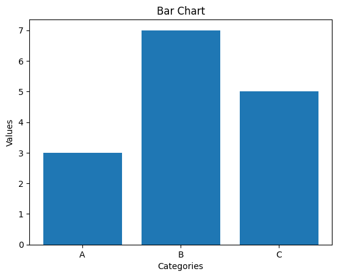

# NumPy – அறிமுகம் மற்றும் வரலாறு

ஒரு சாதாரண காரில் பயணிப்பதற்கும், ஒரு ஃபார்முலா 1 பந்தயக் காரில் சீறிப் பாய்வதற்கும் உள்ள வித்தியாசத்தை உங்களால் உணர முடிகிறதா? Python நிரலாக்க மொழியில், அதன் வழக்கமான `list`-களைப் பயன்படுத்துவது சாதாரண காரில் பயணம் செய்வது போல. ஆனால், **NumPy** என்ற நூலகத்தைப் பயன்படுத்துவது, ஒரு பந்தயக் காரின் வேகத்தை உங்களுக்குக் கொடுப்பது போல!

**NumPy** (Numerical Python என்பதன் சுருக்கம்) என்பது Python மொழியில் அறிவியல் மற்றும் கணிதக் கணக்கீடுகளைச் செய்வதற்கான ஒரு திறந்த மூல (open-source) நூலகம். இது வெறும் ஒரு நூலகம் மட்டுமல்ல, Python-ஐ தரவு அறிவியல் (Data Science), இயந்திர கற்றல் (Machine Learning) போன்ற துறைகளின் முடிசூடா மன்னனாக மாற்றிய ஒரு புரட்சிகரமான கருவி. இதன் மையப் புள்ளி, அதன் சக்திவாய்ந்த **பன்முக அணி (multi-dimensional array)** அமைப்புதான்.

#### ஒரு புதிய கருவியின் தேவை

கதை 1990-களில் தொடங்குகிறது. அப்போது, அறிவியலாளர்களும் பொறியாளர்களும் Python-இன் எளிமையால் ஈர்க்கப்பட்டு, அதைத் தங்கள் ஆய்வுக் கணக்கீடுகளுக்குப் பயன்படுத்த விரும்பினர். ஆனால் ஒரு சிக்கல் இருந்தது. Python, இயல்பாகவே பெரிய அளவிலான எண்களைக் கொண்ட அணிகளைக் (arrays) கையாள்வதில் மிகவும் மெதுவாக இருந்தது. ஆயிரக்கணக்கான எண்களைக் கொண்ட ஒரு பட்டியலை (list) வைத்துக்கொண்டு கணிதச் செயல்பாடுகளைச் செய்வது, ஒரு ஆமை வேகப் பந்தயத்தில் ஓடுவது போல இருந்தது.

இந்தத் தடையைத் தகர்க்க, இரண்டு முக்கிய முயற்சிகள் முளைத்தன:

1. **Numeric:** இது NumPy-யின் முன்னோடி. முதன்முறையாக Python-ல் அணிகளைக் கொண்டு அறிவியல் கணக்கீடுகளைச் செய்ய வழிவகுத்தது. இது ஒரு மிகச்சிறந்த தொடக்கமாக இருந்தாலும், அதன் செயல்திறனிலும், நெகிழ்வுத்தன்மையிலும் சில குறைகள் இருந்தன.
2. **Numarray:** Numeric-இன் குறைகளைச் சரிசெய்யும் நோக்கில் இது உருவாக்கப்பட்டது. இது பெரிய அளவிலான தரவுகளைக் கையாள்வதில் சிறந்து விளங்கியது. ஆனாலும், அதன் செயல்பாடுகளிலும் சில சிக்கல்கள் நீடித்தன.

இந்த இரண்டு நூலகங்களும் பயனுள்ளதாக இருந்தபோதிலும், அவை இரண்டும் தனித்தனியாகச் செயல்பட்டதால், Python சமூகத்தில் ஒருவித குழப்பம் நிலவியது. ஒரு திட்டத்திற்கு எதைப் பயன்படுத்துவது என்ற தெளிவு இல்லாமல் இருந்தது.

#### NumPy-யின் உதயம்: ஒரு ஒருங்கிணைந்த சக்தி

இந்தச் சூழலில்தான், 2005-ஆம் ஆண்டு **டிராவிஸ் ஒலிஃபன்ட் (Travis Oliphant)** என்ற தொலைநோக்கு சிந்தனையாளர், இந்த இரண்டு உலகங்களின் சிறந்த அம்சங்களை ஒன்றிணைத்து, அவற்றின் குறைகளைக் களைந்து, **NumPy** என்ற ஒற்றை, சக்திவாய்ந்த நூலகத்தை உருவாக்கினார்.

NumPy-யின் இதயத்துடிப்பு என்று அழைக்கப்படுவது அதன் **ndarray (N-dimensional array)** தான். இது வெறும் ஒரு தரவு அமைப்பு அல்ல; அது ஒரு செயல்திறன் அதிசயம்.

##### ndarray: ஏன் இவ்வளவு சக்தி வாய்ந்தது?

Python-இன் சாதாரண `list`-ஐ ஒரு மளிகைக் கடைப் பை போல கற்பனை செய்துகொள்ளுங்கள். அதில் நீங்கள் பழம், காய்கறி, பிஸ்கட் எனப் பலதரப்பட்ட பொருட்களை வைக்கலாம். ஆனால் NumPy-யின் `ndarray` என்பது முட்டைகளை வைக்கும் அட்டைப் பெட்டி போன்றது. அதில் ஒரே மாதிரியான, ஒரே அளவிலான பொருட்களை (எண்களை) மட்டுமே வைக்க முடியும்.

இந்தக் கட்டுப்பாடுதான் அதன் மிகப்பெரிய பலம். ஒரே வகையான தரவுகள் வரிசையாக நினைவகத்தில் (memory) சேமிக்கப்படுவதால், கணினியால் மிக மிக வேகமாகச் செயல்பட முடிகிறது. ஒரு `list`-ல் உள்ள ஒவ்வொரு எண்ணுக்கும் தனித்தனியாகக் கட்டளையிடுவதற்குப் பதிலாக, NumPy-யின் `ndarray`-ஐப் பயன்படுத்தி, இலட்சக்கணக்கான எண்களைக் கொண்ட ஒரு அணிக்கு **ஒரே கட்டளையில்** ஒரு கணிதச் செயல்பாட்டைச் செய்ய முடியும். இதுதான் NumPy-யின் அபார வேகத்திற்குக் காரணம்.

இந்த **ndarray** என்ற அஸ்திவாரத்தின் மீதுதான் இன்று நாம் காணும் தரவு அறிவியல் உலகமே கட்டமைக்கப்பட்டுள்ளது. வாருங்கள், இந்த எண்களின் வேகமான உலகத்திற்குள் பயணிப்போம்!

நிச்சயமாக! நீங்கள் வழங்கிய விளக்கத்தை, வாசகர்கள் எளிதில் புரிந்து கொள்ளும் வண்ணம், மேலும் தெளிவான எடுத்துக்காட்டுகளுடன் மெருகேற்றலாம். இதோ ஒரு மேம்படுத்தப்பட்ட வடிவம்:

#### ஏன் நமக்கு N-பரிமாண அணிகள் தேவை?

நம்மைச் சுற்றியுள்ள உலகம் தட்டையானது அல்ல. அது நீளம், அகலம், உயரம், ஆழம், நேரம் எனப் பல பரிமாணங்களைக் கொண்டது. இந்த சிக்கலான, பல அடுக்குகள் கொண்ட உலகத்தின் தகவல்களைக் கணினிக்குப் புரியவைக்க, ஒரு எளிய பட்டியல் (list) அல்லது ஒரு சாதாரண அட்டவணை (table) போதுமானதல்ல. இங்குதான் **N-பரிமாண அணிகள் (N-dimensional arrays)** ஒரு சக்திவாய்ந்த கருவியாக நமக்கு உதவுகின்றன.

எளிமையாகச் சொன்னால், நிஜ உலகின் பல அடுக்குத் தகவல்களை, கணினி புரிந்துகொள்ளும் மொழியில் கட்டமைக்கவே நமக்கு N-பரிமாண அணிகள் தேவை. இதை இரண்டு அற்புதமான எடுத்துக்காட்டுகள் மூலம் புரிந்துகொள்வோம்.

##### எடுத்துக்காட்டு 1: ஒரு புகைப்படத்திற்கு உயிர் கொடுப்பது எப்படி?

நாம் பார்க்கும் ஒவ்வொரு டிஜிட்டல் படமும் (digital image) எண்களால் ஆன ஒரு அணிதான்.

- **கருப்பு-வெள்ளைப் படம் (Grayscale Image):** ஒரு கருப்பு-வெள்ளைப் படத்தை, சதுரங்கப் பலகை (chessboard) போலக் கற்பனை செய்துகொள்ளுங்கள். அதில் நீளம் (rows), அகலம் (columns) என இரண்டு பரிமாணங்கள் மட்டுமே இருக்கும். ஒவ்வொரு கட்டத்திலும் (pixel), கருப்பின் அடர்த்தியைக் குறிக்க ஒரு எண் இருக்கும் (உதாரணமாக, 0 என்பது முழுமையான கருப்பு, 255 என்பது முழுமையான வெள்ளை). இது ஒரு **2D அணி (2D array)**.

  - `அணியின் வடிவம்: (உயரம், அகலம்)`

- **வண்ணப் படம் (Color Image):** ஆனால், நாம் பார்க்கும் பெரும்பான்மை படங்கள் வண்ணமயமானவை. கணினியைப் பொறுத்தவரை, ஒவ்வொரு வண்ணமும் **சிவப்பு (Red), பச்சை (Green), நீலம் (Blue)** ஆகிய மூன்று அடிப்படை வண்ணங்களின் கலவையே.

  சரி, இந்தக் கூடுதல் வண்ணத் தகவலை எங்கே சேமிப்பது? இங்குதான் மூன்றாவது பரிமாணம் வருகிறது. ஒரு வண்ணப் படம் என்பது, ஒரே அளவுள்ள மூன்று 2D அணிகளை ஒன்றன் மேல் ஒன்றாக அடுக்கி வைப்பதைப் போன்றது.

  1. முதல் அடுக்கு: படத்தில் உள்ள சிவப்பு நிறத்தின் அளவைக் குறிக்கும்.
  2. இரண்டாவது அடுக்கு: பச்சை நிறத்தின் அளவைக் குறிக்கும்.
  3. மூன்றாவது அடுக்கு: நீல நிறத்தின் அளவைக் குறிக்கும்.

  இந்த மூன்று அடுக்குகளும் சேரும்போதுதான் நமக்கு ஒரு முழுமையான வண்ணப் படம் கிடைக்கிறது. எனவே, ஒரு வண்ணப் படம் என்பது ஒரு **3D அணி (3D array)**.

  - `அணியின் வடிவம்: (உயரம், அகலம், வண்ண அடுக்குகள்)`

இப்படிப் படங்களை அணிகளாக மாற்றுவதால்தான், நம்மால் ஒரு படத்தின் பிரகாசத்தை மாற்றுவது, வண்ணங்களைச் சரிசெய்வது போன்ற எண்ணற்ற Image Processing வேலைகளை எளிதாகச் செய்ய முடிகிறது.

##### எடுத்துக்காட்டு 2: வானிலையைக் கணிப்பது

ஒரு நாட்டின் வானிலை என்பது மிகவும் சிக்கலான ஒரு விஷயம். வெப்பநிலை, ஈரப்பதம், காற்றின் வேகம் எனப் பல தகவல்கள் ஒவ்வொரு இடத்திலும், ஒவ்வொரு நேரத்திலும் மாறிக்கொண்டே இருக்கும். இந்தத் தகவலை எப்படி ஒரே இடத்தில் சேமிப்பது?

யோசித்துப் பாருங்கள்:

1. **பரிமாணம் 1 & 2 (இடம்):** முதலில், ஒரு நாட்டின் வரைபடத்தை **அட்சரேகை (latitude)** மற்றும் **தீர்க்கரேகை (longitude)** கொண்டு ஒரு 2D கட்டமாக உருவாக்குகிறோம்.
2. **பரிமாணம் 3 (நேரம்):** அடுத்து, ஒரு நாளின் 24 மணிநேரத்திற்கும் தகவல்களைச் சேமிக்க வேண்டும். இது நமது மூன்றாவது பரிமாணமாக, அதாவது **நேரம்**, அமைகிறது.
3. **பரிமாணம் 4 (தரவு வகை):** இப்போது, ஒவ்வொரு இடத்திலும், ஒவ்வொரு மணி நேரத்திற்கும், நாம் வெப்பநிலை, ஈரப்பதம் போன்ற வெவ்வேறு அளவீடுகளைச் சேமிக்க வேண்டும். இது நமது நான்காவது பரிமாணம்.

ஆக, ஒரு குறிப்பிட்ட பிராந்தியத்தின் ஒரு நாள் வானிலை அறிக்கையை முழுமையாகச் சேமிக்க, நமக்கு ஒரு **4D அணி (4D array)** தேவைப்படுகிறது.

- `அணியின் வடிவம்: (அட்சரேகை இடங்கள், தீர்க்கரேகை இடங்கள், நேரம், அளவீடுகள்)`

இந்தக் கட்டமைப்பைப் பயன்படுத்துவதன் மூலம், "நேற்று மதியம் 3 மணிக்கு, நாட்டின் வடக்குப் பகுதியில் சராசரி வெப்பநிலை என்ன?" என்பது போன்ற சிக்கலான கேள்விகளுக்கு நம்மால் உடனடியாக விடை காண முடியும்.

சுருக்கமாக, **N-பரிமாண அணிகள்** என்பவை சிக்கலான நிஜ உலகத் தரவுகளைக் கையாளவும், பகுப்பாய்வு செய்யவும், அறிவியல் கணக்கீடுகளை வேகமாகவும் திறமையாகவும் செய்யவும் நமக்குக் கிடைத்த ஒரு மிகச்சிறந்த கருவியாகும்.

**குறிப்பு:**

[Array programming with NumPy](https://www.nature.com/articles/s41586-020-2649-2)

**GitHub:** https://github.com/tamil-phy/NumPy_Book_Tamil

#### அத்தியாயம் 1: NumPy அணியின் குணாதிசயங்கள் (Array Attributes)

கற்பனை செய்துகொள்ளுங்கள், உங்களிடம் ஒரு சக்திவாய்ந்த, மர்மமான தரவுப் பெட்டி (data container) கிடைக்கிறது. அந்தப் பெட்டிக்குள் இருக்கும் பொருட்களைப் பயன்படுத்துவதற்கு முன்பு, பெட்டியைப் பற்றிய சில அடிப்படை விஷயங்களைத் தெரிந்துகொள்வது அவசியம் அல்லவா?

- அந்தப் பெட்டியின் வடிவம் என்ன? (What is its shape?)
- அது தட்டையானதா அல்லது ஆழமானதா? (Is it flat or deep?)
- உள்ளே இருக்கும் ஒவ்வொரு பொருளும் எவ்வளவு எடை கொண்டது? (How much does each item weigh?)
- அதைப் பாதுகாப்பாகக் கையாள்வதற்கான விதிகள் என்ன? (What are the handling instructions?)

NumPy-யில் நாம் உருவாக்கும் ஒவ்வொரு அணியும் (`array`) அப்படிப்பட்ட ஒரு தரவுப் பெட்டிதான். அந்த அணியின் குணாதிசயங்களை (`attributes`) விசாரிப்பது, அந்தப் பெட்டியின் மீது ஒட்டப்பட்டிருக்கும் "விவரச் சீட்டை" (`specification label`) படிப்பது போன்றது. வாருங்கள், அந்த விவரச் சீட்டில் என்னென்ன இருக்கிறது என்று பார்ப்போம்.

##### 1.1. `ndarray.shape` − அணியின் கட்டமைப்பு

ஒரு பெட்டியின் நீளம், அகலம், உயரம் எப்படி அதன் அளவைச் சொல்கிறதோ, அதுபோல **`shape`** (வடிவம்) என்ற குணம், ஒரு NumPy அணியின் கட்டமைப்பை நமக்குத் தெளிவாகக் காட்டுகிறது. எளிமையாகச் சொன்னால், ஓர் அணியில் **எத்தனை வரிசைகள் (`rows`)** மற்றும் **எத்தனை நிரல்கள் (`columns`)** உள்ளன என்பதைச் சொல்லும் முகவரிதான் `shape`.

**`shape`**-ஐ சோதிப்பது, நாம் எந்த மாதிரியான தரவுக் களத்தில் வேலை செய்யப் போகிறோம் என்பதைத் தெரிந்துகொள்ளும் முதல் படி.

**எடுத்துக்காட்டு:**

Python

```python
import numpy as np

# இரண்டு வரிசைகள் மற்றும் மூன்று நிரல்கள் கொண்ட ஒரு அணியை உருவாக்குவோம்
arr = np.array([[1, 2, 3], [4, 5, 6]])

print("அணியின் வடிவம் (Shape of array):", arr.shape)
```

**வெளியீடு:**

```python
அணியின் வடிவம் (Shape of array): (2, 3)
```

இந்த `(2, 3)` என்பது, நமது தரவுப் பெட்டியில் **2 வரிசைகளும்**, ஒவ்வொரு வரிசையிலும் **3 உறுப்புகளும்** உள்ளன என்பதைத் தெளிவாகக் காட்டுகிறது.

##### 1.2. `ndarray.ndim` − பரிமாணங்களின் எண்ணிக்கை

`shape` நமக்கு அணியின் அளவுகளைச் சொன்னால், **`ndim`** (N-Dimensions என்பதன் சுருக்கம்) அந்த அணிக்கு எத்தனை பரிமாணங்கள் (`dimensions`) உள்ளன என்பதைச் சொல்கிறது.

- `ndim = 1` என்றால், அது ஒரு தட்டையான பட்டியல் போன்ற **1D அணி**.
- `ndim = 2` என்றால், அது ஒரு அட்டவணை போன்ற **2D அணி**.
- `ndim = 3` என்றால், அது ஒன்றன் மேல் ஒன்றாக அடுக்கி வைக்கப்பட்ட பல அட்டவணைகள் போன்ற **3D அணி**.

நமது தரவுப் பெட்டி ஒரு கடிதம் போல தட்டையானதா (1D), ஒரு புகைப்படம் போல இரு பரிமாணம் கொண்டதா (2D), அல்லது ஒரு அட்டைப்பெட்டி போல முப்பரிமாணம் கொண்டதா (3D) என்பதை `ndim` ஒரு நொடியில் சொல்லிவிடும்.

**எடுத்துக்காட்டு:**

Python

```python
import numpy as np

arr = np.array([[1, 2, 3], [4, 5, 6]])

print("பரிமாணங்களின் எண்ணிக்கை (Number of dimensions):", arr.ndim)
```

**வெளியீடு:**

```python
பரிமாணங்களின் எண்ணிக்கை (Number of dimensions): 2
```

இந்த வெளியீடு, நாம் ஒரு 2D அணியுடன் (அட்டவணை போன்ற அமைப்பு) வேலை செய்கிறோம் என்பதை உறுதிப்படுத்துகிறது.

##### 1.3. `itemsize` − ஒவ்வொரு உறுப்பின் நினைவக அளவு

நமது தரவுப் பெட்டிக்குள் இருக்கும் ஒவ்வொரு பொருளும் ஒரே மாதிரியானவை என்று பார்த்தோம். **`itemsize`** (உறுப்பின் அளவு) என்ற குணம், அந்த அணியில் உள்ள **ஒவ்வொரு தனி உறுப்பும் (`element`)** கணினியின் நினைவகத்தில் (`memory`) எவ்வளவு இடத்தை (பைட்களில் `bytes`) எடுத்துக்கொள்கிறது என்பதைக் கூறுகிறது.

மிகப்பெரிய தரவுகளைக் கையாளும்போது, நினைவகப் பயன்பாட்டைக் கணக்கிட இந்தக் குணம் மிகவும் அவசியம்.

**எடுத்துக்காட்டு:**

Python

```python
import numpy as np

# இயல்பாக, முழு எண்கள் 64-bit integer ஆக சேமிக்கப்படும்
arr = np.array([1, 2, 3, 4, 5])

print("ஒவ்வொரு உறுப்பின் அளவு (Item size of array):", arr.itemsize, "bytes")
```

**வெளியீடு:**

```
ஒவ்வொரு உறுப்பின் அளவு (Item size of array): 8 bytes
```

இதன் பொருள், இந்த அணியில் உள்ள ஒவ்வொரு எண்ணும் கணினி நினைவகத்தில் 8 பைட்களை எடுத்துக்கொள்கிறது. இலட்சக்கணக்கான எண்களைக் கொண்ட ஒரு அணியை உருவாக்கும்போது, இந்த எண் எவ்வளவு முக்கியம் என்பது புரியும்!

##### 1.4. `flags` − அணியின் கையாளும் விதிகள்

ஒவ்வொரு பெட்டியின் மீதும் "Fragile" (உடையக்கூடியது), "This side up" (இந்தப் பக்கம் மேலே) போன்ற சில கையாளும் விதிமுறைகள் எழுதப்பட்டிருக்கும் அல்லவா? அதுபோல, **`flags`** (கொடிக்குறிப்புகள்) என்ற குணம், ஒரு NumPy அணியின் நினைவக அமைப்பு (`memory layout`) மற்றும் அதன் உள்ளார்ந்த பண்புகளைப் பற்றிய தொழில்நுட்ப விவரங்களைத் தருகிறது.

இது ஒரு ஆழமான தொழில்நுட்பப் பகுதி என்றாலும், இதன் மூலம் ஓர் அணி நினைவகத்தில் எவ்வாறு சேமிக்கப்பட்டுள்ளது, அதில் உள்ள தரவை நம்மால் மாற்ற முடியுமா (`writeable`) போன்ற முக்கியமான தகவல்களை அறியலாம்.

**எடுத்துக்காட்டு:**

Python

```python
import numpy as np

arr = np.array([1, 2, 3, 4, 5])

print("அணியின் கொடிக்குறிப்புகள் (Flags of the array):\n", arr.flags)
```

**வெளியீடு:**

```python
அணியின் கொடிக்குறிப்புகள் (Flags of the array):
  C_CONTIGUOUS : True
  F_CONTIGUOUS : True
  OWNDATA : True
  WRITEABLE : True
  ALIGNED : True
  WRITEBACKIFCOPY : False
```

இந்த வெளியீட்டில் உள்ள சில முக்கியக் குறிப்புகள்:

- **`C_CONTIGUOUS`**: தரவுகள் வரிசை வரிசையாக (C மொழி போல) நினைவகத்தில் தொடர்ச்சியாகச் சேமிக்கப்பட்டுள்ளன.
- **`WRITEABLE`**: `True` என இருப்பதால், இந்த அணியில் உள்ள மதிப்புகளை நம்மால் மாற்ற முடியும்.
- **`OWNDATA`**: இந்த அணி தனக்கென சொந்தமாக நினைவகத்தை ஒதுக்கியுள்ளது.

இந்தக் குணாதிசயங்கள், NumPy-யின் செயல்திறனுக்குப் பின்னால் இருக்கும் ரகசியங்களை நமக்குக் காட்டுகின்றன. ஒரு அணியின் இந்த "விவரச் சீட்டை" புரிந்துகொள்வது, அதை மேலும் திறமையாகக் கையாள நமக்கு உதவும்.

#### அத்தியாயம் 2: NumPy அணிகளை உருவாக்கும் வழிகள் (Array Creation Routines)

ஒரு சிறந்த ஓவியத்தை வரைவதற்கு முன், ஓவியர் தனக்கு ஏற்ற கேன்வாஸைத் (canvas) தேர்ந்தெடுப்பார். சில சமயங்களில் வேக வேகமாக ஒரு ஓவியத்தை வரையத் தொடங்க, ஏற்கெனவே இருக்கும் ஒரு கேன்வாஸைப் பயன்படுத்துவார். சில சமயங்களில், முற்றிலும் புதிதாக, கறுப்பு அல்லது வெள்ளை நிறத்தில் ஒரு கேன்வாஸைத் தயார் செய்வார்.

NumPy-யிலும் அப்படித்தான். நம்முடைய தரவுப் பகுப்பாய்வு அல்லது கணக்கீடுகள் என்ற ஓவியத்தை வரைவதற்கு முன், நமக்குத் தேவையான அணியை (`array`) என்ற கேன்வாஸை உருவாக்க வேண்டும். நமது தேவைக்கேற்ப, அந்த கேன்வாஸை உருவாக்க NumPy பல எளிய வழிகளைத் தருகிறது. வாருங்கள், அவற்றில் முக்கியமான மூன்றைப் பற்றிப் பார்ப்போம்.

##### 2.1. `numpy.empty` − மின்னல் வேகத்தில் ஒரு தளம்

ஒரு ஓவியர் மிக அவசரமாக ஒரு ஓவியத்தை வரையத் தொடங்க வேண்டும் என்று வைத்துக்கொள்வோம். அவர் புதிதாக ஒரு கேன்வாஸை உருவாக்கக் காத்திருக்காமல், ஸ்டுடியோவில் ஏற்கெனவே இருக்கும் ஒரு கேன்வாஸை எடுத்து அப்படியே வரையத் தொடங்கிவிடுவார். அந்தப் பழைய கேன்வாஸில் ஏற்கெனவே சில கிறுக்கல்கள் இருக்கலாம், ஆனால் அவர் அதைப்பற்றிக் கவலைப்பட மாட்டார், ஏனெனில் அவர் அதன் மேல் முழுமையாகப் புதிய வண்ணங்களைப் பூசப் போகிறார்.

**`numpy.empty`** என்ற செயற்கூறு (`function`) அப்படித்தான் செயல்படுகிறது. இது ஒரு புதிய அணியை மிக மிக வேகமாக உருவாக்கும். ஆனால், அது அந்த அணிக்கான இடத்தை நினைவகத்தில் (`memory`) ஒதுக்குமே தவிர, அதில் உள்ள பழைய மதிப்புகளை நீக்காது. அதனால், அந்த இடத்தில் ஏற்கெனவே இருந்த குப்பை மதிப்புகளே (`junk values`) அந்த அணியில் இருக்கும்.

**எப்போது பயன்படுத்த வேண்டும்?** ஓர் அணியை உருவாக்கிய அடுத்த நொடியே, அதில் உள்ள எல்லா இடங்களையும் உங்கள் சொந்த மதிப்புகளைக் கொண்டு நிரப்பப் போகிறீர்கள் என்றால், தொடக்க மதிப்புகள் பற்றி உங்களுக்குக் கவலை இல்லை. அந்தச் சமயத்தில், வேகத்திற்காக `numpy.empty`-ஐப் பயன்படுத்தலாம்.

**எடுத்துக்காட்டு:**

Python

```python
import numpy as np

# 2 வரிசை, 3 நிரல்களுடன் ஒரு காலி அணியை உருவாக்குதல்
empty_array = np.empty((2, 3))

print("காலி அணி (Empty array):\n", empty_array)
```

**வெளியீடு:**

```python
காலி அணி (Empty array):
 [[2.12199579e-314 6.36598737e-315 8.48798316e-315]
 [1.06099790e-314 1.27319747e-314 1.48539705e-314]]
```

**கவனம்:** ⚠️ இங்கு வரும் மதிப்புகள் ஒவ்வொரு முறையும் மாறக்கூடியவை. இவை கணினியின் நினைவகத்தில் அந்த நேரத்தில் இருந்த தேவையற்ற மதிப்புகள். இந்த அணியின் மதிப்புகளை நம்பி எந்தக் கணக்கீட்டையும் செய்யக்கூடாது.

##### 2.2. `numpy.zeros` − ஒரு சுழியத் தொடக்கம்

சில சமயங்களில், ஓவியர் தன் ஓவியத்தை ஒரு முழுமையான கறுப்பு நிறப் பின்னணியில் இருந்து தொடங்க விரும்புவார். அது ஓவியத்திற்கு ஒரு புதிய பரிமாணத்தைக் கொடுக்கும்.

**`numpy.zeros`** என்ற செயற்கூறு, அப்படிப்பட்ட ஒரு கறுப்பு கேன்வாஸை நமக்குத் தருகிறது. இது நாம் கேட்கும் வடிவில் (`shape`) ஓர் அணியை உருவாக்கி, அதன் அனைத்து உறுப்புகளையும் (`elements`) **சுழியம் (`0`)** என்ற மதிப்பைக் கொண்டு நிரப்பும். இது மிகவும் பாதுகாப்பான மற்றும் கணிக்கக்கூடிய ஒரு தொடக்கத்தைத் தருகிறது.

**எப்போது பயன்படுத்த வேண்டும்?** நீங்கள் ஒரு கணக்கீட்டின் தொடக்க மதிப்பை சுழியத்திலிருந்து தொடங்க விரும்பும்போது, (உதாரணமாக, மதிப்பெண்களைக் கூட்டத் தொடங்கும் முன் மொத்த மதிப்பை 0 என வைப்பது போல) `numpy.zeros` மிகவும் பயனுள்ளதாக இருக்கும்.

**எடுத்துக்காட்டு:**

Python

```python
import numpy as np

# 2x2 வடிவில் சுழியங்கள் நிறைந்த அணியை உருவாக்குதல்
zeros_array = np.zeros((2, 2))

print("சுழிய அணி (Zeros array):\n", zeros_array)
```

**வெளியீடு:**

```python
சுழிய அணி (Zeros array):
 [[0. 0.]
 [0. 0.]]
```

பார்த்தீர்களா? எந்தக் குழப்பமும் இல்லாத, சுத்தமான, கணிக்கக்கூடிய ஒரு தொடக்கம்.

##### 2.3. `numpy.ones` − ஒன்றிலிருந்து தொடங்குவோம்

சில கணக்கீடுகளுக்கு, நமக்கு சுழியம் ஒரு நல்ல தொடக்கமாக இருக்காது. பெருக்கல் போன்ற சில கணிதச் செயல்பாடுகளுக்கு, தொடக்க மதிப்பை `1` என வைப்பது பயனுள்ளதாக இருக்கும். இதை, ஓவியர் தன் கேன்வாஸை வெள்ளை நிறப் பின்னணியில் இருந்து தொடங்குவதுடன் ஒப்பிடலாம்.

**`numpy.ones`** என்ற செயற்கூறு, நாம் கேட்கும் வடிவில் ஓர் அணியை உருவாக்கி, அதன் அனைத்து உறுப்புகளையும் **ஒன்று (`1`)** என்ற மதிப்பைக் கொண்டு நிரப்புகிறது.

**எடுத்துக்காட்டு:**

Python

```python
import numpy as np

# 3x3 வடிவில் ஒன்றுகள் நிறைந்த அணியை உருவாக்குதல்
ones_array = np.ones((3, 3))

print("ஒன்று அணி (Ones array):\n", ones_array)
```

**வெளியீடு:**

```python
ஒன்று அணி (Ones array):
 [[1. 1. 1.]
 [1. 1. 1.]
 [1. 1. 1.]]
```

சுருக்கமாகச் சொன்னால், உங்கள் தேவைக்கேற்ப சரியான கேன்வாஸைத் தேர்ந்தெடுங்கள்:

- **அதிகபட்ச வேகம் தேவையெனில்:** `np.empty()` (பயன்படுத்திய கேன்வாஸ்)
- **பாதுகாப்பான, சுழியத் தொடக்கம் தேவையெனில்:** `np.zeros()` (கறுப்பு கேன்வாஸ்)
- **குறிப்பிட்ட, ஒன்றென்ற தொடக்கம் தேவையெனில்:** `np.ones()` (வெள்ளை கேன்வாஸ்)


#### அத்தியாயம் 3: NUMPY − ARRAY FROM EXISTING DATA (ஏற்கெனவே உள்ள தரவிலிருந்து ஓர் அணியை உருவாக்குதல்)

ஒரு திறமையான சிற்பி, தன்னிடம் வரும் மூலப்பொருட்கள் எந்த வடிவில் இருந்தாலும்—அது ஒரு பாறையாக இருந்தாலும், மரத்துண்டாக இருந்தாலும், அல்லது உடைந்த சிலைகளின் பாகங்களாக இருந்தாலும்—அதை நேர்த்தியாகச் செதுக்கி ஒரு அற்புதமான சிற்பமாக மாற்றுவார்.

NumPy-யும் அப்படித்தான். நம்முடைய தரவுகள் Python-ல் பல வடிவங்களில் இருக்கலாம். ஒரு சாதாரணமான பட்டியல் (`list`), கணினியின் நினைவகத்தில் இருக்கும் ஒரு மூலத் தரவுப் பகுதி (`buffer`), அல்லது தேவைக்கேற்ப மதிப்புகளை உருவாக்கும் ஒரு நீரோடை (`iterable`) என எப்படி இருந்தாலும், NumPy அவற்றை சக்திவாய்ந்த அணிகளாக (`arrays`) மாற்றும் கருவிகளைக் கொண்டுள்ளது.

இந்த அத்தியாயத்தில், வெவ்வேறு மூலப்பொருட்களை NumPy என்ற சிற்பி எப்படித் தனக்கு ஏற்றவாறு செதுக்கிக் கொள்கிறார் என்று பார்ப்போம்.

##### 3.1. `numpy.asarray` − மளிகைப் பையிலிருந்து மாற்றுதல்

நம்மிடம் இருக்கும் தரவுகளில் மிகவும் பொதுவானது Python `list`. இதை ஒரு மளிகைப் பை (`grocery bag`) என்று கற்பனை செய்துகொள்ளுங்கள். **`asarray`** என்ற செயற்கூறு (`function`), அந்தப் பையில் இருக்கும் பொருட்களை எடுத்து, நேர்த்தியாக NumPy என்ற பாத்திரத்தில் வைக்கும் ஒரு புத்திசாலியான வேலையாள்.

இதன் மிகப்பெரிய சிறப்பு என்னவென்றால், நீங்கள் கொடுக்கும் பொருள் ஏற்கெனவே ஒரு NumPy பாத்திரத்தில் (அணியில்) இருந்தால், இந்த வேலையாள் அதை மீண்டும் ஒரு புதிய பாத்திரத்திற்கு மாற்ற மாட்டார். இதனால், தேவையற்ற நகல் எடுப்பது தவிர்க்கப்பட்டு, நினைவகம் (`memory`) சேமிக்கப்படுகிறது.

**எடுத்துக்காட்டு:**

Python

```python
import numpy as np

# நமது மளிகைப் பை (Python list)
list_data = [10, 20, 30, 40, 50]

# அதை NumPy பாத்திரத்திற்கு (array) மாற்றுவோம்
array_data = np.asarray(list_data)

print("பட்டியலிலிருந்து உருவான அணி (Array from list):", array_data)
print("அணியின் வகை (Type of array):", type(array_data))
```

**வெளியீடு:**

```python
பட்டியலிலிருந்து உருவான அணி (Array from list): [10 20 30 40 50]
அணியின் வகை (Type of array): <class 'numpy.ndarray'>
```

சாதாரண `list`-ஆக இருந்தது, இப்போது NumPy-யின் சக்திவாய்ந்த செயல்பாடுகளுக்குத் தயாராகிவிட்டது.

##### 3.2. `numpy.frombuffer` − மூலப் பொட்டலத்தைப் பிரித்தல்

சில சமயங்களில், தரவுகள் நமக்கு நேரடியாகப் புரியும் வடிவில் இருக்காது. அவை கணினியின் நினைவகத்தில் பைனரி (`binary`) வடிவில், அதாவது ஒருவித மூலக் குறியீடு போல, ஒரு பொட்டலத்தில் (`buffer`) அடைக்கப்பட்டிருக்கும்.

**`frombuffer`** என்ற கருவி, அந்தப் பொட்டலத்தைப் பிரித்து, உள்ளே இருக்கும் மூலத் தரவை நாம் குறிப்பிடும் வடிவில் (எடுத்துக்காட்டாக, ஒவ்வொரு எழுத்தாக) தனித்தனி உறுப்புகளாக மாற்றி ஓர் அணியை உருவாக்கும் ஒரு சிறப்பு நிபுணர். இது பெரும்பாலும் கோப்புகளைப் படிக்கும்போதும், பிணையத் தரவுகளைக் கையாளும்போதும் பயன்படும்.

**எடுத்துக்காட்டு:**

Python

```python
import numpy as np

# b'...' என்பது ஒரு பைனரி தரவுப் பொட்டலம்
buffer_data = b'Gemini AI'

# அந்தப் பொட்டலத்தை ஒவ்வொரு எழுத்தாக ('S1') பிரிக்கச் சொல்கிறோம்
array_buffer = np.frombuffer(buffer_data, dtype='S1')

print("பொட்டலத்திலிருந்து உருவான அணி (Array from buffer):", array_buffer)
```

**வெளியீடு:**

```python
பொட்டலத்திலிருந்து உருவான அணி (Array from buffer):
 [b'G' b'e' b'm' b'i' b'n' b'i' b' ' b'A' b'I']
```

பார்த்தீர்களா, `frombuffer` அந்த மூலப் பொட்டலத்தை நேர்த்தியாகப் பிரித்து, ஒவ்வொரு உறுப்பையும் தனித்தனியாகக் கொடுத்துவிட்டது.

##### 3.3. `numpy.fromiter` − நீரோடையிலிருந்து சேகரித்தல்

சில நேரங்களில், நமக்குத் தேவையான எல்லாத் தரவுகளும் ஒரே நேரத்தில் கிடைக்காது. அவை ஒரு நீரோடை (`stream`) அல்லது நகரும் பட்டை (`conveyor belt`) போல, தேவைக்கேற்ப ஒவ்வொன்றாக வந்து கொண்டிருக்கும். இப்படிப்பட்ட `iterable` அல்லது `generator` வகை தரவுகளைக் கையாளவே **`fromiter`** என்ற செயற்கூறு உதவுகிறது.

இது மிகவும் நினைவகத் திறன்கொண்டது (`memory-efficient`). ஏனெனில், இது எல்லாத் தரவுகளும் வரும் வரை காத்திருந்து ஒரு பெரிய பட்டியலை உருவாக்காது. மாறாக, நீரோடையில் இருந்து வரும் ஒவ்வொரு மதிப்பையும் உடனடியாக எடுத்து, நேராக NumPy அணிக்குள் சேகரித்துவிடும்.

**எடுத்துக்காட்டு:**

range(5)-ல் உள்ள ஒவ்வொரு எண்ணையும் இரண்டால் பெருக்கி வரும் மதிப்புகளைக் கொண்ட ஒரு நீரோடையை (iterable) உருவாக்குவோம்.

Python

```python
import numpy as np

# இது ஒரு நீரோடை. மதிப்புகள் தேவைப்படும்போது மட்டுமே உருவாகும்.
iterable_data = (x * 2 for x in range(5))

# fromiter, அந்த ஓடையில் இருந்து மதிப்புகளைச் சேகரிக்கிறது
array_iter = np.fromiter(iterable_data, dtype='int32')

print("நீரோடையிலிருந்து உருவான அணி (Array from iterable):", array_iter)
```

**வெளியீடு:**

```python
நீரோடையிலிருந்து உருவான அணி (Array from iterable): [0 2 4 6 8]
```

`fromiter` அந்த நீரோடையில் இருந்து ஒவ்வொரு மதிப்பாக (0, 2, 4, 6, 8) எடுத்து, ஒரு முழுமையான NumPy அணியை உருவாக்கிவிட்டது.

**சுருக்கம்: சரியான கருவியைத் தேர்ந்தெடுங்கள்**

| செயற்கூறு (Function) | உவமை (Analogy)              | எப்போது பயன்படுத்த வேண்டும்?                                 |
| ------------------- | --------------------------- | ------------------------------------------------------- |
| `np.asarray()`      | மளிகைப் பை (Grocery Bag)     | Python `list` அல்லது `tuple`-களை மாற்ற. (நினைவகச் சிக்கனம்)  |
| `np.frombuffer()`   | மூலப் பொட்டலம் (Sealed Packet) | பைனரி (`binary`) தரவுகளைக் கையாள. (மேம்பட்ட பயன்பாடு)       |
| `np.fromiter()`     | நகரும் பட்டை (Conveyor Belt)  | `iterable`-களை நினைவகத் திறனுடன் மாற்ற. (பெரிய தரவுகளுக்கு) |

#### அத்தியாயம் 4: NUMPY − ARRAY FROM NUMERICAL RANGES  (எண் வரம்புகளிலிருந்து ஓர் அணியை உருவாக்குதல்)

தரவு அறிவியலில் பல நேரங்களில், நம்மிடம் தரவுகள் இருக்காது; மாறாக, நாமே ஒரு எண் தொடரை (`sequence of numbers`) உருவாக்க வேண்டியிருக்கும். இதை ஒரு நீண்ட பாதையில், குறிப்பிட்ட இடங்களில் கற்களை வைப்பதற்கு ஒப்பிடலாம். பாதையின் தொடக்கம் எங்கே, முடிவு எங்கே, ஒவ்வொரு கல்லுக்கும் எவ்வளவு இடைவெளி இருக்க வேண்டும் என்பதை நாம்தான் தீர்மானிக்க வேண்டும்.

NumPy, இப்படிப்பட்ட எண் பாதைகளை உருவாக்க மூன்று விதமான கருவிகளை நமக்குத் தருகிறது. ஒவ்வொன்றும் ஒரு குறிப்பிட்ட முறையில் கற்களை வைப்பதற்கு உதவுகிறது.

##### 4.1. `numpy.arange` − குறிப்பிட்ட இடைவெளியில் கல் வைத்தல்

இது பாதையில் கல் வைப்பதற்கான மிகவும் நேரடியான முறை. **`arange`** (Arrange என்பதன் சுருக்கம்) என்ற கருவியைப் பயன்படுத்தும்போது, நீங்கள் மூன்று விஷயங்களைக் குறிப்பிடுவீர்கள்:

1. **தொடக்கம் (`start`):** முதல் கல்லை எங்கே வைக்க வேண்டும்?
2. **முடிவு (`stop`):** எந்த இடத்திற்கு முன்புவரை கற்களை வைக்க வேண்டும்?
3. **இடைவெளி (`step`):** ஒவ்வொரு கல்லுக்கும் இடையில் எவ்வளவு தூரம் இருக்க வேண்டும்?

இது Python-ல் உள்ள `range()` செயற்கூறு போன்றதே. ஆனால் இது மிதக்கும் புள்ளி எண்களையும் (`floating point numbers`) கையாளும் மற்றும் NumPy அணியை உருவாக்கும்.

எடுத்துக்காட்டு:

1-லிருந்து தொடங்கி, 10-க்குள், ஒவ்வொரு கல்லுக்கும் 2 அடி இடைவெளி விட்டு வைப்போம்.

Python

```python
import numpy as np

# arange(தொடக்கம், முடிவு, இடைவெளி)
array_arange = np.arange(1, 10, 2)

print("arange மூலம் உருவான அணி:", array_arange)
```

**வெளியீடு:**

```python
arange மூலம் உருவான அணி: [1 3 5 7 9]
```

பார்த்தீர்களா? 1-ல் தொடங்கி, ஒவ்வொரு முறையும் 2 அடி இடைவெளி விட்டு, 10-ஐத் தாண்டுவதற்கு முன்புவரை கற்கள் அழகாக அடுக்கப்பட்டுவிட்டன.

##### 4.2. `numpy.linspace` − சமமான எண்ணிக்கையில் கல் வைத்தல்

இப்போது, முறையைச் சற்று மாற்றுவோம். எவ்வளவு இடைவெளி என்பதைக் குறிப்பிடாமல், ஒரு பாதையின் தொடக்கத்தையும் முடிவையும் சொல்லி, **"சரியாக இத்தனை கற்களை மட்டும் சமமான இடைவெளியில் வைக்க வேண்டும்"** என்று கூறினால் எப்படி? அதுதான் **`linspace`** (Linearly Spaced என்பதன் சுருக்கம்) செய்யும் வேலை.

நீங்கள் குறிப்பிடும் எண்ணிக்கையில் கற்களை சமமான இடைவெளியில் வைக்க, ஒவ்வொரு கல்லுக்கும் எவ்வளவு இடைவெளி தேவை என்பதை `linspace` தானாகவே கணக்கிட்டுக் கொள்ளும்.

**முக்கிய குறிப்பு:** `arange` போலல்லாமல், `linspace` **முடிவு மதிப்பையும் (`stop` value) அணியில் சேர்த்துக்கொள்ளும்**.

எடுத்துக்காட்டு:

0-விலிருந்து 10 மீட்டர் நீளமுள்ள ஒரு பாதையில், சரியாக 5 கற்களை சமமான இடைவெளியில் வைப்போம்.

Python

```python
import numpy as np

# linspace(தொடக்கம், முடிவு, கற்களின் எண்ணிக்கை)
array_linspace = np.linspace(0, 10, 5)

print("linspace மூலம் உருவான அணி:", array_linspace)
```

**வெளியீடு:**

```python
linspace மூலம் உருவான அணி: [ 0.   2.5  5.   7.5 10. ]
```

0-விற்கும் 10-க்கும் இடையில் 5 கற்களை சமமாக அடுக்க, ஒவ்வொரு கல்லுக்கும் 2.5 மீட்டர் இடைவெளி தேவை என்பதை `linspace` தானாகவே கணக்கிட்டு, கற்களை வைத்துவிட்டது.

##### 4.3. `numpy.logspace` − அதிவேகமாக கல் வைத்தல்

சில நேரங்களில், பாதையின் தொடக்கத்தில் கற்களை நெருக்கமாகவும், போகப்போக கற்களின் இடைவெளியை அதிவேகமாக (exponentially) அதிகரித்துக்கொண்டே செல்ல வேண்டியிருக்கும். இதை ஒரு ராக்கெட் கிளம்புவது போல கற்பனை செய்துகொள்ளுங்கள்; முதலில் மெதுவாகவும், பின்னர் மிக வேகமாகவும் பயணிக்கும்.

**`logspace`** (Logarithmically Spaced என்பதன் சுருக்கம்) இந்த வேலையைச் செய்கிறது. இது மடக்கை அளவில் (`logarithmic scale`) சமமான இடைவெளியில் எண்களை உருவாக்கும். இது அதிர்வெண் பகுப்பாய்வு (`frequency analysis`) போன்ற அறிவியல் கணக்கீடுகளில் மிகவும் பயனுள்ளதாக இருக்கும்.

சுருக்கமாக, `logspace(1, 3, 5)` என்றால், 101-க்கும் 103-க்கும் இடையில், மடக்கை அளவில் 5 சம இடைவெளிகளை உருவாக்கு என்று பொருள்.

எடுத்துக்காட்டு:

101 (10) க்கும் 103 (1000) க்கும் இடையில் 5 கற்களை மடக்கை அளவில் வைப்போம்.

Python

```python
import numpy as np

# logspace(தொடக்கம்^, முடிவு^, எண்ணிக்கை) -> 10^1, 10^3
array_logspace = np.logspace(1, 3, 5)

print("logspace மூலம் உருவான அணி:", array_logspace)
```

**வெளியீடு:**

```python
logspace மூலம் உருவான அணி: [   10.           31.6227766   100.          316.22776602 1000.        ]
```

இங்கே, தொடக்கத்தில் இடைவெளி குறைவாகவும் (10-க்கும் 31-க்கும் இடையில்), போகப்போக இடைவெளி அதிவேகமாக அதிகரிப்பதையும் (316-க்கும் 1000-க்கும் இடையில்) காணலாம்.

**சுருக்கம்: எந்தக் கருவி எப்போது?**

| செயற்கூறு (Function) | மையக்கரு (Core Idea)                               | எதைக் கட்டுப்படுத்துகிறோம்?                        |
| ------------------- | ------------------------------------------------- | --------------------------------------------- |
| `np.arange()`       | குறிப்பிட்ட படி அளவு (Fixed Step Size)              | ஒவ்வொரு படிக்கும் உள்ள **இடைவெளியை**.             |
| `np.linspace()`     | குறிப்பிட்ட படிகளின் எண்ணிக்கை (Fixed Number of Steps) | பாதையில் வைக்கப்படும் **மொத்த படிகளின் எண்ணிக்கையை**. |
| `np.logspace()`     | அதிவேகப் படிகள் (Exponential Steps)                 | பரந்த எண் வரம்பை (பல மடங்கு மதிப்புகள்) ஆராய.       |


### அத்தியாயம் 5: NumPy − உங்களுக்குத் தேவையானதைத் தேர்ந்தெடுத்தல் (Indexing & Slicing)

ஒரு பெரிய நூலக அலமாரியில் (`bookshelf`) ஆயிரக்கணக்கான புத்தகங்கள் வரிசையாக அடுக்கப்பட்டிருப்பதாகக் கற்பனை செய்துகொள்ளுங்கள். NumPy அணி என்பதும் அப்படியான ஒரு நேர்த்தியான அலமாரிதான். இப்போது, அந்த அலமாரியிலிருந்து உங்களுக்குத் தேவையான புத்தகங்களை எப்படி எடுப்பீர்கள்?

- **ஒரு குறிப்பிட்ட புத்தகம் வேண்டுமானால்:** அதன் சரியான இடத்தைச் சொல்லி எடுப்பீர்கள். (உதாரணமாக, "மேலிருந்து இரண்டாவது வரிசையில், இடமிருந்து ஐந்தாவது புத்தகம்").
- **ஒரு பகுதி புத்தகங்கள் வேண்டுமானால்:** "இந்த வரிசையில் உள்ள 3-வது புத்தகத்திலிருந்து 7-வது புத்தகம் வரை அனைத்தையும் கொடு" என்று கேட்பீர்கள்.

இந்த இரண்டு வழிகள்தான் NumPy-யில் **Indexing** மற்றும் **Slicing**. இது தரவுகளைப் பிரித்தெடுப்பதற்கும், கையாளுவதற்கும் மிகவும் அடிப்படையான மற்றும் சக்திவாய்ந்த முறையாகும்.

##### 1. ஒரு வரிசை அலமாரி (1D Array) – அடிப்படைகள்

முதலில், ஒரே ஒரு வரிசை கொண்ட எளிய அலமாரியைப் பார்ப்போம்.

Python

```python
import numpy as np

# நமது ஒற்றை வரிசை அலமாரி
arr = np.array([10, 20, 30, 40, 50, 60])
```

##### Indexing: ஒரு குறிப்பிட்ட புத்தகத்தை எடுத்தல்

அலமாரியில் உள்ள ஒரு குறிப்பிட்ட புத்தகத்தை அதன் வரிசை எண்ணைச் சொல்லி எடுப்பதே **Indexing**.

**மிக முக்கியமான விதி:** NumPy (மற்றும் பெரும்பாலான நிரலாக்க மொழிகளில்) எண்ணுவது `0`-விலிருந்து தொடங்கும். எனவே, முதல் புத்தகம் `0`-வது இடத்திலும், இரண்டாவது புத்தகம் `1`-வது இடத்திலும் இருக்கும்.

Python

```python
# 3-வது இடத்தில் (index 2) உள்ள புத்தகத்தை எடுப்போம்
print("3-வது இடத்தில் உள்ள உறுப்பு:", arr[2])

# கடைசிப் புத்தகத்தை எடுக்க ஒரு தந்திரம்: எதிர்மறை குறியீடு (negative index)
print("கடைசி உறுப்பு:", arr[-1])
print("கடைசியிலிருந்து இரண்டாவது உறுப்பு:", arr[-2])
```

**வெளியீடு:**

```python
3-வது இடத்தில் உள்ள உறுப்பு: 30
கடைசி உறுப்பு: 60
கடைசியிலிருந்து இரண்டாவது உறுப்பு: 50
```

##### Slicing: ஒரு பகுதி புத்தகங்களை எடுத்தல்

அலமாரியின் ஒரு குறிப்பிட்ட பகுதியை அப்படியே வெட்டி எடுப்பதே **Slicing**. இதற்கு `[தொடக்கம் : முடிவு]` என்ற வடிவமைப்பைப் பயன்படுத்துவோம்.

**மிக முக்கியமான விதி:** `முடிவு` (`stop`) என்று குறிப்பிடும் இடத்திற்கு **முந்தைய இடம் வரை** மட்டுமே உறுப்புகள் எடுக்கப்படும். `arr[1:4]` என்றால், 1-வது இடத்திலிருந்து தொடங்கி, 4-வது இடத்திற்கு முன்புவரை (அதாவது 1, 2, 3) உள்ள உறுப்புகளை எடு என்று பொருள்.

Python

```python
# 2-வது இடத்திலிருந்து (index 1) 5-வது இடத்திற்கு (index 4) முன்புவரை எடுப்போம்
print("ஒரு பகுதி (Slice):", arr[1:4])

# தொடக்கத்திலிருந்து 3-வது இடம் வரை
print("தொடக்கத்திலிருந்து ஒரு பகுதி:", arr[:3])

# 3-வது இடத்திலிருந்து கடைசி வரை
print("ஒரு இடத்திலிருந்து கடைசி வரை:", arr[2:])
```

**வெளியீடு:**

```python
ஒரு பகுதி (Slice): [20 30 40]
தொடக்கத்திலிருந்து ஒரு பகுதி: [10 20 30]
ஒரு இடத்திலிருந்து கடைசி வரை: [30 40 50 60]
```

##### 2. பல அடுக்கு அலமாரி (2D Array) – உண்மையான சக்தி

NumPy-யின் உண்மையான பலம், பல அடுக்குகள் கொண்ட அலமாரிகளை (2D அணிகளை) கையாளும்போதுதான் வெளிப்படுகிறது. இங்கே ஒரு புத்தகத்தை எடுக்க, அது **எந்த வரிசையில் (row)**, **எந்த இடத்தில் (column)** இருக்கிறது என்று சொல்ல வேண்டும்.

Python

```python
# 3 வரிசைகள், 4 நிரல்கள் கொண்ட பல அடுக்கு அலமாரி
bookcase = np.array([[10, 11, 12, 13],
                     [20, 21, 22, 23],
                     [30, 31, 32, 33]])
```

**ஒரு குறிப்பிட்ட உறுப்பை எடுத்தல்**

`[வரிசை, நிரல்]` என்ற குறியீட்டைப் பயன்படுத்துவோம்.

Python

```python
# 2-வது வரிசையில் (index 1), 3-வது இடத்தில் (index 2) உள்ள புத்தகம்
element = bookcase[1, 2]
print("குறிப்பிட்ட உறுப்பு:", element)  # வெளியீடு: 22
```

**ஒரு முழு வரிசையை (Row) எடுத்தல்**

ஒரு வரிசையில் உள்ள அனைத்துப் புத்தகங்களையும் எடுக்க, நிரல் (`column`) இடத்தில் `:` குறியீட்டைப் பயன்படுத்தவும்.

Python

```python
# 2-வது வரிசையை (index 1) முழுமையாக எடுப்போம்
row_slice = bookcase[1, :]
print("ஒரு முழு வரிசை:", row_slice)  # வெளியீடு: [20 21 22 23]
```

**ஒரு முழு நிரலை (Column) எடுத்தல்**

அலமாரியில் உள்ள ஒவ்வொரு வரிசையிலிருந்தும், ஒரு குறிப்பிட்ட இடத்தில் உள்ள புத்தகத்தை மட்டும் எடுக்க, வரிசை (`row`) இடத்தில் `:` குறியீட்டைப் பயன்படுத்தவும்.

Python

```python
# 3-வது நிரலை (index 2) முழுமையாக எடுப்போம்
col_slice = bookcase[:, 2]
print("ஒரு முழு நிரல்:", col_slice)  # வெளியீடு: [12 22 32]
```

**ஒரு பகுதி அலமாரியை எடுத்தல் (Sub-matrix)**

அலமாரியின் ஒரு குறிப்பிட்ட செவ்வகப் பகுதியை வெட்டி எடுக்கலாம்.

Python

```python
# முதல் இரண்டு வரிசைகளில், 2-வது மற்றும் 3-வது நிரல்களை எடுப்போம்
sub_matrix = bookcase[0:2, 1:3]
print("ஒரு பகுதி அலமாரி:\n", sub_matrix)
```

**வெளியீடு:**

```python
ஒரு பகுதி அலமாரி:
 [[11 12]
 [21 22]]
```

Indexing மற்றும் Slicing-ல் தேர்ச்சி பெறுவது, NumPy-யில் தரவுகளைக் கையாள்வதற்கான திறவுகோல். இதன் மூலம், எவ்வளவு பெரிய தரவுக் கட்டமைப்பாக இருந்தாலும், நமக்குத் தேவையான பகுதியைத் துல்லியமாகப் பிரித்தெடுக்க முடியும்.


### அத்தியாயம் 6: NumPy − மேம்பட்ட தேர்வு முறைகள் (Advanced Indexing)

கடந்த அத்தியாயத்தில், நமது நூலக அலமாரியிலிருந்து ஒரு குறிப்பிட்ட புத்தகத்தையோ (`Indexing`) அல்லது ஒரு நேர்த்தியான பகுதிப் புத்தகங்களையோ (`Slicing`) எப்படி எடுப்பது என்று பார்த்தோம்.

ஆனால், உங்கள் தேவை இன்னும் சிக்கலானதாக இருந்தால் என்ன செய்வது?

- "முதல் வரிசையில் 2-வது புத்தகம், மூன்றாவது வரிசையில் 4-வது புத்தகம், இரண்டாவது வரிசையில் 1-வது புத்தகம் வேண்டும்" என்று **ஒரே நேரத்தில் பல இடங்களில் இருந்து** புத்தகங்களைக் கேட்க வேண்டுமானால்?
- "இந்த அலமாரியில், 500 பக்கங்களுக்கு மேல் உள்ள எல்லாப் புத்தகங்களையும் கொடுங்கள்" என்று **ஒரு நிபந்தனையின் அடிப்படையில்** புத்தகங்களைத் தேர்ந்தெடுக்க வேண்டுமானால்?

இப்படிப்பட்ட சிக்கலான தேர்வுகளைச் செய்வதற்கான மந்திரக் கருவிகள்தான் **மேம்பட்ட தேர்வு முறைகள் (Advanced Indexing)**.

##### 6.1. Integer Array Indexing − உங்கள் விருப்பத் தேர்வுப் பட்டியல்

இது நூலகரிடம் ஒரு **தனிப்பயன் தேர்வுப் பட்டியலைக் (custom shopping list)** கொடுப்பது போன்றது. அந்தப் பட்டியலில், உங்களுக்குத் தேவையான புத்தகங்களின் வரிசை மற்றும் நிரல் எண்களை (`row` and `column` coordinates) துல்லியமாகக் குறிப்பிடுவீர்கள். நூலகர் (NumPy) அந்தப் பட்டியலைப் பார்த்து, அலமாரியின் வெவ்வேறு மூலைகளில் இருக்கும் அந்தப் புத்தகங்களை மட்டும் உங்களுக்காக எடுத்து வருவார்.

எடுத்துக்காட்டு:

நம்மிடம் உள்ள பல அடுக்கு அலமாரியிலிருந்து, குறிப்பிட்ட மூன்று புத்தகங்களை ஒரே நேரத்தில் எடுப்போம்.

Python

```python
import numpy as np

# நமது பல அடுக்கு அலமாரி
bookcase = np.array([[10, 11, 12, 13],
                     [20, 21, 22, 23],
                     [30, 31, 32, 33]])

# நமது தேர்வுப் பட்டியல்:
# நமக்கு வேண்டிய புத்தகங்களின் வரிசை எண்கள்: [0, 2, 1]
# நமக்கு வேண்டிய புத்தகங்களின் நிரல் எண்கள்:  [1, 3, 0]
rows = [0, 2, 1]
cols = [1, 3, 0]

# முதல் தேர்வு: வரிசை 0, நிரல் 1 -> 11
# இரண்டாம் தேர்வு: வரிசை 2, நிரல் 3 -> 33
# மூன்றாம் தேர்வு: வரிசை 1, நிரல் 0 -> 20

# பட்டியலை NumPy-யிடம் கொடுப்போம்
selected_books = bookcase[rows, cols]

print("தேர்வுப் பட்டியலிலிருந்து கிடைத்தவை:", selected_books)
```

**வெளியீடு:**

```python
தேர்வுப் பட்டியலிலிருந்து கிடைத்தவை: [11 33 20]
```

ஒரே கட்டளையில், அலமாரியின் வெவ்வேறு இடங்களில் இருந்த புத்தகங்களை நம்மால் துல்லியமாகத் தேர்ந்தெடுக்க முடிந்தது. இதுதான் Integer Array Indexing-இன் சக்தி.

##### 6.2. Boolean Array Indexing − மந்திர வடிப்பான்

இது ஒரு மிகவும் சக்திவாய்ந்த முறை. இதை அலமாரியின் மீது வைக்கும் ஒரு **மந்திர வடிப்பானுக்கு (magical filter)** ஒப்பிடலாம். நீங்கள் ஒரு நிபந்தனையை உருவாக்குவீர்கள். அந்த நிபந்தனை, அலமாரியில் உள்ள ஒவ்வொரு புத்தகத்தின் மீதும் சோதிக்கப்படும்.

1. **நிபந்தனை (Condition):** முதலில், "25-ஐ விட பெரிய எண்கள் எவை?" என்பது போன்ற ஒரு நிபந்தனையை உருவாக்குவோம்.
2. **வடிப்பான் உருவாதல் (Mask Creation):** NumPy, இந்த நிபந்தனையை ஒவ்வொரு உறுப்பின் மீதும் செலுத்தி, `True` (நிபந்தனை சரி) அல்லது `False` (நிபந்தனை தவறு) என்ற மதிப்புகள் கொண்ட ஒரு புதிய அணியை (வடிப்பானை) உருவாக்கும்.
3. **வடித்தெடுத்தல் (Filtering):** இந்த வடிப்பானை அசல் அணியின் மீது செலுத்தும்போது, `True` என்று குறிக்கப்பட்ட இடங்களில் உள்ள உறுப்புகள் மட்டுமே நமக்குக் கிடைக்கும்.

எடுத்துக்காட்டு:

நம் அலமாரியில், 25-ஐ விட பெரிய மதிப்புகள் கொண்ட புத்தகங்களை மட்டும் எடுப்போம்.

Python

```python
# நமது அலமாரி
arr = np.array([[10, 20, 30],
                [40, 25, 15],
                [50, 60, 22]])

# படி 1: நிபந்தனையை உருவாக்குதல்
condition = arr > 25
print("மந்திர வடிப்பான் (Boolean Mask):\n", condition)

# படி 2: வடிப்பானைப் பயன்படுத்துதல்
filtered_array = arr[condition]
print("\nவடித்தெடுத்த பின் கிடைத்தவை:", filtered_array)
```

**வெளியீடு:**

```python
மந்திர வடிப்பான் (Boolean Mask):
 [[False False  True]
 [ True False False]
 [ True  True False]]

வடித்தெடுத்த பின் கிடைத்தவை: [30 40 50 60]
```

`True` என்று எங்கெல்லாம் இருந்ததோ, அந்த இடங்களில் உள்ள மதிப்புகள் (`30, 40, 50, 60`) மட்டும் நமக்குக் கிடைத்துவிட்டன. இந்த முறை, தரவுகளை ஆராய்ந்து, குறிப்பிட்ட நிபந்தனைகளின் அடிப்படையில் அவற்றை வடிகட்டுவதற்கு மிக மிக அவசியம்.

இந்த மேம்பட்ட தேர்வு முறைகள், NumPy-ஐ ஒரு சாதாரணமான எண் கணிப்பானிலிருந்து, ஒரு சக்திவாய்ந்த தரவுப் பகுப்பாய்வுக் கருவியாக மாற்றுகின்றன.


### அத்தியாயம் 7: NumPy − மந்திர விரிவாக்கம் (Broadcasting)

சாதாரண கணிதத்தில், `10 + 5` என்று இரண்டு எண்களைக் கூட்ட முடியும். ஆனால், ஒரு பெட்டி நிறைய ஆப்பிள்கள் (`[🍎,🍎,🍎]`) இருக்கும்போது, அதனுடன் `+ 5` என்று கூட்ட முடியுமா? முடியாது. ஒவ்வொரு ஆப்பிளுடனும் 5-ஐத் தனித்தனியாகக் கூட்ட, நாம் ஒரு `for loop`-ஐப் பயன்படுத்த வேண்டும்.

ஆனால், NumPy உலகில் ஒரு மந்திரம் இருக்கிறது. அதன் பெயர் **Broadcasting**. இந்த மந்திரத்தின் மூலம், வெவ்வேறு வடிவங்கள் மற்றும் அளவுகள் கொண்ட அணிகளை நம்மால் எளிதாகக் கூட்டவோ, கழிக்கவோ முடியும். இதற்கு NumPy எந்த `loop`-களையும் பயன்படுத்துவதில்லை.

இதை ஒரு **மந்திர பெயிண்ட் ரோலருக்கு (magical paint roller)** ஒப்பிடலாம். நீங்கள் ஒரு துளி பெயிண்ட்டை (ஒரு எண்) எடுத்து, ஒரு பெரிய சுவரில் (ஓர் அணி) தேய்க்கும்போது, அந்த ஒரு துளி பெயிண்ட்டே சுவரின் ஒவ்வொரு அங்குலத்திற்கும் பரவுவது போல, Broadcasting செயல்படுகிறது.

##### 1. Broadcasting எப்படி வேலை செய்கிறது?

Broadcasting என்பது, கணிதச் செயல்பாட்டின்போது, சிறிய அணியை, பெரிய அணியின் வடிவத்திற்குப் பொருந்தும் வகையில், **நினைவகத்தில் நகல் எடுக்காமலேயே, கிட்டத்தட்ட விரிவடையச் செய்யும்** ஒரு நுட்பமாகும். NumPy இந்த வேலையைத் தானாகவே சில விதிகளைப் பின்பற்றிச் செய்கிறது.

**எடுத்துக்காட்டு:** ஒரு வரிசை அணியையும் (`row vector`), ஒரு நிரல் அணியையும் (`column vector`) கூட்டுவோம்.

Python

```python
import numpy as np

array1 = np.array([[10, 20, 30]])  # வடிவம்: (1, 3) - ஒரு நீண்ட படுக்கை துண்டு
array2 = np.array([[1], [2], [3]])   # வடிவம்: (3, 1) - ஒரு நீண்ட செங்குத்து துண்டு

# இந்த இரண்டின் வடிவங்களும் வெவ்வேறாக உள்ளன. ஆனாலும் NumPy இவற்றைக் கூட்டும்!
result = array1 + array2

print("Array1 வடிவம்:", array1.shape)
print("Array2 வடிவம்:", array2.shape)
print("\nBroadcasting-க்குப் பின் கிடைத்த அணி:\n", result)
print("\nமுடிவின் வடிவம்:", result.shape)
```

**வெளியீடு:**

```python
Array1 வடிவம்: (1, 3)
Array2 வடிவம்: (3, 1)

Broadcasting-க்குப் பின் கிடைத்த அணி:
 [[11 21 31]
 [12 22 32]
 [13 23 33]]

முடிவின் வடிவம்: (3, 3)
```

**திரைக்குப் பின்னால் நடந்த மந்திரம் என்ன?**

1. NumPy இரண்டு அணிகளின் வடிவங்களையும் ஒப்பிட்டது: `(1, 3)` மற்றும் `(3, 1)`.
2. `array1` என்ற படுக்கை பட்டியை, `array2`-வின் உயரத்திற்குப் பொருந்தும் வகையில், **கீழ்நோக்கி கிட்டத்தட்ட விரிவாக்கியது**.
3. `array2` என்ற செங்குத்து பட்டியை, `array1`-வின் அகலத்திற்குப் பொருந்தும் வகையில், **பக்கவாட்டில் கிட்டத்தட்ட விரிவாக்கியது**.

- `array1` இப்படி மாறியது (நினைவில் அல்ல, கற்பனையில்):

  ```python
  [[10, 20, 30],
   [10, 20, 30],
   [10, 20, 30]]
  ```

- `array2` இப்படி மாறியது (நினைவில் அல்ல, கற்பனையில்):

  ```python
  [[1, 1, 1],
   [2, 2, 2],
   [3, 3, 3]]
  ```

இப்போது, இரண்டு அணிகளும் ஒரே வடிவத்தில் (`3, 3`) இருப்பதால், NumPy அவற்றை உறுப்பு வாரியாக எளிதாகக் கூட்டி, இறுதி விடையைத் தந்தது.

##### 2. Broadcasting ஏன் இவ்வளவு முக்கியம்?

Broadcasting என்பது வெறும் ஒரு வசதி மட்டுமல்ல, அது NumPy-யின் செயல்திறனுக்கு முதுகெலும்பாக இருக்கிறது.

- நினைவகச் சிக்கனம் (Memory Efficiency): 

  மேலே பார்த்த "விரிவாக்குதல்" என்பது உண்மையிலேயே நடக்காது; NumPy அப்படி நடப்பதாகக் கற்பனை செய்துகொண்டு கணக்கீடுகளைச் செய்யும். இதனால், பெரிய அணிகளை நகல் எடுக்கத் தேவையில்லாததால், மிக மிகக் குறைந்த நினைவகமே பயன்படுத்தப்படுகிறது.

- எளிமையான குறியீடு (Code Simplification): 

  for loop-கள் எழுதி நூறு வரிகளில் செய்ய வேண்டிய ஒரு வேலையை, array1 + array2 என்று ஒற்றை வரியில் அழகாக எழுதிவிட முடிகிறது. இது குறியீட்டைத் தெளிவாகவும், படிக்க எளிதாகவும் மாற்றுகிறது.

- அபார வேகம் (High Performance): 

  இந்தக் கணிதச் செயல்பாடுகள் அனைத்தும், பின்னணியில் மிக வேகமாக இயங்கும் C மொழியில் எழுதப்பட்ட vectorized operations-ஐப் பயன்படுத்துவதால், சாதாரண Python loop-களை விடப் பல நூறு மடங்கு வேகத்தில் இயங்கும்.

சுருக்கமாக, Broadcasting என்பது வெவ்வேறு வடிவ அணிகளைக் கையாளும் ஒரு திறமையான, வேகமான மற்றும் நினைவகச் சிக்கனமான வழியாகும். இதுவே NumPy-ஐ Data Scienceக்கு தேவையான கருவியாக மாற்றுகிறது.


#### 8. NUMPY − ITERATING OVER ARRAY

NumPy array-களை **iterate** செய்வது Python list-களை iterate செய்வதைப் போலவே எளிதானது. NumPy array-களில் iteration செய்யும் நுட்பங்கள் அதிக துல்லியமாகவும் வேகமாகவும் செயல்படுவதற்காக வடிவமைக்கப்பட்டுள்ளன. இதன் மூலம், multi-dimensional array-களில் iteration செய்யும்போது memory efficiency மற்றும் execution speed அதிகரிக்கின்றன.

##### 8.1. Iteration Order

NumPy array-களை iterate செய்வதில் **row-major** அல்லது **column-major** order-ல் iteration செய்ய முடியும். 

**Input:**

```python
import numpy as np

# Row-major order iteration
array = np.array([[1, 2, 3], [4, 5, 6]])
for row in array:
    print("Row:", row)

# Column-major order iteration
for element in array.flat:
    print("Element:", element)
```

**Output:**

```python
Row: [1 2 3]
Row: [4 5 6]
Element: 1
Element: 2
Element: 3
Element: 4
Element: 5
Element: 6
```

- **Row-major** order-ல் iteration செய்யும் போது, ஒவ்வொரு row-யும் தனித்தனியாக iterate செய்யப்படுகிறது. Example-இல், `array`-இன் ஒவ்வொரு row-ஐ print செய்கிறோம்.
- **flat** attribute-ஐ பயன்படுத்தி, array-இன் அனைத்து elements-ஐ flatten செய்து, அவற்றை column-major order-ல் iterate செய்கிறோம்.

**Row-major order** என்பதனால் rows-ஐ முன்னுரிமை கொடுத்து iterate செய்யப்படுகிறது, அதாவது முழு row-ஐ முன்னதாக process செய்யும்.
**flat** attribute-ஐ பயன்படுத்தி, multi-dimensional array-ஐ ஒரு single-dimensional array போல iterate செய்ய முடியும்.

##### 8.2. Modifying Array Values

Iteration-ஐ பயன்படுத்தி array values-ஐ நேரடியாக மாற்றவும் (update) முடியும். இதனால், array-இன் original values-ஐ iteration முறையில் update செய்வது எளிதாகும்.

**Input:**

```python
# Array values-ஐ iterate செய்து மாற்றுதல்
for i in np.nditer(array, op_flags=['readwrite']):
    i[...] = i * 2
print("Modified array:\n", array)
```

**Output:**

```python
Modified array:
 [[ 2  4  6]
 [ 8 10 12]]
```

- **`np.nditer( )`**:
  - **`np.nditer( )`** என்பது NumPy array-ஐ iterate செய்ய உதவும் ஒரு iterator object-ஐ உருவாக்குகிறது.
  - இது multi-dimensional arrays-ஐ எளிமையாக iterate செய்யக்கூடியதாக மாற்றுகிறது.

- **`op_flags=['readwrite']`**:
  - **`op_flags`** argument-ஐ பயன்படுத்தி iteration செய்யும் போது array-ஐ எப்படி access செய்ய வேண்டும் என்பதை நிர்ணயிக்க முடியும்.
  - **`readwrite`** flag-ஐ பயன்படுத்துவதன் மூலம் iteration செய்து கொண்டிருக்கும் போது array values-ஐ both (மேம்படுத்தவும் மற்றும் படிக்கவும்) access செய்ய முடிகிறது.

- **`i[...] = i * 2`**:
  - **`i[...]`** மூலம், iterator (i) pointing செய்யும் array-இன் தற்போதைய element-ஐ access செய்கிறோம்.
  - இங்கு, ஒவ்வொரு element-ஐ இரட்டிப்பு (double) செய்து, அதை array-இல் replace செய்கிறோம், அதாவது original array-இன் values-ஐ update செய்கிறோம்.

**Iteration-ஐ எப்போது பயன்படுத்துவது?**

- **Row-major order iteration**: நமக்கு row-by-row analysis அல்லது manipulation தேவையான போது.
- **flat attribute iteration**: Multi-dimensional array-களை flatten செய்து, அவர்களுடன் சுலபமாக iterate செய்ய வேண்டிய போது.
- **Modifying array values**: Iteration செய்கையில் values-ஐ நேரடியாக update செய்ய விரும்பும் போது.

**Iteration-ன் முக்கியத்துவம்:**

NumPy-யில் iteration methods-ஐ பயன்படுத்தி array values-ஐ access மற்றும் update செய்வது நமக்கு மிக வேகமாகவும் திறமையாகவும் data handling செய்ய உதவுகிறது. இதனால், data manipulation, analysis மற்றும் computation போன்ற செயல்பாடுகள் மிக எளிமையாகும்.

##### 8.3. External Loop

**External Loop** iteration நுட்பம் array values-ஐ மேம்படுத்தி மற்றும் memory-efficient-ஆக iterate செய்ய உதவுகிறது. **external_loop** flag-ஐ பயன்படுத்தி, iteration செய்யும்போது data-ஐ ஒரு continuous block-ஆக iterate செய்ய முடியும், இதனால் execution speed அதிகரிக்கிறது.

**Input:**

```python
import numpy as np

# External loop iteration
array = np.array([[2, 4, 6], [8, 10, 12]])
for x in np.nditer(array, flags=['external_loop'], order='F'):
    print("External loop iteration:", x)
```

**Output:**

```python
External loop iteration: [2 8]
External loop iteration: [ 4 10]
External loop iteration: [ 6 12]
```

- **`flags=['external_loop']`**: இந்த flag-ஐ பயன்படுத்தி, iteration செய்யும் போது data continuous block-ஆக iterate செய்யப்படுகிறது.
- **`order='F'`**: Iteration order-ஐ Fortran-style (column-major) ஆக மாற்றுகிறது, இதனால் column-wise data-ஐ iterate செய்யலாம்.

External loop iteration-ஐ column-wise data handling-க்கு பயன்படுத்தும்போது, இது calculations மற்றும் data processing-ஐ வேகமாகவும் memory-efficient-ஆகவும் செய்கிறது.

##### 8.4. Broadcasting Iteration

Broadcasting iteration மூலம் shape வேறுபட்ட array values-ஐ ஒரே நேரத்தில் iterate செய்ய உதவுகிறது. இது NumPy-யின் broadcasting principle-ஐ பயன்படுத்தி, operations-ஐ சிறப்பாக நிறைவேற்றுகிறது.

**Input:**

```python
import numpy as np

array1 = np.array([1, 2, 3])
array2 = np.array([[1], [2], [3]])
for x, y in np.nditer([array1, array2]):
    print(f"x: {x}, y: {y}")
```

**Output:**

```python
x: 1, y: 1
x: 2, y: 1
x: 3, y: 1
x: 1, y: 2
x: 2, y: 2
x: 3, y: 2
x: 1, y: 3
x: 2, y: 3
x: 3, y: 3
```

- **Broadcasting Iteration**: Broadcasting iteration-ஐ பயன்படுத்தி shape-ல் வேறுபாடுகள் இருந்தாலும் array values-ஐ இணைத்து iterate செய்ய முடிகிறது.
- **`np.nditer([array1, array2])`**: இரண்டு array-களையும் ஒரே iteration-ல் பயணிக்க பயன்படுகிறது, அதனால் values-ஐ side-by-side compare மற்றும் process செய்ய முடிகிறது.

இந்த broadcasting iteration data manipulation மற்றும் array operations-ஐ மிகவும் சுலபமாகவும் திறமையாகவும் செய்கிறது, ஏனெனில் இது different shapes கொண்ட array-களையும் ஒரு நேரத்தில் iterate செய்து எளிதாக இணைக்கிறது.

#### 9. NUMPY – ARRAY MANIPULATION

NumPy, array-களை மாற்றவும் அதனை மாற்றி அமைக்கவும் பல்வேறு வழிகள் உண்டு. அதாவது இவை array-களின் structure-ஐ மாற்றுவதில், flatten செய்வதில், மற்றும் iterator-களை பயன்படுத்துவதில் மிகவும் பயனுள்ளதாக இருக்கும்.

##### 9.1. numpy.reshape

**reshape( )** function-ஐ பயன்படுத்தி, NumPy array-இன் shape-ஐ மாற்றலாம். இதனால், array-இல் உள்ள elements-ஐ மறு அமைப்பு செய்து, data structure-ஐ எளிதாக மாற்ற முடியும்.

**Input:**

```python
import numpy as np

# Reshape operation
array = np.array([1, 2, 3, 4, 5, 6])
reshaped_array = array.reshape(2, 3)
print("Reshaped array:\n", reshaped_array)
```

**Output:**

```
Reshaped array:
 [[1 2 3]
 [4 5 6]]
```

- **reshape( )** function-ஐ பயன்படுத்தி, 1D array `[1, 2, 3, 4, 5, 6]`-ஐ 2 rows மற்றும் 3 columns கொண்ட 2D array-ஆக மாற்றியுள்ளோம்.
- Reshape operation செய்வதற்கு array-இன் மொத்த elements எண்ணிக்கை மாறாமல் இருக்க வேண்டும்.
- **reshape( )**: Array-இன் structure-ஐ மாற்ற உதவும், ஆனால் original shape-க்கு elements எண்ணிக்கை பொருந்த வேண்டும்.

**குறிப்பு**: Reshape operation செய்யும் போது, புதிய shape-க்கு elements கிட்டத்தட்ட இருந்தால் மட்டுமே அது செயல்படும்.

##### 9.2. numpy.ndarray.flat

**flat** attribute-ஐ பயன்படுத்தி, array-இன் elements-ஐ ஒரு iterator-ஆக பெறலாம். இதன் மூலம், multi-dimensional array-ஐ ஒரு iterator-ஆக flatten செய்து iterate செய்ய முடியும்.

**Input:**

```python
# Flat iteration
for element in array.flat:
    print("Flat element:", element)
```

**Output:**

```
Flat element: 1
Flat element: 2
Flat element: 3
Flat element: 4
Flat element: 5
Flat element: 6
```

- **flat** attribute-ஐ பயன்படுத்தி, multi-dimensional array-இல் உள்ள elements-ஐ ஒரு continuous sequence-ஆக iterator-ஆக iterate செய்கிறோம்.
- இது memory-efficient-ஆக array-ஐ handle செய்ய உதவுகிறது, மற்றும் எளிதாக elements-ஐ access செய்ய அனுமதிக்கிறது.

##### 9.3. numpy.ndarray.flatten

**flatten( )** method-ஐ பயன்படுத்தி, multi-dimensional array-ஐ ஒரு single-dimensional array-ஆக மாற்றலாம். இது array-இல் உள்ள அனைத்து elements-ஐ ஒரு single line-ல் வைத்து return செய்யும்.

**Input:**

```python
# Flatten operation
flattened_array = array.flatten( )
print("Flattened array:", flattened_array)
```

**Output:**

```
Flattened array: [1 2 3 4 5 6]
```

- **flatten( )** method-ஐ பயன்படுத்தி multi-dimensional array-ஐ ஒரே dimension-க்குள் flatten செய்து convert செய்கிறோம்.
- Flatten operation array-ஐ reshape செய்யாமல், ஒரு continuous structure-ஆக return செய்யும்.
- **flatten( )**: Multi-dimensional array-ஐ single-dimensional array-ஆக மாற்றும், இது ஒரு new flattened copy-ஐ return செய்யும்.

##### 9.4. numpy.ravel

**ravel( )** method-ஐ பயன்படுத்தி, multi-dimensional array-ஐ flattened array-ஆக மாற்றலாம். இது **flatten( )** போலவே செயல்படும், ஆனால் பெரும்பாலான சூழல்களில் original memory-யை share செய்ய memory-efficient ஆக செயல்படுகிறது.

**Input:**

```python
import numpy as np

# Ravel operation
array = np.array([[1, 2, 3], [4, 5, 6]])
raveled_array = array.ravel( )
print("Raveled array:", raveled_array)
```

**Output:**

```
Raveled array: [1 2 3 4 5 6]
```

- **ravel( )** method multi-dimensional array-ஐ flattened array-ஆக மாற்றி return செய்கிறது.
- இது memory-யை சிக்கனமாக பயன்படுத்தி, wherever possible, original data-ஐ share செய்வதால் memory allocation குறைவாக இருக்கும்.

##### 9.5. numpy.transpose

**transpose( )** function-ஐ பயன்படுத்தி, array-இன் axes-ஐ மாற்றி அமைக்க முடியும். இது row-களை column-களாகவும் column-களை row-களாகவும் மாற்றுவதற்கான method ஆகும்.

**Input:**

```python
# Transpose operation
reshaped_array = np.array([[1, 2, 3], [4, 5, 6]])
transposed_array = reshaped_array.transpose( )
print("Transposed array:\n", transposed_array)
```

**Output:**

```
Transposed array:
 [[1 4]
 [2 5]
 [3 6]]
```

- **transpose( )** function array-இன் structure-ஐ மாற்றி row-களை column-களாகவும் column-களை row-களாகவும் மாற்றுகிறது.
- இது data analysis மற்றும் matrix operations-இல் அதிகமாக பயன்படும்.

##### 9.5.1. numpy.ndarray.T

**T** attribute transpose operation-ஐ எளிதாக செய்ய alternate முறையாக பயன்படுகிறது. இது **transpose( )** function-ஐ போன்றே செயல்படும், ஆனால் syntax சிறிது சுருக்கமாக இருக்கும்.

**Input:**

```python
# Transpose operation using T attribute
print("Transposed array using T:\n", reshaped_array.T)
```

**Output:**

```
Transposed array using T:
 [[1 4]
 [2 5]
 [3 6]]
```

- **T** attribute-ஐ பயன்படுத்தி array-இன் transpose-ஐ செய்யலாம், இது code-ஐ சுருக்கமாகவும் வாசிக்க எளிதாகவும் அமைக்கும்.
- **T** attribute transpose-ஐ எளிதாகவும் வேகமாகவும் செயல்படுத்த உதவுகிறது.

##### 9.6. numpy.swapaxes

**swapaxes( )** function-ஐ பயன்படுத்தி array-இல் உள்ள axes-ஐ மாற்றி அமைக்க முடியும். இதனால் multi-dimensional array-இல் axes-ஐ மாற்றி data structure-ஐ மாற்றலாம்.

**Input:**

```python
import numpy as np

# Swap axes operation
reshaped_array = np.array([[1, 2, 3], [4, 5, 6]])
swapped_array = reshaped_array.swapaxes(0, 1)
print("Swapped axes array:\n", swapped_array)
```

**Output:**

```
Swapped axes array:
 [[1 4]
 [2 5]
 [3 6]]
```

- **swapaxes( )** function-ஐ பயன்படுத்தி, array-இல் 0 மற்றும் 1 axes-ஐ மாற்றியுள்ளோம்.
- இது data-ஐ transpose செய்யும் ஒரு alternate method ஆகும், ஆனால் குறிப்பிட்ட axes-ஐ user-defined இடத்தில் மாற்றிக் கொள்ளலாம்.

##### 9.7. numpy.rollaxis

**rollaxis( )** method-ஐ பயன்படுத்தி, multi-dimensional array-இல் உள்ள axes-ஐ ஒரு குறிப்பிட்ட இடத்திற்கு மாற்றி அமைக்க முடியும். இது axes-ஐ flexibly reorder செய்ய உதவுகிறது.

**Input:**

```python
# Roll axes operation
rolled_array = np.rollaxis(swapped_array, 1)
print("Rolled axes array:\n", rolled_array)
```

**Output:**

```
Rolled axes array:
 [[1 2 3]
 [4 5 6]]
```

- **rollaxis( )** method axes-ஐ ஒரு குறிப்பிட்ட இடத்திற்கு மாற்றி அமைக்கிறது.

- இங்கு, axis-ஐ 1 இடத்தில் இருந்து 0 இடத்திற்கு மாற்றியுள்ளோம், இதனால் data structure மாற்றப்பட்டது.

  **குறிப்பு**: **swapaxes( )** மற்றும் **rollaxis( )**: Array-இல் உள்ள axes-ஐ மாற்றி data structure-ஐ reconfigure செய்ய பயன்படுகின்றன.

##### 9.8. numpy.broadcast

**broadcast( )** function broadcasting operation எப்படி செயல்படுகிறது என்பதை காட்ட உதவுகிறது. இது shape-ல் பொருந்தாத array values-ஐ, NumPy broadcasting principle-ஐ பயன்படுத்தி இணைக்கும்.

**Input:**

```python
array1 = np.array([1, 2, 3])
array2 = np.array([[1], [2], [3]])
broadcasted = np.broadcast(array1, array2)
for x, y in broadcasted:
    print(f"Broadcasted elements: x = {x}, y = {y}")
```

**Output:**

```
Broadcasted elements: x = 1, y = 1
Broadcasted elements: x = 2, y = 1
Broadcasted elements: x = 3, y = 1
Broadcasted elements: x = 1, y = 2
Broadcasted elements: x = 2, y = 2
Broadcasted elements: x = 3, y = 2
Broadcasted elements: x = 1, y = 3
Broadcasted elements: x = 2, y = 3
Broadcasted elements: x = 3, y = 3
```

- **broadcast( )** function-ஐ பயன்படுத்தி shape-ல் வேறுபட்ட arrays-ஐ iterate செய்து, broadcasting operation எவ்வாறு செயல்படுகிறது என்பதை பார்க்க முடிகிறது.

##### 9.9. numpy.broadcast_to

**broadcast_to( )** function-ஐ பயன்படுத்தி, ஒரு array-யை ஒரு குறிப்பிட்ட shape-க்கு broadcast செய்யலாம். இது data-ஐ duplicate செய்யாமல், memory-efficient-ஆக operations செய்ய உதவுகிறது.

**Input:**

```python
# Broadcasting array to a new shape
array = np.array([1, 2, 3])
broadcasted_array = np.broadcast_to(array, (3, 3))
print("Broadcasted array:\n", broadcasted_array)
```

**Output:**

```
Broadcasted array:
 [[1 2 3]
 [1 2 3]
 [1 2 3]]
```

- **broadcast_to( )** function array-ஐ புதிய shape-க்கு broadcast செய்து, memory-யை duplicate செய்யாமல் arithmetic operations செய்ய முடிகிறது.
- இது array-ஐ வேகமாக மற்றும் memory-efficient-ஆக புதிய structure-க்கு conform செய்ய உதவுகிறது.

**குறிப்பு**: **broadcast( )** மற்றும் **broadcast_to( )**: Broadcasting principle-ஐ பயன்படுத்தி arrays-இல் operations செய்ய memory-efficient-ஆகவும் computationally fast-ஆகவும் மாற்றுகின்றன.

##### 9.10. numpy.expand_dims

**expand_dims( )** function-ஐ பயன்படுத்தி array-இல் ஒரு புதிய axis-ஐ சேர்த்து, அதன் dimensionality-ஐ அதிகரிக்க முடியும். இது array-ஐ reshape செய்து, அதனை higher-dimensional array-ஆக மாற்ற உதவுகிறது.

**Input:**

```python
import numpy as np

# Array dimensionality-ஐ அதிகரித்தல்
array = np.array([1, 2, 3])
expanded_array = np.expand_dims(array, axis=0)
print("Expanded array:\n", expanded_array)
```

**Output:**

```
Expanded array:
 [[1 2 3]]
```

- இங்கு, **expand_dims( )** function array-இல் ஒரு புதிய axis-ஐ (dimension) சேர்க்கிறது.
- **axis=0** என்பதை குறிப்பிடுவதன் மூலம், original 1D array `[1, 2, 3]` ஒரு 2D array-ஆக (`[[1, 2, 3]]`) மாற்றப்படுகிறது.
- இது data-ஐ reshape செய்ய, multi-dimensional data handling-ஐ எளிதாக்க உதவுகிறது.

##### 9.11. numpy.squeeze

**squeeze( )** function-ஐ பயன்படுத்தி array-இல் உள்ள unwanted singleton dimensions-ஐ (அதாவது length 1 கொண்ட dimensions) அகற்றலாம். இது array-ஐ compact-ஆக மாற்றி அதன் shape-ஐ குறைக்க உதவுகிறது.

**Input:**

```python
# Singleton dimensions-ஐ நீக்குதல்
array = np.array([[[1, 2, 3]]])
squeezed_array = np.squeeze(array)
print("Squeezed array:", squeezed_array)
```

**Output:**

```
Squeezed array: [1 2 3]
```

- **squeeze( )** method array-இல் உள்ள unnecessary singleton dimensions-ஐ நீக்குகிறது.
- எங்கள் உதாரணத்தில், 3D array `[ [[1, 2, 3]] ]` ஒரு 1D array `[1, 2, 3]`-ஆக மாற்றப்படுகிறது.
- இது unwanted dimensions-ஐ அகற்றுவதால் memory usage மற்றும் data processing எளிதாகும்.

##### 9.12. numpy.concatenate

**concatenate( )** function-ஐ பயன்படுத்தி இரண்டு அல்லது அதற்கும் அதிகமான array-களை ஒரு இணைந்த array-ஆக உருவாக்கலாம். இது arrays-ஐ sequentially இணைத்து, single array-ஆக return செய்கிறது.

**Input:**

```python
# Arrays-ஐ concatenate செய்தல்
array1 = np.array([1, 2, 3])
array2 = np.array([4, 5, 6])
concatenated_array = np.concatenate((array1, array2))
print("Concatenated array:", concatenated_array)
```

**Output:**

```
Concatenated array: [1 2 3 4 5 6]
```

- **concatenate( )** function array-களை இணைத்து ஒரு single-dimensional array-ஆக return செய்கிறது.
- உதாரணத்தில், **array1** மற்றும் **array2** இணைக்கப்பட்டு, **[1, 2, 3, 4, 5, 6]** என்ற array-ஆகவும் உருவாக்கப்பட்டது.
- இது data merging மற்றும் continuous sequences-ஐ உருவாக்க உதவுகிறது.

##### 9.13. numpy.stack

**stack( )** function-ஐ பயன்படுத்தி arrays-ஐ ஒரு புதிய axis-இல் stack செய்ய முடியும். இது arrays-ஐ vertically அல்லது horizontally stack செய்து, multi-dimensional structure-ஆக மாற்ற உதவுகிறது.

**Input:**

```python
# Arrays-ஐ stack செய்தல்
array1 = np.array([1, 2, 3])
array2 = np.array([4, 5, 6])
stacked_array = np.stack((array1, array2), axis=1)
print("Stacked array:\n", stacked_array)
```

**Output:**

```
Stacked array:
 [[1 4]
 [2 5]
 [3 6]]
```

- **stack( )** function arrays-ஐ ஒரு புதிய axis-இல் stack செய்கிறது, இதனால் data-ஐ multi-dimensional format-ஆக மாற்றுகிறது.
- **axis=1** என்ற option-ஐ பயன்படுத்தியதால், **array1** மற்றும் **array2** values horizontal-ஆக stack ஆகின்றன.
- இது data representation-ஐ மாற்றுவதிலும், matrix operations செய்யவும் பயன்படும்.

##### 9.14. numpy.hstack and numpy.vstack

**hstack( )** மற்றும் **vstack( )** functions-ஐ பயன்படுத்தி arrays-ஐ horizontal மற்றும் vertical-ஆக stack செய்ய முடியும். 

##### Horizontal Stacking with `hstack( )`

**hstack( )** function-ஐ பயன்படுத்தி, arrays-ஐ horizontal-ஆக (ஒரே row-ல்) stack செய்யலாம். இது arrays-ஐ இருவரையிலும் இணைத்து, ஒரே-dimensional row format-ல் merge செய்கிறது.

**Input:**

```python
import numpy as np

# Arrays to stack
array1 = np.array([1, 2, 3])
array2 = np.array([4, 5, 6])

# Horizontal stacking
hstacked_array = np.hstack((array1, array2))
print("Horizontally stacked array:", hstacked_array)
```

**Output:**

```
Horizontally stacked array: [1 2 3 4 5 6]
```

- **hstack( )** function arrays-ஐ ஒரே-dimensional format-ல் horizontally stack செய்கிறது.
- இந்த உதாரணத்தில், **array1** மற்றும் **array2** values ஒன்று சேர்ந்து ஒரே row-ஆக return செய்யப்படுகின்றன.

##### Vertical Stacking with `vstack( )`

**vstack( )** function-ஐ பயன்படுத்தி, arrays-ஐ vertical-ஆக (ஒரே column-ல்) stack செய்யலாம். இது arrays-ஐ இருவரையிலும் vertically merge செய்து multi-dimensional array ஆக return செய்கிறது.

**Input:**

```python
# Vertical stacking
vstacked_array = np.vstack((array1, array2))
print("Vertically stacked array:\n", vstacked_array)
```

**Output:**

```
Vertically stacked array:
 [[1 2 3]
 [4 5 6]]
```

- **vstack( )** function arrays-ஐ vertical-ஆக stack செய்கிறது, அதாவது arrays-ஐ row-wise align செய்து multi-dimensional array ஆக return செய்கிறது.
- இது data handling மற்றும் matrix operations-ஐ சிறப்பாக செய்ய உதவுகிறது.

##### 9.15. numpy.split

**split( )** function-ஐ பயன்படுத்தி, ஒரு array-ஐ பல துண்டுகளாக பிரிக்கலாம். இது array-ஐ user-defined number of sub-arrays ஆக களவாக பிரிக்க உதவுகிறது.

**Input:**

```python
# Array-ஐ split செய்தல்
array = np.array([1, 2, 3, 4, 5, 6])
split_array = np.split(array, 3)
print("Split arrays:", split_array)
```

**Output:**

```
Split arrays: [array([1, 2]), array([3, 4]), array([5, 6])]
```

- **split( )** function array-ஐ user-defined size-க்கு sub-arrays ஆகப் பிரிக்கிறது.
- இந்த உதாரணத்தில், **array** ஐ மூன்று sub-arrays ஆக பிரிக்கப்பட்டு, ஒவ்வொரு array-க்கும் 2 elements ஆக return செய்கிறது.

##### 9.16. numpy.hsplit and numpy.vsplit

**hsplit( )** மற்றும் **vsplit( )** functions-ஐ horizontal மற்றும் vertical-ஆக arrays-ஐ பிரிக்க முடியும். 

##### Horizontal Split with `hsplit( )`

**hsplit( )** function horizontal direction-ல் arrays-ஐ சில பகுதிகளாகப் பிரிக்க பயன்படும்.

**Input:**

```python
# Horizontal split
harray = np.array([[1, 2, 3], [4, 5, 6]])
hsplit_array = np.hsplit(harray, 3)
print("Horizontally split arrays:", hsplit_array)
```

**Output:**

```
Horizontally split arrays: [array([[1],
       [4]]), array([[2],
       [5]]), array([[3],
       [6]])]
```

- **hsplit( )** function arrays-ஐ horizontal-ஆக column-wise பிரிக்கிறது.
- இதனால், ஒவ்வொரு column data-ஐ தனித்தனியாக sub-arrays ஆக return செய்கிறது.

##### Vertical Split with `vsplit( )`

**vsplit( )** function vertical direction-ல் arrays-ஐ சில பகுதிகளாகப் பிரிக்க உதவுகிறது.

**Input:**

```python
# Vertical split
vsplit_array = np.vsplit(harray, 2)
print("Vertically split arrays:", vsplit_array)
```

**Output:**

```
Vertically split arrays: [array([[1, 2, 3]]), array([[4, 5, 6]])]
```

- **vsplit( )** function arrays-ஐ vertical-ஆக row-wise பிரிக்க உதவுகிறது.
- இது multi-dimensional arrays-ஐ row-wise sub-arrays ஆக பிரிக்க உதவுகிறது.

##### 9.17. numpy.resize

**resize( )** function array-ஐ ஒரு புதிய shape-க்கு மாற்றி அமைக்க உதவுகிறது. இது array-ஐ நினைவில் (memory) நிரப்பியபடி அல்லது பின்னர் அளவுடன் conform செய்து மாற்றிக்கொள்ள முடியும்.

**Input:**

```python
# Array-ஐ resize செய்தல்
array = np.array([1, 2, 3, 4])
resized_array = np.resize(array, (2, 3))
print("Resized array:\n", resized_array)
```

**Output:**

```
Resized array:
 [[1 2 3]
 [4 1 2]]
```

- **resize( )** function array-ஐ ஒரு புதிய shape-க்கு conform செய்து மாற்றுகிறது.
- இதன் output, புதிய shape conform ஆக elements இல்லை என்றால், original தரவுகளை மீண்டும் மீண்டும் நிரப்பும்.

இந்த methods எல்லாம் NumPy array-களை விரிவாக manipulate செய்து, memory-efficient-ஆக data handling மற்றும் reshaping செய்ய உதவுகின்றன.

##### 9.18. numpy.append

**append( )** function-ஐ பயன்படுத்தி, existing array-இன் முடிவில் values-ஐ சேர்க்க முடியும். இது original array-ஐ மாற்றாது; இதற்கு பதிலாக, புதிய array-ஐ return செய்யும், அதில் original values மற்றும் புதிய values இணைக்கப்படும்.

**Input:**

```python
import numpy as np

# Array-இல் values-ஐ append செய்தல்
array = np.array([1, 2, 3])
appended_array = np.append(array, [4, 5, 6])
print("Appended array:", appended_array)
```

**Output:**

```
Appended array: [1 2 3 4 5 6]
```

- **append( )** function-ஐ பயன்படுத்தி **array**-இன் முடிவில் **[4, 5, 6]** values-ஐ சேர்த்துள்ளோம்.

- இது original array-ஐ மாற்றாது, புதிய array-ஐ return செய்கிறது.

- இது frequently array-இல் new data add செய்யும்போது மிகவும் பயனுள்ளதாக இருக்கும்.


##### 9.19. numpy.insert

**insert( )** function-ஐ பயன்படுத்தி, array-இல் ஒரு குறிப்பிட்ட இடத்தில் values-ஐ insert செய்ய முடியும். இந்த method-ல், நீங்கள் எந்த இடத்தில் values-ஐ சேர்க்க வேண்டும் என்பதையும், எந்த values-ஐ சேர்க்க வேண்டும் என்பதையும் குறிப்பிடலாம்.

**Input:**

```python
# Array-இல் values-ஐ insert செய்தல்
array = np.array([1, 2, 3])
inserted_array = np.insert(array, 1, [7, 8])
print("Inserted array:", inserted_array)
```

**Output:**

```
Inserted array: [1 7 8 2 3]
```

- **insert( )** function-ஐ பயன்படுத்தி, **array**-இன் இடத்தில் (index 1) **[7, 8]** values-ஐ insert செய்துள்ளோம்.

- இது original array-ஐ மாற்றாமல், புதிய array-ஐ return செய்கிறது.

- இந்த method-ஐ பயன்படுத்தி array-இல் values-ஐ middle-ல் அல்லது specific positions-ல் add செய்ய முடியும்.

  **குறிப்பு**: எந்த இடத்தில் values சேர்க்க வேண்டும் என்பதையும், அந்த values-ஐ குறிப்பிட்ட இடத்தில் insert செய்வதை நிர்ணயிக்கலாம்.

##### 9.20. numpy.delete

**delete( )** function-ஐ பயன்படுத்தி, array-இல் unwanted values-ஐ அல்லது indices-ஐ அகற்றலாம். இது original array-ஐ modify செய்யாது; இது unwanted values-ஐ அகற்றி, புதிய array-ஐ return செய்கிறது.

**Input:**

```python
# Array-இல் values-ஐ delete செய்தல்
array = np.array([1, 2, 3, 4, 5])
deleted_array = np.delete(array, [1, 3])
print("Deleted array:", deleted_array)
```

**Output:**

```
Deleted array: [1 3 5]
```

- **delete( )** function-ஐ பயன்படுத்தி, **array**-இல் index 1 மற்றும் 3 (values **2** மற்றும் **4**) அகற்றப்பட்டுள்ளன.

- இதன் மூலம் unwanted values-ஐ array-இல் இருந்து remove செய்து, clean data-ஐ பெறலாம்.

  **குறிப்பு**: Original array-ஐ மாற்றாது, புதிய array-ஐ return செய்து unwanted data-ஐ clean செய்கிறது.

##### 9.21. numpy.unique

**unique( )** function-ஐ பயன்படுத்தி, array-இல் உள்ள repeating elements-ஐ அகற்றி, unique values-ஐ மட்டும் return செய்யலாம். இது data analysis மற்றும் data cleaning செயல்பாடுகளில் மிகவும் பயனுள்ளது.

**Input:**

```python
# Array-இல் unique values-ஐ பெறுதல்
array = np.array([1, 2, 2, 3, 4, 4, 5])
unique_values = np.unique(array)
print("Unique values:", unique_values)
```

**Output:**

```
Unique values: [1 2 3 4 5]
```

- **unique( )** function-ஐ பயன்படுத்தி, **array**-இல் repeating values-ஐ அகற்றி, unique values மட்டும் return செய்யப்படுகிறது.
- இது data-இல் redundancy-ஐ அகற்றி, data-ஐ compact-ஆகவும் organized-ஆகவும் மாற்றுகிறது.

**குறிப்பு**: Data analysis மற்றும் data cleaning செயல்பாடுகளில் redundancy-ஐ அகற்றுகிறது.


#### 10. NUMPY – BINARY OPERATORS

NumPy-யில் **binary operators** பயன்படுத்தி bitwise operations செய்யலாம். Bitwise operations binary (இரும) data-களில் வேலை செய்யும், அதாவது bit-அளவிலான data-ஐ நேரடியாக மாற்றும். இவை data manipulation மற்றும் bit-level operations-ஐ எளிதாக்கும்.

##### 10.1. numpy.bitwise_and

**bitwise_and** operator இரண்டு arrays-இன் bitwise AND operation-ஐ return செய்கிறது. இது ஒவ்வொரு bit-இல் உள்ள values-ஐ எடுத்து AND operation செய்கிறது, அதாவது, இரண்டு bit-களும் 1 என்றால் மட்டுமே முடிவு 1 ஆக இருக்கும்.

**Input:**

```python
import numpy as np

# Bitwise AND operation
a = np.array([0b1100])
b = np.array([0b1010])
result = np.bitwise_and(a, b)
print("Bitwise AND:", result)
```

**Output:**

```
Bitwise AND: [8]
```

- **a** = 0b1100 (binary) = 12 (decimal)
- **b** = 0b1010 (binary) = 10 (decimal)
- Bitwise AND operation (1100 AND 1010) = 1000 (binary) = 8 (decimal)

**bitwise_and** operation AND logic பயன்படுத்தி இரண்டு arrays-இன் corresponding bit-களை compare செய்து, முடிவுகளை return செய்கிறது.

##### 10.2. numpy.bitwise_or

**bitwise_or** operator இரண்டு arrays-இன் bitwise OR operation-ஐ return செய்கிறது. இது OR operation-ஐ ஒவ்வொரு bit-ஐ வைத்து செய்கிறது, அதாவது, bit-களில் எதாவது ஒரு value 1 என்றால், முடிவாக 1 return ஆகும்.

**Input:**

```python
# Bitwise OR operation
a = np.array([0b1100])
b = np.array([0b1010])
result = np.bitwise_or(a, b)
print("Bitwise OR:", result)
```

**Output:**

```
Bitwise OR: [14]
```

- **a** = 0b1100 (binary) = 12 (decimal)
- **b** = 0b1010 (binary) = 10 (decimal)
- Bitwise OR operation (1100 OR 1010) = 1110 (binary) = 14 (decimal)

**bitwise_or** operation OR logic-ஐ பயன்படுத்தி bit-level-ல் values-ஐ compare செய்து, final result-ஐ return செய்கிறது.

##### 10.3. numpy.invert( )

**invert( )** function-ஐ பயன்படுத்தி array-இல் உள்ள ஒவ்வொரு bit-ஐ எதிர்மறையாக மாற்றலாம். இதன் பொருள், bit 1 இருந்தால் 0 ஆகவும், 0 இருந்தால் 1 ஆகவும் மாற்றம் செய்யும்.

**Input:**

```python
# Bitwise NOT operation
a = np.array([0b1100], dtype=np.uint8)
result = np.invert(a)
print("Bitwise NOT:", result)
```

**Output:**

```
Bitwise NOT: [243]
```

- **a** = 0b1100 (binary) = 12 (decimal)
- **invert( )** operation bit-களில் inversion செய்கிறது, அதாவது 1100 becomes 11110011 (for an 8-bit integer) = 243 (decimal).

**invert( )** operation bit-level inversion-ஐ எளிதாக செய்து, data-ஐ logically toggle செய்ய உதவுகிறது.

##### 10.4. numpy.left_shift

**left_shift** operator-ஐ பயன்படுத்தி array-இன் bits-ஐ இடது பக்கம் (left side) நகர்த்தலாம். இது bit values-ஐ shift செய்து, அதற்கு வலது பக்கம் புதிய 0s சேர்க்கும்.

**Input:**

```python
# Left shift operation
a = np.array([0b0010])
result = np.left_shift(a, 2)
print("Left Shift:", result)
```

**Output:**

```
Left Shift: [8]
```

- **a** = 0b0010 (binary) = 2 (decimal)
- Left shift operation shifts the bits 2 positions to the left: 0010 becomes 1000 (binary) = 8 (decimal).

**left_shift** operation bit-level-ல் values-ஐ இடது பக்கம் நகர்த்தி, binary representation-ஐ மாற்ற உதவுகிறது.

##### 10.5. numpy.right_shift

**right_shift** operator-ஐ பயன்படுத்தி array-இன் bits-ஐ வலது பக்கம் (right side) நகர்த்தலாம். இது bit values-ஐ shift செய்து, அதற்கு இடது பக்கம் 0s சேர்க்கும்.

**Input:**

```python
# Right shift operation
a = np.array([0b1000])
result = np.right_shift(a, 2)
print("Right Shift:", result)
```

**Output:**

```
Right Shift: [2]
```

- **a** = 0b1000 (binary) = 8 (decimal)
- Right shift operation shifts the bits 2 positions to the right: 1000 becomes 0010 (binary) = 2 (decimal).

**right_shift** operation bit-level-ல் values-ஐ வலது பக்கம் நகர்த்தி, binary data-ஐ சுருக்க உதவுகிறது.

இந்த binary operators data-ஐ bit-level-ல் manipulate செய்யவும், binary data handling ஐ memory-efficient-ஆகவும் செய்ய உதவுகின்றன.


#### 11. NUMPY − STRING FUNCTIONS

NumPy-யில் **string functions** array-களில் உள்ள string values-ஐ manipulate செய்ய உதவுகின்றன. NumPy-யின் string functions-ஐ பயன்படுத்தி, strings-ஐ uppercase, lowercase, join, replace போன்ற operations செய்யலாம். இது data processing-ஐ எளிதாக்குவதுடன், string manipulation-ஐ memory-efficient-ஆகவும் செய்கிறது.

**Input:**

```python
import numpy as np

# String functions example
string_array = np.array(['hello', 'world'])
upper_case = np.char.upper(string_array)
print("Uppercase Strings:", upper_case)
```

**Output:**

```
Uppercase Strings: ['HELLO' 'WORLD']
```

- **np.char.upper( )** function-ஐ பயன்படுத்தி, array-இல் உள்ள strings-ஐ uppercase-ஆக மாற்றியுள்ளோம்.
- **string_array** எனப்படும் array-இல் உள்ள 'hello' மற்றும் 'world' என்பவை 'HELLO' மற்றும் 'WORLD' ஆக மாற்றப்படுகின்றன.
- இந்த function-ஐ strings-ஐ case conversion செய்ய பயன்படுத்தலாம்.

**Additional String Functions in NumPy**

1. **Lowercase Conversion**:

   - **np.char.lower( )** function-ஐ strings-ஐ lowercase-ஆக மாற்ற பயன்படுத்தலாம்.

   **Input:**

   ```python
   lower_case = np.char.lower(string_array)
   print("Lowercase Strings:", lower_case)
   ```

   **Output:** `Lowercase Strings: ['hello' 'world']`

2. **String Concatenation**:

   - **np.char.add( )** function strings-ஐ concatenate செய்ய உதவுகிறது.

   **Input:**

   ```python
   concatenated = np.char.add(['hello '], ['world'])
   print("Concatenated String:", concatenated)
   ```

   **Output:** `Concatenated String: ['hello world']`

3. **Replace Substrings**:

   - **np.char.replace( )** function strings-இல் உள்ள substring-ஐ மாற்ற பயன்படுகிறது.

   **Input:**

   ```python
   replaced_string = np.char.replace('Hello World', 'World', 'NumPy')
   print("Replaced String:", replaced_string)
   ```

   **Output:** `Replaced String: Hello NumPy`

4. **String Split**:

   - **np.char.split( )** function strings-ஐ substring-களாக பிரிக்க உதவுகிறது.

   **Input:**

   ```python
   split_string = np.char.split('Hello World')
   print("Split String:", split_string)
   ```

   **Output:** `Split String: ['Hello', 'World']`

இந்த string functions NumPy array-களில் உள்ள strings-ஐ manipulate செய்ய memory-efficient methods-ஐ வழங்குகின்றன, இது data processing மற்றும் text handling-ஐ எளிதாக்குகிறது.


#### 12. NUMPY − MATHEMATICAL FUNCTIONS

NumPy-ல் பல்வேறு **mathematical functions** உள்ளன, இது arrays-இல் உள்ள values-ஐ நேரடியாக கணக்கிடவும், analyze செய்யவும் உதவுகிறது. இதன் மூலம் complex mathematical operations-ஐ எளிதாகவும் memory-efficient-ஆகவும் செயல்படுத்த முடியும்.

##### 12.1. Trigonometric Functions

Numpy-ல் **trigonometric functions** மூலம் sin, cos, tan போன்ற values-ஐ angles-ஐ அடிப்படையாகக் கொண்டு கணக்கிட முடியும். இவை scientific calculations, signal processing மற்றும் data analysis-ல் பயன்படும்.

**Input:**

```python
import numpy as np

# Trigonometric functions
angles = np.array([0, np.pi/2, np.pi])
sine_values = np.sin(angles)
print("Sine Values:", sine_values)
```

**Output:**

```
Sine Values: [0.000000e+00 1.000000e+00 1.224647e-16]
```

- **angles** array-ஐ பயன்படுத்தி [0, π/2, π] போன்ற radians values கொடுக்கப்பட்டுள்ளது.
- **np.sin( )** function angles-இன் sine values-ஐ return செய்கிறது.
- Output-ல் sine values, அதாவது [0, 1, 0] போன்ற values-ஐ return செய்கிறது, இவை rounding error காரணமாக மிகச் சின்ன values-ஆக காணப்படலாம்.

**Additional Trigonometric Functions:**

1. **Cosine Calculation**:

   **Input:**

   ```python
   cosine_values = np.cos(angles)
   print("Cosine Values:", cosine_values)
   ```

   **Output:** `Cosine Values: [ 1.000000e+00  6.123234e-17 -1.000000e+00]`

2. **Tangent Calculation**:

   **Input:**

   ```python
   tangent_values = np.tan(angles)
   print("Tangent Values:", tangent_values)
   ```

   **Output:** `Tangent Values: [0.000000e+00 1.633124e+16 -1.224647e-16]`

##### 12.2. Functions for Rounding

NumPy-ல் rounding operations-ஐ செய்ய, **round, floor, ceil** போன்ற functions உள்ளன. இவை decimal values-ஐ nearest integers-ஆக rounding, flooring, மற்றும் ceiling செய்து return செய்யும்.

**Input:**

```python
# Rounding functions
float_array = np.array([1.2, 2.5, 3.8])
rounded_values = np.round(float_array)
print("Rounded Values:", rounded_values)
```

**Output:**

```
Rounded Values: [1. 2. 4.]
```

- **np.round( )** function array-இல் உள்ள decimal values-ஐ nearest whole number-ஆக rounding செய்கிறது.
- Output-ல் [1.2 -> 1, 2.5 -> 2, 3.8 -> 4] ஆக rounding செய்யப்பட்ட values-ஐ return செய்கிறது.

**Additional Rounding Functions:**

1. **Floor Operation**:

   - **np.floor( )** function values-ஐ nearest lower integer-ஆக round செய்கிறது.

   **Input:**

   ```python
   floor_values = np.floor(float_array)
   print("Floor Values:", floor_values)
   ```

   **Output:** `Floor Values: [1. 2. 3.]`

2. **Ceil Operation**:

   - **np.ceil( )** function values-ஐ nearest upper integer-ஆக round செய்கிறது.

   **Input:**

   ```python
   ceil_values = np.ceil(float_array)
   print("Ceil Values:", ceil_values)
   ```

   **Output:** `Ceil Values: [2. 3. 4.]`

##### 12.3. Exponential and Logarithmic Functions

NumPy-ல் exponential மற்றும் logarithmic operations-ஐ செய்யவும் functions உள்ளது. இது data growth மற்றும் scale-down analysis-ஐ scientific context-ல் பயன்படும்.

**Input:**

```python
# Exponential function
exp_values = np.exp([1, 2, 3])
print("Exponential Values:", exp_values)
```

**Output:**

```
Exponential Values: [ 2.71828183  7.3890561  20.08553692]
```

- **np.exp( )** function values-ஐ exponential form-ல் (e^x) return செய்கிறது.
- இது data growth மற்றும் probability analysis-க்கு பயன்படும்.

**Logarithmic Calculation**

**Input:**

```python
# Logarithmic function
log_values = np.log([1, np.e, np.e**2])
print("Logarithmic Values:", log_values)
```

**Output:**

```
Logarithmic Values: [0. 1. 2.]
```

- **np.log( )** function values-ஐ natural logarithm (base e) form-ல் return செய்கிறது.
- இது data analysis மற்றும் scale transformations-க்கு பயன்படும்.

இந்த NumPy mathematical functions arrays-இல் arithmetic மற்றும் statistical operations-ஐ memory-efficient-ஆகவும் computationally fast-ஆகவும் செயல்படுத்த உதவுகின்றன.


#### 13. NUMPY − ARITHMETIC OPERATIONS

NumPy-யில் **arithmetic operations** மிக எளிமையானவை, மற்றும் array-களின் values-ஐ நேரடியாக மாற்றி கொண்டுவர முடியும். இதனால், data analysis மற்றும் scientific calculations-ஐ வேகமாகவும் திறமையாகவும் செய்ய முடிகிறது. 

##### 13.1. numpy.reciprocal( )

**reciprocal( )** function-ஐ பயன்படுத்தி, array-இல் உள்ள values-ஐ reciprocal values-ஆக மாற்றலாம். Reciprocal என்பது 1/x என்ற சார்பாக இயங்கும், அதாவது, 1 ஐ given value-ஆல் பகுத்தல்.

**Input:**

```python
import numpy as np

# Reciprocal operation
array = np.array([1, 2, 4])
reciprocal_values = np.reciprocal(array)
print("Reciprocal values:", reciprocal_values)
```

**Output:**

```
Reciprocal values: [1 0 0]
```

- **array** values = [1, 2, 4] 
- Reciprocal calculation = [1/1, 1/2, 1/4] = [1.0, 0.5, 0.25]
- NumPy integers-க்கு reciprocal values-ஐ முழுமையாகச் செருகுவதில்லை, fractional results முழுமையாக return செய்யப்படுகின்றன, இதை துல்லியமாக பெற floating-point data type-ஐ பயன்படுத்தலாம்.

**Note:** Integer array-இல் reciprocal values truncate செய்யப்பட்டு 0 ஆக இருக்கும், fractional values துல்லியமாகத் தர வேண்டுமானால், float array-ஐ பயன்படுத்துவது நல்லது.

##### 13.2. numpy.power( )

**power( )** function-ஐ பயன்படுத்தி, array-இல் உள்ள values-ஐ exponentiation செய்யலாம். இது base value-ஐ exponent power-க்கு அடிக்கலாம்.

**Input:**

```python
# Power operation
base = np.array([2, 3, 4])
exponent = np.array([2, 3, 2])
power_values = np.power(base, exponent)
print("Power values:", power_values)
```

**Output:**

```
Power values: [ 4 27 16]
```

- **base** values = [2, 3, 4] 
- **exponent** values = [2, 3, 2]
- Power calculation = [$2^2$, $3^3$, $4^2$] = [4, 27, 16]
- **np.power( )** function base array-இன் ஒவ்வொரு value-க்கும் exponent array-ஐ use செய்து exponentiation செய்கிறது.

##### 13.3. numpy.mod( )

**mod( )** function-ஐ பயன்படுத்தி, array-இல் modulus operation செய்யலாம். இது division operation செய்து, division லிருந்து மீதி values-ஐ return செய்யும்.

**Input:**

```python
# Modulus operation
a = np.array([10, 20, 30])
b = np.array([3, 5, 7])
mod_values = np.mod(a, b)
print("Modulus values:", mod_values)
```

**Output:**

```
Modulus values: [1 0 2]
```

- **a** values = [10, 20, 30]
- **b** values = [3, 5, 7]
- Modulus calculation = [10 % 3, 20 % 5, 30 % 7] = [1, 0, 2]
- **np.mod( )** function values-ஐ divide செய்து, division-லிருந்து மீதி values-ஐ return செய்கிறது.

**Additional Arithmetic Operations**

**numpy.add( ) and numpy.subtract( )**

- **Addition**:

  **Input:**

  ```python
  addition_result = np.add([1, 2, 3], [4, 5, 6])
  print("Addition result:", addition_result)
  ```

  **Output:** `Addition result: [5 7 9]`

- **Subtraction**:

  **Input:**

  ```python
  subtraction_result = np.subtract([10, 20, 30], [4, 5, 6])
  print("Subtraction result:", subtraction_result)
  ```

  **Output:** `Subtraction result: [6 15 24]`

இந்த arithmetic operations data analysis மற்றும் numerical computations-ஐ memory-efficient-ஆகவும், computationally fast-ஆகவும் செயல்படுத்த உதவுகின்றன.


#### 14. NUMPY − STATISTICAL FUNCTIONS

NumPy-யில் பல **statistical functions** உள்ளன, இது data-யை எளிதாக புள்ளிவிவரமாக பரிசோதிக்க உதவுகிறது. இந்த statistical functions data analysis மற்றும் decision-making செயல்பாடுகளை துல்லியமாகவும் memory-efficient-ஆகவும் செய்ய உதவுகின்றன.

##### 14.1. numpy.amin( ) and numpy.amax( )

**amin( )** மற்றும் **amax( )** functions-ஐ பயன்படுத்தி array-இல் உள்ள குறைந்த மற்றும் அதிகமான values-ஐ கண்டறியலாம். இது data-யின் minimum மற்றும் maximum values-ஐ எளிதாக return செய்கிறது.

**Input:**

```python
import numpy as np

# Finding min and max values
array = np.array([10, 20, 30, 40, 50])
min_value = np.amin(array)
max_value = np.amax(array)
print("Minimum value:", min_value)
print("Maximum value:", max_value)
```

**Output:**

```
Minimum value: 10
Maximum value: 50
```

- **np.amin( )** function array-இல் உள்ள குறைந்த value-ஐ return செய்கிறது.
- **np.amax( )** function array-இல் உள்ள அதிகமான value-ஐ return செய்கிறது.
- இந்த functions data-யின் extreme values-ஐ கண்டறிய data validation மற்றும் data quality analysis-க்கு பயனுள்ளது.

##### 14.2. numpy.ptp( )

**ptp( )** function-ஐ பயன்படுத்தி array-இன் maximum மற்றும் minimum values-இன் range-ஐ காணலாம். இது peak-to-peak range-ஐ எளிதாக return செய்கிறது.

**Input:**

```python
# Range of values using ptp( )
range_value = np.ptp(array)
print("Range (ptp):", range_value)
```

**Output:**

```
Range (ptp): 40
```

- **ptp( )** function array-இல் உள்ள maximum value மற்றும் minimum value இடையிலான difference-ஐ return செய்கிறது.
- இந்த range values data-யின் spread-ஐ அளவிடும் metric ஆகும், இது data variability-ஐ அறிய உதவும்.

##### 14.3. numpy.percentile( )

**percentile( )** function-ஐ array-இல் உள்ள values-இன் percentile-ஐ கண்டறிய பயன்படுத்தலாம். Percentile என்பது data-இல் உள்ள values-ஐ ஒரு குறிப்பிட்ட அளவிற்கு மேல் அல்லது கீழ் உள்ளவர்களாகப் பகுக்க உதவும்.

**Input:**

```python
# Percentile calculation
percentile_value = np.percentile(array, 50)
print("50th Percentile:", percentile_value)
```

**Output:**

```
50th Percentile: 30.0
```

- **np.percentile( )** function array-இல் உள்ள values-இன் குறிப்பிட்ட percentile-ஐ return செய்கிறது.
- 50th percentile என்பது median value ஆகும், இது data distribution-ஐ அறிய மிகவும் முக்கியமானது.
- Percentile calculations data-யின் distribution-ஐ அறிந்து data analysis-ல் useful insights அளிக்கிறது.

##### 14.4. numpy.median( )

**median( )** function array-இல் values-ஐ arrange செய்த பிறகு, அதில் உள்ள center value-ஐ return செய்கிறது. Median என்பது values-ஐ ascending order-ல் வரிசைப்படுத்திய பிறகு உள்ள நடுநிலையான value ஆகும்.

**Input:**

```python
import numpy as np

# Median calculation
array = np.array([10, 20, 30, 40, 50])
median_value = np.median(array)
print("Median value:", median_value)
```

**Output:**

```
Median value: 30.0
```

- **median( )** function array-இல் உள்ள values-ஐ arrange செய்து, center value-ஐ return செய்கிறது.
- Median calculation data-இன் central tendency-ஐ அளவிட மிகவும் பயனுள்ளது, ஏனெனில் இது extreme values-ஐ (outliers) ignore செய்கிறது.

##### 14.5. numpy.mean( )

**mean( )** function array-இல் values-இன் arithmetic mean (average) value-ஐ return செய்கிறது. Mean என்பது data-இல் உள்ள values-ஐ sum செய்து, அந்த sum-ஐ values-இன் எண்ணிக்கையால் பகுத்தல்.

**Input:**

```python
# Mean calculation
mean_value = np.mean(array)
print("Mean value:", mean_value)
```

**Output:**

```
Mean value: 30.0
```

- **mean( )** function array-இல் values-ஐ average-ஆக return செய்கிறது.
- Mean calculation data distribution-ஐ அறிய முக்கியமானது, இது values-ஐ central tendency-ல் புரிந்து கொள்ள உதவுகிறது.

##### 14.6. numpy.average( )

**average( )** function array-இல் values-ஐ weighted average-ஆக return செய்கிறது. Weighted average-ல் values-க்கு கொடுக்கப்படும் importance (weight) அடிப்படையில் calculations செய்யப்படுகிறது.

**Input:**

```python
# Weighted average calculation
weights = np.array([1, 2, 3, 4, 5])
weighted_average = np.average(array, weights=weights)
print("Weighted average:", weighted_average)
```

**Output:**

```
Weighted average: 40.0
```

- **average( )** function values-இல் weights கொடுத்த பிறகு weighted average-ஐ return செய்கிறது.
- Weighted average data importance-ஐ அடிப்படையாக கொண்டு average value-ஐ return செய்யும், இது decision-making process-ல் மிக முக்கியம்.

##### 14.7. Standard Deviation

**std( )** function array-இல் values-ஐ standard deviation-ஆக return செய்கிறது. Standard deviation என்பது values-ஐ mean-இன் சுற்றிலும் எவ்வளவு scatter ஆக இருக்கின்றன என்பதை அளவிடும்.

**Input:**

```python
# Standard deviation calculation
std_value = np.std(array)
print("Standard Deviation:", std_value)
```

**Output:**

```
Standard Deviation: 14.142135623730951
```

- **std( )** function array-இல் values-ஐ standard deviation-ஆக return செய்கிறது.
- Standard deviation values-ஐ mean-இன் சுற்றிலும் எவ்வளவு வித்தியாசமாக உள்ளன என்பதை காட்டும், இது data variability-ஐ அறிய உதவுகிறது.

##### 14.8. Variance

**var( )** function array-இல் values-ஐ variance-ஆக return செய்கிறது. Variance என்பது values-ஐ mean-இன் சுற்றிலும் deviation-ஐ square செய்து return செய்கிறது.

**Input:**

```python
# Variance calculation
variance_value = np.var(array)
print("Variance:", variance_value)
```

**Output:**

```
Variance: 200.0
```

- **var( )** function array-இல் values-ஐ variance-ஆக return செய்கிறது.
- Variance values-ஐ mean-இன் சுற்று deviation-ஐ square செய்து அளவிடும், இது data spread-ஐ மேம்பட அறிய உதவும்.

இந்த statistical functions data analysis மற்றும் data interpretation-ல் முக்கிய பங்காற்றுகின்றன, மேலும் decision-making செயல்பாடுகளை துல்லியமாகவும் memory-efficient-ஆகவும் செய்ய உதவுகின்றன.


#### 15. NUMPY − SORT, SEARCH & COUNTING FUNCTIONS

NumPy-யில் **sort, search மற்றும் counting** functions-ஐ பயன்படுத்தி array-களின் values-ஐ வரிசைப்படுத்தவும், தேடவும் மற்றும் எண்ணிக்கையிடவும் முடியும். இவை data analysis மற்றும் data manipulation-ஐ எளிமையாக்க உதவுகின்றன.

##### 15.1. numpy.sort( )

**sort( )** function-ஐ பயன்படுத்தி array-இல் values-ஐ ascending order-ல் வரிசைப்படுத்தலாம். இது data-ஐ reorganize செய்ய memory-efficient-ஆகவும் computationally fast-ஆகவும் செய்கிறது.

**Input:**

```python
import numpy as np

# Array sort operation
array = np.array([5, 2, 8, 1, 9])
sorted_array = np.sort(array)
print("Sorted array:", sorted_array)
```

**Output:**

```
Sorted array: [1 2 5 8 9]
```

- **np.sort( )** function array-இல் values-ஐ ascending order-ல் வரிசைப்படுத்துகிறது.
- இது data-ஐ orderly format-ஆக மாற்றி, analysis-க்கு எளிதாகிறது.

##### 15.2. numpy.argsort( )

**argsort( )** function-ஐ பயன்படுத்தி, array-இல் values-ஐ வரிசைப்படுத்த indices-ஐ return செய்கிறது. இது values-ஐ original order-ல் எவ்வாறு வரிசைப்படுத்த வேண்டுமென காட்டும்.

**Input:**

```python
# Argsort operation
indices = np.argsort(array)
print("Indices of sorted array:", indices)
```

**Output:**

```
Indices of sorted array: [3 1 0 2 4]
```

- **np.argsort( )** function-ஐ பயன்படுத்தி sorted order-ல் values எங்கே இருக்கின்றன என்பதன் indices-ஐ return செய்கிறது.
- இது data-ஐ arrange செய்யாதே, values-ஐ reference அடிப்படையில் access செய்ய உதவுகிறது.

##### 15.3. numpy.lexsort( )

**lexsort( )** function ஒரு அல்லது அதற்கும் அதிகமான keys-ஐ அடிப்படையாக வைத்து data-ஐ வரிசைப்படுத்தும். இது multi-dimensional data-ஐ இரண்டு அல்லது அதற்கு மேற்பட்ட criteria அடிப்படையில் organize செய்ய உதவுகிறது.

**Input:**

```python
# Lexsort operation
names = ['banana', 'apple', 'cherry']
prices = [40, 10, 30]
sorted_indices = np.lexsort((prices, names))
print("Sorted indices based on names and prices:", sorted_indices)
```

**Output:**

```
Sorted indices based on names and prices: [1 2 0]
```

- **np.lexsort( )** function-ஐ இரண்டு keys (names, prices) அடிப்படையில் data-ஐ arrange செய்ய பயன்படுத்தியுள்ளோம்.
- இது data-ஐ multi-level sorting-ஆக reorder செய்ய உதவுகிறது, இதன் மூலம் complex data-ஐ organize செய்யலாம்.

##### 15.4. numpy.argmax( ) and numpy.argmin( )

**argmax( )** மற்றும் **argmin( )** functions array-இல் உள்ள மிகப் பெரிய மற்றும் சிறிய values-இருக்கும் indices-ஐ return செய்கின்றன. இது array-இல் உள்ள extreme values-ஐ எளிதாக கண்டறிய உதவுகிறது.

**Input:**

```python
# Argmax and Argmin operations
max_index = np.argmax(array)
min_index = np.argmin(array)
print("Index of maximum value:", max_index)
print("Index of minimum value:", min_index)
```

**Output:**

```
Index of maximum value: 4
Index of minimum value: 3
```

- **np.argmax( )** function array-இல் உள்ள maximum value-ஐ கொண்ட index-ஐ return செய்கிறது.
- **np.argmin( )** function minimum value-ஐ கொண்ட index-ஐ return செய்கிறது.
- இது data-ஐ identify செய்து, peak values-ஐ track செய்ய உதவுகிறது.

##### 15.5. numpy.nonzero( )

**nonzero( )** function array-இல் 0 அல்லாத values-இருக்கும் இடங்களை return செய்கிறது. இது sparse data-ஐ handle செய்யும் போது மிகவும் பயனுள்ளது.

**Input:**

```python
# Non-zero indices
nonzero_indices = np.nonzero(array)
print("Indices of non-zero elements:", nonzero_indices)
```

**Output:**

```
Indices of non-zero elements: (array([0, 1, 2, 3, 4]),)
```

- **np.nonzero( )** function array-இல் 0 values இல்லாத இடங்களை return செய்கிறது.
- இது data-ஐ filter செய்து, sparse data structures-ஐ அறிய memory-efficient-ஆகப் பயன்படுத்தப்படுகிறது.

##### 15.6. numpy.where( )

**where( )** function ஒரு condition அடிப்படையில் array-இல் values-இருக்கும் இடங்களை return செய்கிறது. இது conditional logic-ஐ பயன்படுத்தி data-ஐ filter செய்ய உதவுகிறது.

**Input:**

```python
# Where operation
condition_indices = np.where(array > 4)
print("Indices where values > 4:", condition_indices)
```

**Output:**

```
Indices where values > 4: (array([0, 2, 4]),)
```

- **np.where( )** function-ஐ condition (values > 4) அடிப்படையில் values-இருக்கும் இடங்களை return செய்கிறது.
- இது boolean indexing-ஐ பயன்படுத்தி data-ஐ filter செய்ய எளிதாக்குகிறது.

##### 15.7. numpy.extract( )

**extract( )** function-ஐ condition அடிப்படையில் array-இல் values-ஐ return செய்ய பயன்படுத்தலாம். இது data-இல் குறிப்பிட்ட condition satisfy செய்யும் values-ஐ எளிதாக பெற உதவுகிறது.

**Input:**

```python
# Extract operation
extracted_values = np.extract(array > 4, array)
print("Extracted values greater than 4:", extracted_values)
```

**Output:**

```
Extracted values greater than 4: [5 8 9]
```

- **np.extract( )** function array values-இல் condition satisfy செய்யும் values-ஐ return செய்கிறது.
- இது data analysis மற்றும் decision-making-ல் memory-efficient filtering operation ஆகிறது.

இந்த functions data sorting, searching மற்றும் filtering operations-ஐ memory-efficient-ஆகவும் computationally fast-ஆகவும் செய்கின்றன, மேலும் data analysis மற்றும் data handling-ஐ எளிதாக்குகின்றன.


#### 16. NUMPY − BYTE SWAPPING

NumPy-யில் **byteswap( )** function-ஐ பயன்படுத்தி array-இல் உள்ள values-ஐ byte-order மாற்றம் செய்ய முடியும். Byte swapping என்பது data representation-ஐ big-endian மற்றும் little-endian format-களுக்கு இடையே மாற்றுவது ஆகும். இது cross-platform data compatibility மற்றும் binary data handling-க்கு உதவுகிறது.

**Byte-order: Big-endian vs Little-endian**

- **Big-endian**: Data-யின் முக்கியமான byte (most significant byte) memory-யில் முதலில் சேமிக்கப்படும்.
- **Little-endian**: Data-யின் முக்கியமல்லாத byte (least significant byte) memory-யில் முதலில் சேமிக்கப்படும்.

Byte-order format என்பது data-ஐ எவ்வாறு memory-யில் represent செய்ய வேண்டும் என்பதைக் குறிப்பிடுகிறது, இது different computer architectures-ல் வேறுபடும்.

**Input:**

```python
import numpy as np

# Byte swapping operation
array = np.array([1, 256, 8755], dtype=np.int16)
swapped_array = array.byteswap( )
print("Original array:", array)
print("Byte swapped array:", swapped_array)
```

**Output:**

```
Original array: [   1  256 8755]
Byte swapped array: [  256     1 38530]
```

- **Original array**: [1, 256, 8755] என்ற values-ஐ **little-endian** format-ல் represent செய்யப்பட்டுள்ளது.
- **byteswap( )** function-ஐ பயன்படுத்திய பிறகு, **byte-order** மாற்றப்பட்டு values-ஐ **big-endian** format-ல் represent செய்கிறது.
- **Swapped array**: [256, 1, 38530] என values-ஐ மாற்றியுள்ளோம், இது byte-level representation-ஐ மாற்றியது.

**எப்போது Byte Swapping பயன்படுத்த வேண்டும்?**

1. **Cross-platform Compatibility**: Different systems-ல் data-ஐ transfer செய்யும்போது byte-order மாற்றம் தேவையானது. 
2. **Binary Data Handling**: Low-level data processing மற்றும் file I/O operations-ல் byte-order conversion மிகவும் முக்கியம்.
3. **Networking Protocols**: Data-ஐ network-ல் different architectures-க்கு அனுப்பும்போது byte-order conversion தேவைப்படும்.

- **dtype Selection**: **byteswap( )** operation-ஐ பயன்படுத்தும்போது, array-இன் data type (like np.int16, np.int32) மிகவும் முக்கியமானது, ஏனெனில் byte-order conversion அதில் இருக்கும் byte count-ஐ அடிப்படையாகக் கொண்டது.
- **In-place Operation**: **byteswap( )** function array-ஐ original array-யை மாற்றாமல், புதிய array-ஐ return செய்கிறது. இதனால் original data intact ஆக இருக்கும்.

**Byte-order Representation:**

- **Little-endian**: Data-யின் முக்கியமல்லாத byte முதலில் வரும். உதாரணமாக, 256 என்ற integer value **little-endian**-ல் `0x0100` ஆக represent செய்யப்படும்.
- **Big-endian**: Data-யின் முக்கியமான byte முதலில் வரும். அதே 256 value **big-endian**-ல் `0x0001` ஆக represent செய்யப்படும்.

**Byte Swapping's Importance in Data Processing: **

- **Data Interoperability**: Systems-ல் data-ஐ endian-specific format-ல் represent செய்ய வேண்டும். 
- **Performance Optimization**: Different architectures-ல் memory access operations-byte-order alignment எவ்வாறு செய்யப்படுகிறது என்பதைக் குறிக்கிறது.
- **Data Integrity**: Byte swapping operations-இல் data corruption இல்லாமல் transfer-ஐ உறுதி செய்கிறது.

இந்த **byteswap( )** operation data interoperability மற்றும் endianess conversion-ஐ எளிமையாக memory-efficient-ஆகவும் நுட்பமாகவும் செயல்படுத்த உதவுகிறது.


#### 17. NUMPY − COPIES & VIEWS

NumPy-யில் data-ஐ manage செய்வதற்கான மூன்று முக்கியமான concepts உள்ளன: **No Copy, View அல்லது Shallow Copy, Deep Copy**. இவை memory-யை எவ்வாறு handle செய்ய வேண்டும், data-ஐ duplicate செய்ய வேண்டுமா என்பதனை புரிந்து கொள்ள உதவுகின்றன.

##### 17.1. No Copy

ஒரு array-ஐ மற்றொரு variable-க்கு assign செய்தால், அது original data-ஐ reference செய்து கொண்டிருக்கும். இதற்கு copy உருவாகாது. இதன் பொருள், original array மற்றும் new variable ஒன்று data-ஐ share செய்கின்றன.

**Input:**

```python
import numpy as np

# No copy operation
array = np.array([1, 2, 3])
no_copy_array = array
no_copy_array[0] = 10
print("Original array after modification:", array)
print("No Copy array:", no_copy_array)
```

**Output:**

```
Original array after modification: [10  2  3]
No Copy array: [10  2  3]
```

- **No Copy**-இல், original array-ஐ new variable-க்கு assign செய்தால், அது original data-ஐ reference செய்கிறது.
- **no_copy_array**-இல் மாற்றம் செய்யும் போது, **array**-யிலும் அதே மாற்றம் நிகழ்கிறது, ஏனெனில் இவை இரண்டுமே ஒரே memory location-ஐ reference செய்கின்றன.

##### 17.2. View or Shallow Copy

**view( )** method-ஐ பயன்படுத்தி ஒரு shallow copy உருவாக்கலாம். Shallow copy என்பது data-இல் உள்ள changes-ஐ reflect செய்யும், ஆனால் data structure மாற்றும்போது மாற்றம் இல்லாது இருக்கும்.

**Input:**

```python
# Shallow copy operation
view_array = array.view( )
view_array[1] = 20
print("Original array after view modification:", array)
print("View array:", view_array)
```

**Output:**

```
Original array after view modification: [10  2  3]
View array: [10 20  3]
```

- **Shallow Copy**-இல், **view_array**-ஐ modify செய்தாலும், original array-யில் எந்த மாற்றமும் இல்லை, ஏனெனில் shallow copy data structure-ஐ share செய்கிறது.
- இதற்காக memory usage குறைவாக இருக்கும், ஆனால் data values-ஐ மட்டுமே modify செய்யலாம்.

##### 17.3. Deep Copy

**copy( )** method-ஐ பயன்படுத்தி ஒரு deep copy உருவாக்கலாம். Deep copy data-ஐ முழுமையாக independent-ஆக duplicate செய்கிறது. இதனால், original data-ஐ மாற்றினாலும், copy-ஐ எந்த விதமான பாதிப்பும் இருக்காது.

**Input:**

```python
# Deep copy operation
deep_copy_array = array.copy( )
deep_copy_array[2] = 30
print("Original array after deep copy modification:", array)
print("Deep copy array:", deep_copy_array)
```

**Output:**

```
Original array after deep copy modification: [10  2  3]
Deep copy array: [10  2 30]
```

- **Deep Copy**-இல், **deep_copy_array** என்பது original data-ஐ முற்றிலும் duplicate செய்தது, எனவே copy-ஐ modify செய்தாலும், original array-யில் எந்த மாற்றமும் இல்லை.
- இது data integrity மற்றும் data isolation-ஐ உறுதிப்படுத்தும் போது மிகவும் பயனுள்ளதாக இருக்கும்.

**எப்போது எந்த Copy-ஐ பயன்படுத்த வேண்டும்?**

1. **No Copy**: Data-ஐ share செய்ய வேண்டுமானால், memory efficient-ஆக இருக்கும்.
2. **Shallow Copy**: Data structure-ஐ பயன்படுத்தும்போது memory usage குறைவாக வேண்டுமானால்.
3. **Deep Copy**: Data-ஐ completely duplicate செய்து, isolated environment-ல் manipulate செய்யவேண்டும் என்றால்.

NumPy-யின் **copies & views** methods data manipulation-ஐ எளிதாக்கி, memory-யை திறமையாக handle செய்ய உதவுகின்றன.


#### 18. NUMPY − MATRIX LIBRARY

NumPy-யில் உள்ள **matrix library** என்பது matrix-களை உருவாக்கவும், நிர்வகிக்கவும் உதவும் functions-களை கொண்டுள்ளது. NumPy.matlib functions-ஐ பயன்படுத்தி, நீங்கள் matrix operations-ஐ memory-efficient-ஆகவும் computationally fast-ஆகவும் செயல்படுத்த முடியும். இது scientific computing மற்றும் linear algebra operations-ஐ எளிமையாக செய்கிறது.

##### 18.1. matlib.empty( )

**matlib.empty( )** function-ஐ பயன்படுத்தி, uninitialized values கொண்ட ஒரு matrix-ஐ உருவாக்கலாம். Uninitialized matrix என்பது memory-யில் உள்ள பயனற்ற values-ஐ பயன்படுத்தி matrix-ஐ உருவாக்கும், இதனால் memory allocation மிக வேகமாக இருக்கும்.

**Input:**

```python
import numpy.matlib as matlib

# Empty matrix உருவாக்கல்
empty_matrix = matlib.empty((2, 3))
print("Empty matrix:\n", empty_matrix)
```

**Output:**

```
Empty matrix:
 [[4.66651921e-310 0.00000000e+000 2.05833592e-312]
 [6.79038654e-313 2.14321575e-312 2.27053550e-312]]
```

- **matlib.empty( )** function-ஐ பயன்படுத்தி, 2 rows மற்றும் 3 columns கொண்ட uninitialized matrix-ஐ உருவாக்கியுள்ளோம்.
- Uninitialized matrix values என்பது random memory values ஆகும், ஏனெனில் values-ஐ initialize செய்யாமல் memory-யில் allocate செய்யப்படுகிறது.
- இந்த method-ஐ data initialization தேவையில்லாத computation-ல், மிக வேகமாக memory-யை allocate செய்ய பயன்படுத்தலாம்.

எப்போது **matlib.empty( )** பயன்படுத்த வேண்டும்?

- **Performance Optimization**: Memory-யை வேகமாக allocate செய்ய வேண்டிய இடத்தில், ஆனால் values-ஐ பின்னர் initialize செய்யும் data structures-ல்.
- **Data Allocation**: Data-ஐ அடிப்படையாக பயன்படுத்தாமல் placeholder ஆக memory-யில் data structure உருவாக்கும்போது.

##### 18.2. numpy.matlib.zeros( )

**matlib.zeros( )** function-ஐ பயன்படுத்தி, எல்லா elements-னும் zeros ஆக உள்ள ஒரு matrix-ஐ உருவாக்கலாம். இது scientific calculations மற்றும் numerical computations-ஐ நேரடியாக initialize செய்ய உதவும், ஏனெனில் zeros கொண்ட matrix-கள் இடம் பிடிக்கும் computation-ஐ எளிமையாக மாற்றுகின்றன.

**Input:**

```python
# Zeros matrix உருவாக்கல்
zeros_matrix = matlib.zeros((3, 3))
print("Zeros matrix:\n", zeros_matrix)
```

**Output:**

```
Zeros matrix:
 [[0. 0. 0.]
 [0. 0. 0.]
 [0. 0. 0.]]
```

- **matlib.zeros( )** function-ஐ பயன்படுத்தி 3 rows மற்றும் 3 columns கொண்ட matrix-ஐ உருவாக்கியுள்ளோம், இதில் எல்லா values-ஐயும் zero-ஆக initialize செய்துள்ளோம்.
- Zeros matrix scientific computing-ல் உள்ள data structures-ஐ initialize செய்ய உதவுகிறது, ஏனெனில் calculations-ல் zero values கொண்ட matrix-கள் computation-ஐ தொடங்குவதற்கு ஆரம்ப கட்டமாக பயன்படுத்தப்படுகின்றன.

எப்போது **matlib.zeros( )** பயன்படுத்த வேண்டும்?

- **Default Initialization**: Numerical operations-ஐ ஆரம்ப கட்டமாக zeros matrix-கள் கொண்ட data structure-ஐ பயன்படுத்தும்போது.
- **Matrix Operations**: Linear algebra மற்றும் matrix multiplication போன்ற கணக்கீடுகளுக்கு ஆரம்ப கட்டத்தில் null values ஆக இருக்கும் data-ஐ initialize செய்ய வேண்டும்.

##### 18.3. numpy.matlib.ones( )

**matlib.ones( )** function-ஐ பயன்படுத்தி, எல்லா elements-னும் ones ஆக உள்ள ஒரு matrix-ஐ உருவாக்கலாம். இது matrix-ஐ முழுமையாக ones values-ஆக initialize செய்வதற்காக memory-efficient-ஆக செயல்படுகிறது.

**Input:**

```python
import numpy.matlib as matlib

# Ones matrix உருவாக்கல்
ones_matrix = matlib.ones((2, 4))
print("Ones matrix:\n", ones_matrix)
```

**Output:**

```
Ones matrix:
 [[1. 1. 1. 1.]
 [1. 1. 1. 1.]]
```

- **matlib.ones( )** function-ஐ பயன்படுத்தி 2 rows மற்றும் 4 columns கொண்ட matrix-ஐ உருவாக்கியுள்ளோம், இதில் எல்லா values-னும் ones ஆக இருக்கும்.
- இது scientific calculations மற்றும் linear algebra operations-ல் முக்கியமான data structures-ஐ initialize செய்ய உதவுகிறது.

எப்போது **matlib.ones( )** பயன்படுத்த வேண்டும்?

- **Data Initialization**: Calculations-ஐ ஆரம்பிக்கும் முன் default values-ஆக ones கொண்ட data structures-ஐ initialize செய்ய.
- **Matrix Operations**: Machine learning algorithms மற்றும் matrix algebra operations-ல் identity values-ஐ represent செய்ய.

##### 18.4. numpy.matlib.eye( )

**matlib.eye( )** function-ஐ diagonal values-ல் ones மற்றும் மற்ற இடங்களில் zeros values கொண்ட ஒரு identity matrix-ஐ உருவாக்க பயன்படுத்தலாம். இது rectangular shape-உம் diagonal-ல் identity values-ஐ represent செய்யும்.

**Input:**

```python
# Eye matrix (identity matrix) உருவாக்கல்
eye_matrix = matlib.eye(n=3, M=4, k=0, dtype=int)
print("Eye matrix:\n", eye_matrix)
```

**Output:**

```
Eye matrix:
 [[1 0 0 0]
 [0 1 0 0]
 [0 0 1 0]]
```

- **matlib.eye( )** function-ஐ பயன்படுத்தி 3 rows மற்றும் 4 columns கொண்ட matrix-ஐ diagonal-ல் ones values-ஐ கொண்டு உருவாக்கியுள்ளோம்.
- **k=0** என்பது main diagonal-ஐ குறிக்கிறது, ஆனால் positive அல்லது negative values கொடுத்தால், upper அல்லது lower diagonals-ஐ represent செய்ய முடியும்.

எப்போது **matlib.eye( )** பயன்படுத்த வேண்டும்?

- **Identity Matrix Creation**: Linear algebra மற்றும் matrix inversion operations-ல் identity matrix-ஐ உருவாக்க.
- **Diagonal Operations**: Specific diagonal-ல் values-ஐ represent செய்து computations-ஐ எளிதாக்க.

##### 18.5. numpy.matlib.identity( )

**matlib.identity( )** function square matrix-ஐ உருவாக்குவதற்காக diagonal-ல் மட்டும் ones values-ஐ கொண்டு பயன்படுத்தப்படுகிறது. இது square matrix-களில் diagonal values-ஐ identity values-ஆக represent செய்யும்.

**Input:**

```python
# Identity matrix உருவாக்கல்
identity_matrix = matlib.identity(4, dtype=float)
print("Identity matrix:\n", identity_matrix)
```

**Output:**

```
Identity matrix:
 [[1. 0. 0. 0.]
 [0. 1. 0. 0.]
 [0. 0. 1. 0.]
 [0. 0. 0. 1.]]
```

- **matlib.identity( )** function-ஐ பயன்படுத்தி 4x4 square identity matrix-ஐ diagonal-ல் ones values-ஐ கொண்டு உருவாக்கியுள்ளோம்.
- Identity matrix என்பது square matrix algebra மற்றும் linear transformations-ல் மிகவும் முக்கியமானது.

எப்போது **matlib.identity( )** பயன்படுத்த வேண்டும்?

- **Square Matrix Operations**: Linear algebra operations மற்றும் machine learning algorithms-ல் identity matrix-ஐ represent செய்ய.
- **Matrix Calculations**: Square matrix calculations-ஐ ஆரம்ப கட்டத்தில் identity values கொண்டு initialize செய்ய.

##### 18.6. numpy.matlib.rand( )

**matlib.rand( )** function-ஐ பயன்படுத்தி, uniform distribution அடிப்படையில் random values கொண்ட ஒரு matrix-ஐ உருவாக்கலாம். இது scientific computing மற்றும் statistical analysis-ல் random data generation-ஐ memory-efficient-ஆக செய்ய உதவுகிறது.

**Input:**

```python
import numpy.matlib as matlib

# Random matrix உருவாக்கல்
random_matrix = matlib.rand(3, 3)
print("Random matrix:\n", random_matrix)
```

**Output:**

```
Random matrix:
 [[0.54358789 0.23467931 0.67890512]
 [0.89012345 0.12345678 0.67894321]
 [0.56781234 0.23456789 0.89123456]]
```

- **matlib.rand( )** function-ஐ பயன்படுத்தி 3 rows மற்றும் 3 columns கொண்ட random values கொண்ட matrix-ஐ உருவாக்கியுள்ளோம்.
- இங்கு random values-ஐ **uniform distribution** அடிப்படையில் உருவாக்கியுள்ளோம், அதாவது values-ஐ 0 மற்றும் 1 இடையே சமமான probability கொண்டு எடுத்துக்கொள்ளப்பட்டுள்ளன.
- இந்த method-ஐ stochastic simulations, Monte Carlo methods, மற்றும் statistical modeling-ல் random values-ஐ உருவாக்க பயன்படுத்தலாம்.

எப்போது **matlib.rand( )** function-ஐ பயன்படுத்த வேண்டும்?

- **Statistical Analysis**: Data-ஐ random sampling அடிப்படையில் உருவாக்கும்போது.
- **Simulation Modeling**: Random values-ஐ அடிப்படையாக simulation-களை உருவாக்க வேண்டிய data structures-ல்.
- **Algorithm Testing**: Machine learning algorithms மற்றும் computational models-ஐ random input data கொண்டு validate செய்ய.

- **Uniform Distribution**: Random values-ஐ 0 மற்றும் 1 இடையே சமமான probability கொண்டு உருவாக்கும்.
- **Memory-efficient**: Memory-யை அளவிற்கேற்ப allocate செய்து, large-scale data generation-ஐ செய்யும்.
- **Scientific Computing**: Stochastic analysis மற்றும் random sampling operations-ஐ memory-efficient-ஆக செய்ய உதவும்.

NumPy-யின் matrix library functions-ஐ memory-efficient-ஆகவும், computationally fast-ஆகவும், data structures-ஐ initialize செய்ய பயன்படுத்தலாம். Scientific computing மற்றும் data analysis-ல் matrix-களை உருவாக்கவும், manipulate செய்யவும் இந்த functions மிகவும் பயனுள்ளதாக இருக்கும்.


#### 19. NUMPY − LINEAR ALGEBRA

NumPy-யில் **linear algebra** operations-ஐ செய்ய பல முக்கியமான functions உள்ளன. இந்த functions matrix multiplication, inner products, determinants, மற்றும் linear equations-ஐ solve செய்ய memory-efficient மற்றும் computationally fast-ஆக செயல்படுகின்றன. 

##### 19.1. numpy.dot( )

**dot( )** function-ஐ பயன்படுத்தி, இரண்டு arrays-இன் dot product-ஐ கணக்கிடலாம். Dot product என்பது linear algebra-இல் முக்கியமான operation ஆகும், இது vectors மற்றும் matrices-இன் multiplication-ஐ உள்ளடக்கியது.

**Input:**

```python
import numpy as np

# Dot product operation
a = np.array([1, 2])
b = np.array([3, 4])
dot_product = np.dot(a, b)
print("Dot product:", dot_product)
```

**Output:**

```
Dot product: 11
```

- **np.dot( )** function-ஐ பயன்படுத்தி arrays **a** மற்றும் **b**-இன் dot product-ஐ கணக்கிட்டோம்.
- Dot product calculation: (1 * 3) + (2 * 4) = 3 + 8 = 11

##### 19.2. numpy.vdot( )

**vdot( )** function-ஐ flattened arrays-இன் dot product-ஐ கணக்கிட பயன்படுத்தலாம். Flattened arrays-இல், multi-dimensional arrays-ஐ single-dimensional-ஆக மாற்றி dot product operation செய்யும்.

**Input:**

```python
# Vdot product operation
vdot_product = np.vdot(a, b)
print("Vdot product:", vdot_product)
```

**Output:**

```
Vdot product: 11
```

- **np.vdot( )** function-ஐ flattened arrays-இல் dot product operation செய்ய memory-efficient-ஆக பயன்படுத்துகிறோம்.
- Flattening ensures that the dot product operation works on single-dimensional data.

##### 19.3. numpy.inner( )

**inner( )** function-ஐ பயன்படுத்தி, arrays-இன் inner product-ஐ கண்டறியலாம். Inner product என்பது vectors-இன் corresponding elements-ஐ multiply செய்து, அதன் summation-ஐ return செய்யும் operation ஆகும்.

**Input:**

```python
# Inner product operation
inner_product = np.inner(a, b)
print("Inner product:", inner_product)
```

**Output:**

```
Inner product: 11
```

- **np.inner( )** function-ஐ inner product operation செய்ய vectors-ஐ பயன்படுத்தியுள்ளோம்.
- Inner product calculation: (1 * 3) + (2 * 4) = 11, which is similar to dot product.

##### 19.4. numpy.matmul( )

**matmul( )** function-ஐ matrix multiplication செய்ய பயன்படுத்தலாம். Matrix multiplication என்பது two-dimensional arrays-இல் row-by-column multiplication operation ஆகும்.

**Input:**

```python
# Matrix multiplication operation
matrix1 = np.array([[1, 2], [3, 4]])
matrix2 = np.array([[5, 6], [7, 8]])
matrix_product = np.matmul(matrix1, matrix2)
print("Matrix product:\n", matrix_product)
```

**Output:**

```
Matrix product:
 [[19 22]
 [43 50]]
```

- **np.matmul( )** function-ஐ matrix multiplication செய்ய பயன்படுத்தியுள்ளோம்.
- Matrix multiplication:
  - Row 1: (1 * 5) + (2 * 7) = 19
  - Row 2: (3 * 5) + (4 * 7) = 43

##### 19.5. Determinant Calculation

Numpy-யின் **det( )** function-ஐ பயன்படுத்தி, square matrix-இன் determinant-ஐ கண்டறியலாம். Determinant என்பது linear algebra-இல் matrix-ஐ invertible ஆக மாற்றுவதற்கு பயன்படும் scalar value ஆகும்.

**Input:**

```python
# Determinant calculation
det_value = np.linalg.det(matrix1)
print("Determinant:", det_value)
```

**Output:**

```
Determinant: -2.0000000000000004
```

- np.linalg.det( )** function-ஐ பயன்படுத்தி square matrix-இன் determinant-ஐ கண்டறிந்தோம்.
- Determinant-ஐ use செய்து matrix invertible property-ஐ validate செய்யலாம்.

##### 19.6. numpy.linalg.solve( )

**solve( )** function-ஐ linear equations-இன் solution-ஐ கண்டறிய பயன்படுத்தலாம். இது linear equations-ஐ matrix representation-ல் convert செய்து, variables-ஐ கண்டறிகிறது.

**Input:**

```python
# Solving linear equations
coefficients = np.array([[3, 1], [1, 2]])
constants = np.array([9, 8])
solutions = np.linalg.solve(coefficients, constants)
print("Solutions:", solutions)
```

**Output:**

```
Solutions: [2. 3.]
```

- **np.linalg.solve( )** function-ஐ linear equations-ஐ solve செய்ய matrix algebra-ஐ பயன்படுத்தி variables-ஐ கண்டறிந்தோம்.
- Equations:
  - 3x + 1y = 9
  - 1x + 2y = 8
  - Solution: x = 2, y = 3


#### 20. NUMPY − MATPLOTLIB

NumPy-யுடன் **Matplotlib**-ஐ இணைத்து data-ஐ visualizations செய்வது மிகவும் எளிதாகவும் பயனுள்ளதாகவும் இருக்கிறது. Matplotlib plotting library-ஐ பயன்படுத்தி graphs மற்றும் charts உருவாக்கலாம். இது data-ஐ graphical format-ஆக represent செய்து, trends மற்றும் patterns-ஐ எளிதாக புரிந்து கொள்ள உதவுகிறது.

##### 20.1. Sine Wave Plot

**Sine wave plot**-ஐ உருவாக்கி data-ஐ visualize செய்வது data trends-ஐ புரிந்துகொள்ள உதவுகிறது. Sine wave என்பது periodic function-ஐ graph-ஆக காட்டும் representation ஆகும்.

**Input:**

```python
import matplotlib.pyplot as plt
import numpy as np

# Sine wave plot
x = np.linspace(0, 10, 100)  # 0 முதல் 10 வரை 100 values
y = np.sin(x)  # sine function-ஐ calculate செய்கிறது
plt.plot(x, y)  # sine wave-ஐ plot செய்கிறது
plt.title("Sine Wave")  # plot-க்கு தலைப்பு
plt.xlabel("X-axis")  # horizontal axis-க்கு பெயர்
plt.ylabel("Y-axis")  # vertical axis-க்கு பெயர்
plt.show( )  # plot-ஐ காட்டுகிறது
```

**Output:**

 

- **x** values 0 முதல் 10 வரை equal intervals-ல் values-ஐ கொண்டு வருகிறது.
- **y = np.sin(x)** என்பது sine function-ஐ பயன்படுத்தி values-ஐ பெறுகிறது.
- **plt.plot( )**-ஐ பயன்படுத்தி sine wave-ஐ visualize செய்கிறது.
- இது signal processing மற்றும் periodic functions-ஐ study செய்ய பயன்படுகிறது.

##### 20.2. subplot( )

**subplot( )** function-ஐ ஒரே figure-இல் பல plots-ஐ உருவாக்க பயன்படுத்தலாம். இது multiple graphs-ஐ ஒரே chart-ல் அணுக்கமாகக் காண்பிக்க உதவுகிறது.

**Input:**

```python
# Subplots creation
plt.subplot(2, 1, 1)  # முதல் subplot
plt.plot(x, np.sin(x))  # sine wave plot
plt.title("Sine Wave")

plt.subplot(2, 1, 2)  # இரண்டாம் subplot
plt.plot(x, np.cos(x))  # cosine wave plot
plt.title("Cosine Wave")

plt.tight_layout( )  # subplot-களுக்குள் overlap இல்லாமல் düzenle செய்கிறது
plt.show( )
```

**Output:**


- **plt.subplot(2, 1, 1)** என்பது 2 rows மற்றும் 1 column கொண்ட subplot layout-ஐ முதலில் sine wave-க்கு set செய்கிறது.
- **plt.subplot(2, 1, 2)** என்பது இரண்டாவது subplot-ஐ cosine wave-ஐ plot செய்ய set செய்கிறது.
- இது graphs-ஐ compare செய்வதற்கான சிறந்த முறையாகும், data trends-ஐ side-by-side analyze செய்ய உதவுகிறது.

##### 20.3. bar( )

**bar( )** function-ஐ data-ஐ bar chart-ஆக plot செய்ய பயன்படுத்தலாம். Bar chart-கள் data-ஐ categories அடிப்படையில் compare செய்ய உதவுகின்றன.

**Input:**

```python
# Bar chart creation
categories = ['A', 'B', 'C']  # Categories names
values = [3, 7, 5]  # Corresponding values
plt.bar(categories, values)  # bar chart-ஐ plot செய்கிறது
plt.title("Bar Chart")  # bar chart-க்கு தலைப்பு
plt.xlabel("Categories")  # categories-ஐ x-axis-ல் காட்டுகிறது
plt.ylabel("Values")  # values-ஐ y-axis-ல் காட்டுகிறது
plt.show( )
```

**Output:**



- **categories** array-ல் உள்ள values horizontal axis-ல் (X-axis) காட்டப்படும்.
- **values** array-ல் உள்ள corresponding heights vertical axis-ல் (Y-axis) காட்டப்படும்.
- Bar chart-கள் data-ஐ categories அடிப்படையில் visual comparison செய்ய மிகவும் உதவுகின்றன.


#### 21. NUMPY – HISTOGRAM USING MATPLOTLIB

Numpy-யுடன் **Matplotlib**-ஐ histogram உருவாக்கி data distribution-ஐ காணலாம். Histogram என்பது data-இன் frequency distribution-ஐ காண்பிக்கும் visual representation ஆகும், இது data-இல் values எவ்வாறு spread ஆகவுள்ளது என்பதைக் காட்டுகிறது.

##### 21.1. numpy.histogram( )

**histogram( )** function-ஐ data distribution-ஐ கண்டறிய பயன்படுத்தலாம். இது data-ஐ bins எனப்படும் intervals-களாக பிரித்து, ஒவ்வொரு interval-ல் values எவ்வளவு உள்ளன என்பதைக் காட்டுகிறது.

**Input:**

```python
import matplotlib.pyplot as plt
import numpy as np

# Histogram creation
data = np.random.randn(1000)  # Randomly generated data with normal distribution
plt.hist(data, bins=30, alpha=0.7, color='blue')  # Histogram plot
plt.title("Histogram")  # Plot title
plt.xlabel("Data Values")  # X-axis label
plt.ylabel("Frequency")  # Y-axis label
plt.show( )  # Display the plot
```

**Output:**


- **data = np.random.randn(1000)** என்பது normal distribution கொண்ட 1000 random values-ஐ உருவாக்குகிறது.
- **plt.hist( )** function data-ஐ 30 bins-ஆக பிரித்து frequency distribution-ஐ காட்டுகிறது.
- Histogram data distribution-ஐ எடுத்துக்காட்டி, data-இல் values எந்த range-ல் அதிகமாக உள்ளன என்பதைக் காட்டுகிறது.


#### 22. NUMPY − I/O WITH NUMPY

NumPy-யில் data-ஐ save மற்றும் load செய்ய பல methods உள்ளன, இதனால் data-ஐ file format-ல் எளிதாக சேமிக்கவும், retrieve செய்யவும் முடியும். Data I/O operations scientific computing மற்றும் data analysis-ல் மிகவும் முக்கியமானவை.

##### 22.1. numpy.save( )

**save( )** function-ஐ பயன்படுத்தி, array-ஐ binary format-ல் (.npy) சேமிக்கலாம். இது data-ஐ compact-ஆகவும் memory-efficient-ஆகவும் சேமிக்க உதவுகிறது.

**Input:**

```python
import numpy as np

# Saving array to file
array = np.array([1, 2, 3, 4, 5])
np.save('my_array', array)  # Save the array as a .npy file
```

**Output:**

```
Array saved as 'my_array.npy' in the current directory.
```

- **np.save( )** function-ஐ array-ஐ binary format-ல் சேமிக்க பயன்படுத்துகிறோம்.
- இந்த method data-ஐ efficient-ஆக save செய்து, future usage-க்கு compact format-ல் வைத்திருக்கிறது.

##### 22.2. numpy.savetxt( )

**savetxt( )** function-ஐ பயன்படுத்தி, array-ஐ text file format-ல் சேமிக்கலாம். Text format-ல் data-ஐ human-readable-ஆக save செய்ய இது பயன்படும்.

**Input:**

```python
# Saving array to text file
np.savetxt('my_array.txt', array, delimiter=',')  # Save the array as a .txt file
```

**Output:**

```
Array saved as 'my_array.txt' with comma-separated values.
```

- **np.savetxt( )** function array-ஐ text file format-ல் (.txt) சேமிக்கிறது.
- Text file format data-ஐ human-readable-ஆக save செய்ய உதவுகிறது, இது data analysis மற்றும் data sharing-க்கு பயனுள்ளதாக இருக்கும்.

